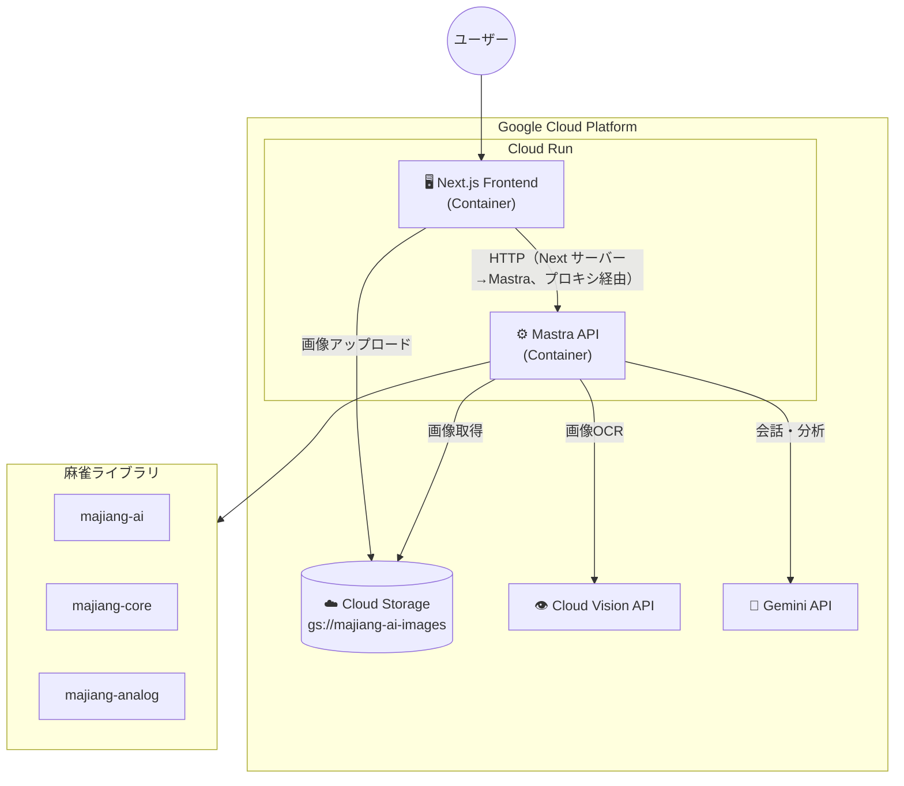
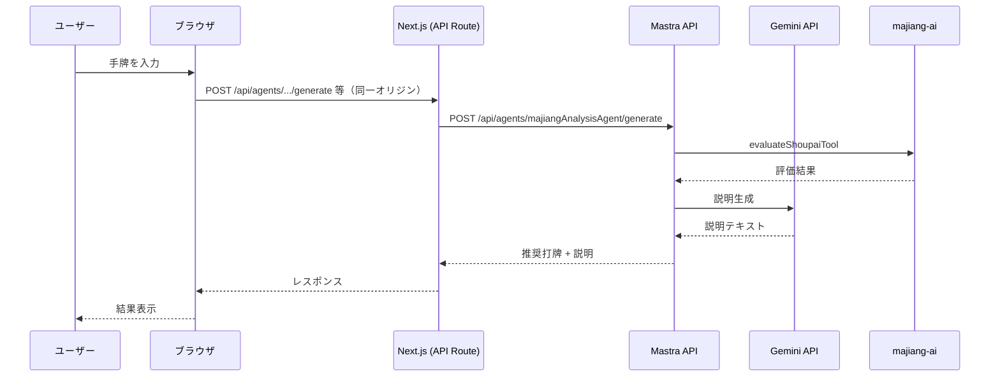
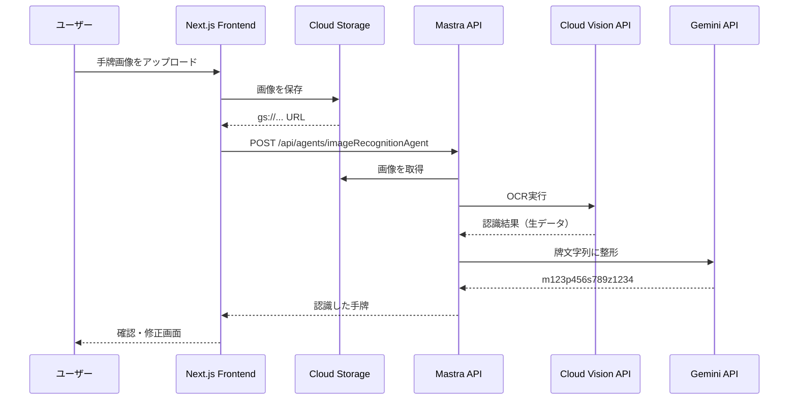

# 麻雀AI アーキテクチャ設計

## 概要

Google Cloud Platform（GCP）に統一した構成で、Mastra API + Next.jsフロントエンドをCloud Runでホストする。
画像認識にはCloud Vision API + Gemini APIを使用し、画像はCloud Storageに保存する。

> 詳細な比較検討は [docs/ui-deployment-comparison.md](./docs/ui-deployment-comparison.md) を参照
>
> GCP環境設定の詳細は [docs/gcp/README.md](./docs/gcp/README.md) を参照

## アーキテクチャ



## コンポーネント

| コンポーネント       | 役割                                               |
| -------------------- | -------------------------------------------------- |
| **Next.js Frontend** | 手牌入力、画像アップロード、結果表示（majiang-ui） |
| **Mastra API**       | Agent実行、ツール呼び出し                          |
| **Cloud Storage**    | 手牌画像の保存                                     |
| **Cloud Vision API** | 画像OCR（牌認識）                                  |
| **Gemini API**       | 会話生成、分析結果の整形                           |
| **majiang-ai/core**  | 麻雀AI評価ロジック                                 |

---

## Mastra API エンドポイント

Mastraは以下のREST APIを提供します：

### Agents

- `POST /api/agents/{agentName}/generate` - エージェントの実行
- `POST /api/agents/{agentName}/stream` - ストリーミング実行

### Workflows

- `POST /api/workflows/{workflowId}` - ワークフローの実行

### Tools

- `GET /api/tools` - 利用可能なツールの一覧

### 例: majiangAnalysisAgentの呼び出し

```typescript
POST /api/agents/majiangAnalysisAgent/generate
Content-Type: application/json

{
  "messages": [
    {
      "role": "user",
      "content": "手牌: m123p1234789s3388 の最適な打牌を教えてください"
    }
  ]
}
```

---

## ディレクトリ構成

```
majiang-ai/
├── mastra/                    # Mastra API (バックエンド)
│   ├── src/
│   │   └── mastra/
│   │       ├── agents/
│   │       │   ├── majiang-analysis-agent.ts
│   │       │   └── image-recognition-agent.ts
│   │       ├── tools/
│   │       │   └── eval/shoupai/
│   │       ├── workflows/
│   │       │   └── evaluate-shoupai.ts
│   │       └── index.ts
│   ├── Dockerfile             # Cloud Run用
│   └── package.json
│
├── frontend/                  # Next.js Frontend
│   ├── app/
│   │   ├── layout.tsx
│   │   ├── page.tsx
│   │   └── api/
│   │       └── upload/        # GCSアップロード用API Route
│   ├── components/
│   │   ├── ImageUpload.tsx
│   │   ├── ImagePreview.tsx
│   │   ├── ShoupaiEditor.tsx
│   │   ├── GameInfoForm.tsx
│   │   └── AnalysisResult.tsx
│   ├── lib/
│   │   ├── mastra-client.ts
│   │   └── gcs-client.ts      # Cloud Storage クライアント
│   ├── Dockerfile             # Cloud Run用
│   └── package.json
│
├── submodules/
│   ├── majiang-ai/
│   ├── majiang-core/
│   ├── majiang-ui/
│   └── majiang-analog/
│
├── docs/
│   ├── ui-deployment-comparison.md
│   └── image-to-paipu-design.md
│
└── cloudbuild.yaml            # Cloud Build設定
```

---

## デプロイ構成

### 1. Mastra API (バックエンド)

- **デプロイ先**: Cloud Run
- **リージョン**: asia-northeast1（東京）
- **URL**: `https://majiang-ai-api-xxxxx.a.run.app` (例)
- **エンドポイント**:
  - `POST /api/agents/majiangAnalysisAgent/generate`
  - `POST /api/agents/imageRecognitionAgent/generate`
  - `POST /api/workflows/evaluateShoupai`
  - `GET /api/tools`

### 2. Next.js Frontend

- **デプロイ先**: Cloud Run
- **リージョン**: asia-northeast1（東京）
- **URL**: `https://majiang-ai-xxxxx.a.run.app` (例)
- **環境変数**:
  - `MASTRA_API_URL`: Mastra APIのURL
  - `GCS_BUCKET`: Cloud Storageバケット名

### 3. Cloud Storage

- **バケット名**: `majiang-ai-images`
- **リージョン**: asia-northeast1
- **用途**: 手牌画像の保存

---

## データフロー

### 手牌分析（テキスト入力）

- ブラウザは **Next.js の同一オリジン**（例: `/api/agents/...`）のみ呼ぶ。Next.js の API Route が Mastra API をプロキシする（[docs/cors-strategy.md](./docs/cors-strategy.md) 選択肢 C）。



### 画像認識フロー



---

## 技術スタック

### バックエンド (Mastra API)

- Mastra Framework
- TypeScript
- Cloud Run (Container)
- Gemini API
- Cloud Vision API

### フロントエンド (Next.js)

- Next.js 14+ (App Router)
- React
- TypeScript
- Tailwind CSS
- majiang-ui（牌の描画）
- @google-cloud/storage

### インフラ

- Cloud Run
- Cloud Storage
- Cloud Build
- Cloud Logging / Monitoring

---

## 環境変数

### Mastra API

| 変数名                 | 説明                   | 例                   |
| ---------------------- | ---------------------- | -------------------- |
| `GOOGLE_API_KEY`       | Gemini API キー        | `AIza...`            |
| `GOOGLE_CLOUD_PROJECT` | GCPプロジェクトID      | `majiang-ai-project` |
| `GCS_BUCKET`           | Cloud Storage バケット | `majiang-ai-images`  |

### Next.js Frontend

| 変数名                 | 説明                                       | 例                                       |
| ---------------------- | ------------------------------------------ | ---------------------------------------- |
| `MASTRA_API_URL`       | Mastra API の URL（**サーバー専用**、プロキシ用） | `https://majiang-ai-api-xxxxx.a.run.app` |
| `GCS_BUCKET`           | Cloud Storage バケット                     | `majiang-ai-images`                      |
| `GOOGLE_CLOUD_PROJECT` | GCPプロジェクトID                          | `majiang-ai-project`                     |

- **設計**: ブラウザは Mastra を直接叩かず、Next.js の API Route 経由で叩く。そのため Mastra の URL は `MASTRA_API_URL`（サーバー専用）でよく、`NEXT_PUBLIC_` は不要。Secret Manager で実行時に渡せる（[docs/cors-strategy.md](./docs/cors-strategy.md) 参照）。

---

## Dockerfile

### Mastra API

**方法1: プロジェクトルートからビルド（推奨）**

プロジェクトルート（`majiang-ai/`）から実行する場合:

```dockerfile
# mastra/Dockerfile
FROM node:20-alpine

WORKDIR /app

# 依存関係のインストール
COPY mastra/package*.json ./
# ローカル依存関係（submodules）も含めるため、開発依存関係もインストール
RUN npm ci

# ソースコードとsubmodulesのコピー
COPY mastra/ ./
COPY submodules/ ./submodules/

# ビルド実行
RUN npm run build

# 環境変数設定
ENV PORT=8080
ENV NODE_ENV=production

EXPOSE 8080

CMD ["npm", "start"]
```

ビルドコマンド:

```bash
# プロジェクトルートから実行
docker build -f mastra/Dockerfile -t majiang-ai-api:local .
```

### Next.js Frontend

```dockerfile
FROM node:20-alpine AS builder

WORKDIR /app
COPY package*.json ./
RUN npm ci
COPY . .
RUN npm run build

FROM node:20-alpine AS runner
WORKDIR /app

ENV NODE_ENV=production
ENV PORT=8080

COPY --from=builder /app/.next/standalone ./
COPY --from=builder /app/.next/static ./.next/static
COPY --from=builder /app/public ./public

EXPOSE 8080
CMD ["node", "server.js"]
```

---

## Cloud Build設定

```yaml
# cloudbuild.yaml
steps:
  # Mastra API をビルド・デプロイ
  - name: "gcr.io/cloud-builders/docker"
    args: ["build", "-t", "gcr.io/$PROJECT_ID/majiang-ai-api", "./mastra"]

  - name: "gcr.io/cloud-builders/docker"
    args: ["push", "gcr.io/$PROJECT_ID/majiang-ai-api"]

  - name: "gcr.io/google.com/cloudsdktool/cloud-sdk"
    entrypoint: gcloud
    args:
      - "run"
      - "deploy"
      - "majiang-ai-api"
      - "--image=gcr.io/$PROJECT_ID/majiang-ai-api"
      - "--region=asia-northeast1"
      - "--allow-unauthenticated"

  # Frontend をビルド・デプロイ
  - name: "gcr.io/cloud-builders/docker"
    args:
      ["build", "-t", "gcr.io/$PROJECT_ID/majiang-ai-frontend", "./frontend"]

  - name: "gcr.io/cloud-builders/docker"
    args: ["push", "gcr.io/$PROJECT_ID/majiang-ai-frontend"]

  - name: "gcr.io/google.com/cloudsdktool/cloud-sdk"
    entrypoint: gcloud
    args:
      - "run"
      - "deploy"
      - "majiang-ai-frontend"
      - "--image=gcr.io/$PROJECT_ID/majiang-ai-frontend"
      - "--region=asia-northeast1"
      - "--allow-unauthenticated"

images:
  - "gcr.io/$PROJECT_ID/majiang-ai-api"
  - "gcr.io/$PROJECT_ID/majiang-ai-frontend"
```

---

## 注意事項

1. **認証**: Cloud Run間の通信はIAMで制御可能（必要に応じて設定）
2. **コールドスタート**: min-instances=1 で回避可能（追加コスト）
3. **CORS**: ブラウザは Next.js の同一オリジンのみ叩くため CORS 不要。Next.js の API Route が Mastra API をプロキシする（[docs/cors-strategy.md](./docs/cors-strategy.md) 選択肢 C）。
4. **ログ**: Cloud Loggingで一元管理
5. **コスト**: $300のGCPクレジットで十分に運用可能
6. **画像認識**: 精度検証が必要
   - 詳細は [docs/image-recognition-evaluation.md](./docs/image-recognition-evaluation.md) を参照

---

## 実装ステップ

### Phase 1: 環境構築

- [x] GCPプロジェクトの作成
  - [x] majiang-ai-beta
- [x] Cloud Storage バケットの作成
- [x] 必要なAPIの有効化（Cloud Run, Vision API, Gemini API）

### Phase 2: Mastra APIのCloud Run移行

#### 2.1 事前準備

- [ ] **GCP環境の確認**
  - [x] プロジェクトID確認: `gcloud config get-value project` → `majiang-ai-beta`
  - [x] リージョン確認: `gcloud config get-value run/region` → `asia-northeast1`
  - [x] Artifact Registry API有効化確認
    ```bash
    gcloud services enable artifactregistry.googleapis.com
    ```
  - [x] サービスアカウント確認: `majiang-ai-sa@majiang-ai-beta.iam.gserviceaccount.com`
    - [x] `roles/storage.objectViewer` ロール付与済み
    - [x] `roles/storage.objectCreator` ロール付与済み

- [x] **ローカル開発環境の確認**
  - [x] ADC（Application Default Credentials）設定済み
    ```bash
    gcloud auth application-default login --project=majiang-ai-beta
    ```
  - [x] 環境変数の確認（`mastra/.env`）
    - `GOOGLE_API_KEY`: Gemini APIキー
    - `GOOGLE_CLOUD_PROJECT=majiang-ai-beta`
    - `GCS_BUCKET=majiang-ai-images`

#### 2.2 Dockerfileの作成

- [x] **`mastra/Dockerfile` の作成**
  - [x] ベースイメージ: `node:20-alpine`（Node.js 22.13.0以上が必要だが、20で動作確認）
  - [x] 作業ディレクトリ: `/app`
  - [x] 依存関係のインストール
    - `mastra/package.json` と `mastra/package-lock.json` をコピー
    - `npm ci` で依存関係をインストール（submodulesも含むため開発依存関係も必要）
  - [x] ソースコードとsubmodulesのコピー
    - `mastra/` ディレクトリ全体をコピー
    - `submodules/` ディレクトリをコピー（ローカル依存関係）
  - [x] ビルド実行
    - `npm run build` でTypeScriptをコンパイル
  - [x] 環境変数設定
    - `PORT=8080`（Cloud Runのデフォルトポート）
    - `NODE_ENV=production`
  - [x] ポート公開: `EXPOSE 8080`
  - [x] 起動コマンド: `CMD ["npm", "start"]`（`mastra start`を実行）

  **注意**: Dockerfileはプロジェクトルートからビルドすることを想定（`docker build -f mastra/Dockerfile .`）

- [x] **`.dockerignore` の作成（オプション、プロジェクトルートに配置）**
  - [x] `node_modules/`
  - [x] `.env`
  - [x] `.git/`
  - [x] `*.log`
  - [x] `.cursor/`
  - [x] `docs/`

#### 2.3 VercelDeployerの削除

- [x] **`mastra/src/mastra/index.ts` の修正**
  - [x] `VercelDeployer` のインポートを削除
    ```typescript
    // 削除: import { VercelDeployer } from '@mastra/deployer-vercel';
    ```
  - [x] `deployer` オプションを削除
    ```typescript
    // 削除: deployer: new VercelDeployer({ ... })
    ```

- [x] **`mastra/package.json` の修正**
  - [x] `@mastra/deployer-vercel` を依存関係から削除
    ```bash
    npm uninstall @mastra/deployer-vercel
    ```

- [x] **`vercel.json` の確認・削除（存在する場合）**
  - [x] プロジェクトルートの `vercel.json` を確認
  - [x] Mastra API用の設定があれば削除

#### 2.4 ローカルでのDockerビルド・動作確認

- [x] **Dockerイメージのビルド**

  ```bash
  # プロジェクトルートから実行
  docker build -f mastra/Dockerfile -t majiang-ai-api:local .
  ```

- [x] **ローカルでコンテナ実行**

  ```bash
  docker run -p 8080:8080 \
    -e GOOGLE_API_KEY="your-api-key" \
    -e GOOGLE_CLOUD_PROJECT="majiang-ai-beta" \
    -e GCS_BUCKET="majiang-ai-images" \
    majiang-ai-api:local
  ```

- [x] **動作確認**
  - [x] ヘルスチェック: `curl http://localhost:8080/api/tools`
  - [x] エージェント実行テスト:
  - [x] ログ確認: エラーがないことを確認

#### 2.5 Artifact Registryの準備

- [x] **リポジトリの作成**

  ```bash
  gcloud artifacts repositories create majiang-ai-repo \
    --repository-format=docker \
    --location=asia-northeast1 \
    --description="Docker images for majiang-ai"
  ```

- [x] **認証設定**
  ```bash
  gcloud auth configure-docker asia-northeast1-docker.pkg.dev
  ```

#### 2.6 Cloud Runへのデプロイ

- [x] **Dockerイメージのビルド・プッシュ**

  ```bash
  # プロジェクトルートから実行

  # 重要: Cloud Runはx86_64アーキテクチャを使用するため、--platformを指定
  # Apple Silicon (ARM64) でビルドする場合は必須
  docker build --platform linux/amd64 \
    -f mastra/Dockerfile \
    -t asia-northeast1-docker.pkg.dev/majiang-ai-beta/majiang-ai-repo/majiang-ai-api:latest .

  # Artifact Registryにプッシュ
  docker push asia-northeast1-docker.pkg.dev/majiang-ai-beta/majiang-ai-repo/majiang-ai-api:latest
  ```

  **注意**:
  - Apple Silicon (M1/M2/M3) Macでビルドする場合は、`--platform linux/amd64`を必ず指定してください
  - これにより、Cloud Runが要求するx86_64アーキテクチャのイメージがビルドされます
  - ビルド時間は長くなりますが、Cloud Runで正しく動作します

- [x] **Cloud Runサービスのデプロイ**

  ```bash
  gcloud run deploy majiang-ai-api \
    --image asia-northeast1-docker.pkg.dev/majiang-ai-beta/majiang-ai-repo/majiang-ai-api:latest \
    --region asia-northeast1 \
    --platform managed \
    --allow-unauthenticated \
    --service-account majiang-ai-sa@majiang-ai-beta.iam.gserviceaccount.com \
    --set-env-vars GOOGLE_API_KEY="your-api-key",GOOGLE_CLOUD_PROJECT="majiang-ai-beta",GCS_BUCKET="majiang-ai-images" \
    --memory 1Gi \
    --cpu 1 \
    --timeout 300 \
    --max-instances 10 \
    --min-instances 0 \
    --port 8080
  ```

  **重要**: Apple Silicon Macでビルドする場合は、`--platform linux/amd64`を指定してビルドすること

- [x] **デプロイ結果の確認**
  - [x] サービスURLの取得: `gcloud run services describe majiang-ai-api --region asia-northeast1 --format 'value(status.url)'`
  - [x] URLをメモ（例: `https://majiang-ai-api-bjl7enjnaq-an.a.run.app`）

#### 2.7 動作確認

- [x] **APIエンドポイントのテスト**
  - [x] ツール一覧取得
    ```bash
    curl https://majiang-ai-api-xxxxx.a.run.app/api/tools
    ```
  - [x] エージェント実行テスト

    ```bash
    # 基本的なリクエスト
    curl -X POST https://majiang-ai-api-xxxxx.a.run.app/api/agents/majiangAnalysisAgent/generate \
      -H "Content-Type: application/json" \
      -d '{
        "messages": [
          {
            "role": "user",
            "content": "手牌: m123p1234789s3388 の最適な打牌を教えてください"
          }
        ]
      }' | jq '.'

    # より詳細な分析リクエスト
    curl -X POST https://majiang-ai-api-xxxxx.a.run.app/api/agents/majiangAnalysisAgent/generate \
      -H "Content-Type: application/json" \
      -d '{
        "messages": [
          {
            "role": "user",
            "content": "手牌: m123p1234789s3388 の最適な打牌を教えてください。現在のシャンテン数と評価値、打牌候補の評価も知りたいです。"
          }
        ]
      }' | jq '.'
    ```

  - [ ] ワークフロー実行テスト（オプション）
    ```bash
    curl -X POST https://majiang-ai-api-xxxxx.a.run.app/api/workflows/evaluateShoupai \
      -H "Content-Type: application/json" \
      -d '{ ... }'
    ```

#### 2.8 環境変数の管理（Secret Manager推奨）

- [ ] **Secret Managerへの移行（オプション、推奨）**
  - [x] `GOOGLE_API_KEY` をSecret Managerに保存
    ```bash
    echo -n "your-api-key" | gcloud secrets create google-api-key --data-file=-
    ```
  - [x] サービスアカウントにSecret Managerアクセス権限を付与
    ```bash
    gcloud secrets add-iam-policy-binding google-api-key \
      --member="serviceAccount:majiang-ai-sa@majiang-ai-beta.iam.gserviceaccount.com" \
      --role="roles/secretmanager.secretAccessor"
    ```
  - [x] Cloud RunでSecretを環境変数として参照
    ```bash
    gcloud run services update majiang-ai-api \
      --region asia-northeast1 \
      --update-secrets GOOGLE_API_KEY=google-api-key:latest
    ```

#### 2.9 ドキュメント更新

- [x] **`ARCHITECTURE.md` の更新**
  - [x] デプロイ済みURLを記載
  - [x] 環境変数の設定方法を記載

- [x] **`docs/gcp/README.md` の更新（必要に応じて）**
  - [x] Cloud Runサービスの情報を追加

---

**完了条件**:

- ✅ Dockerfileが作成され、ローカルでビルド・実行できる
- ✅ VercelDeployerが削除され、コードがクリーンになっている
- ✅ Cloud Runにデプロイされ、APIエンドポイントが正常に動作している
- ✅ ログにエラーがなく、認証が正しく機能している

### Phase 3: Next.js Frontendの作成

> 詳細な実装計画・タスク一覧・質問・懸念点は [docs/frontend-implementation-plan.md](./docs/frontend-implementation-plan.md) を参照

- [ ] プロジェクト作成
- [ ] 手牌入力UI
- [ ] 画像アップロードUI（GCS連携）
- [ ] API連携
- [ ] Dockerfileの作成
- [ ] Cloud Runへのデプロイ

### Phase 4: 画像認識機能

- [ ] imageRecognitionAgentの実装
- [ ] Cloud Vision API連携
- [ ] Gemini APIで整形
- [ ] UIとの統合

### Phase 5: 本番運用

- [ ] Cloud Buildパイプラインの構築
- [ ] 監視・アラートの設定
- [ ] パフォーマンスチューニング
