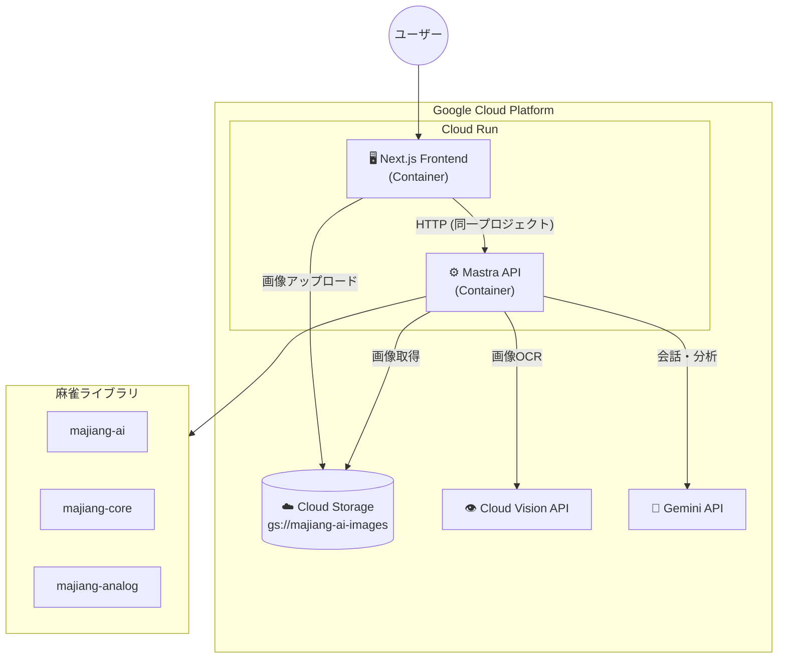
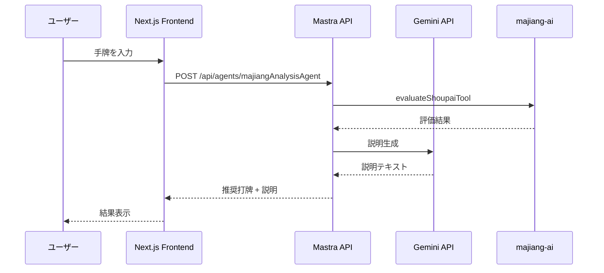
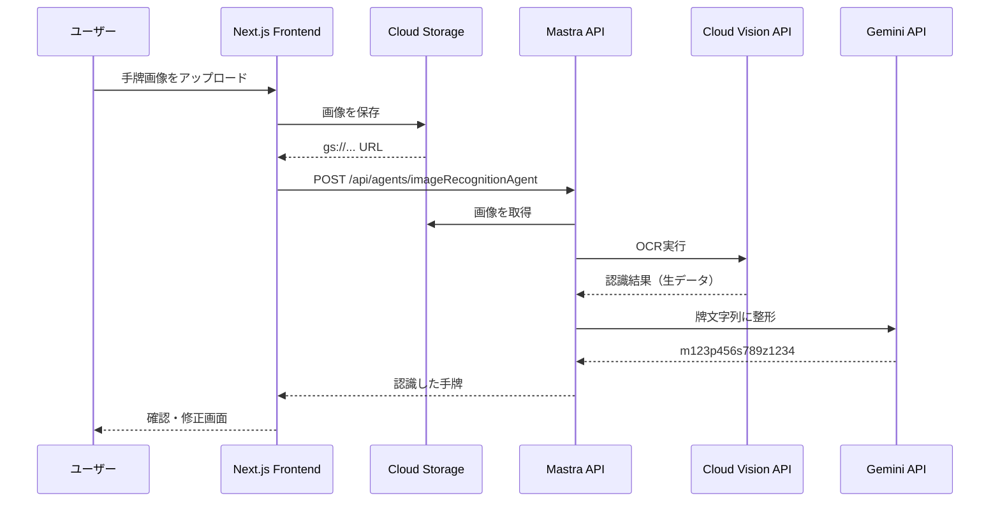

# 麻雀AI アーキテクチャ設計

## 概要

Google Cloud Platform（GCP）に統一した構成で、Mastra API + Next.jsフロントエンドをCloud Runでホストする。
画像認識にはCloud Vision API + Gemini APIを使用し、画像はCloud Storageに保存する。

> 詳細な比較検討は [docs/ui-deployment-comparison.md](./docs/ui-deployment-comparison.md) を参照

## アーキテクチャ



## コンポーネント

| コンポーネント         | 役割                                                   |
| ---------------------- | ------------------------------------------------------ |
| **Next.js Frontend**   | 手牌入力、画像アップロード、結果表示（majiang-ui）     |
| **Mastra API**         | Agent実行、ツール呼び出し                              |
| **Cloud Storage**      | 手牌画像の保存                                         |
| **Cloud Vision API**   | 画像OCR（牌認識）                                      |
| **Gemini API**         | 会話生成、分析結果の整形                               |
| **majiang-ai/core**    | 麻雀AI評価ロジック                                     |

---

## Mastra API エンドポイント

Mastraは以下のREST APIを提供します：

### Agents

- `POST /api/agents/{agentName}` - エージェントの実行
- `POST /api/agents/{agentName}/stream` - ストリーミング実行

### Workflows

- `POST /api/workflows/{workflowId}` - ワークフローの実行

### Tools

- `GET /api/tools` - 利用可能なツールの一覧

### 例: majiangAnalysisAgentの呼び出し

```typescript
POST /api/agents/majiangAnalysisAgent
Content-Type: application/json

{
  "messages": [
    {
      "role": "user",
      "content": "手牌: m123p1234789s3388 の最適な打牌を教えてください"
    }
  ]
}
```

---

## ディレクトリ構成

```
majiang-ai/
├── mastra/                    # Mastra API (バックエンド)
│   ├── src/
│   │   └── mastra/
│   │       ├── agents/
│   │       │   ├── majiang-analysis-agent.ts
│   │       │   └── image-recognition-agent.ts
│   │       ├── tools/
│   │       │   └── eval/shoupai/
│   │       ├── workflows/
│   │       │   └── evaluate-shoupai.ts
│   │       └── index.ts
│   ├── Dockerfile             # Cloud Run用
│   └── package.json
│
├── frontend/                  # Next.js Frontend
│   ├── app/
│   │   ├── layout.tsx
│   │   ├── page.tsx
│   │   └── api/
│   │       └── upload/        # GCSアップロード用API Route
│   ├── components/
│   │   ├── ImageUpload.tsx
│   │   ├── ImagePreview.tsx
│   │   ├── ShoupaiEditor.tsx
│   │   ├── GameInfoForm.tsx
│   │   └── AnalysisResult.tsx
│   ├── lib/
│   │   ├── mastra-client.ts
│   │   └── gcs-client.ts      # Cloud Storage クライアント
│   ├── Dockerfile             # Cloud Run用
│   └── package.json
│
├── submodules/
│   ├── majiang-ai/
│   ├── majiang-core/
│   ├── majiang-ui/
│   └── majiang-analog/
│
├── docs/
│   ├── ui-deployment-comparison.md
│   └── image-to-paipu-design.md
│
└── cloudbuild.yaml            # Cloud Build設定
```

---

## デプロイ構成

### 1. Mastra API (バックエンド)

- **デプロイ先**: Cloud Run
- **リージョン**: asia-northeast1（東京）
- **URL**: `https://majiang-ai-api-xxxxx.a.run.app` (例)
- **エンドポイント**:
  - `POST /api/agents/majiangAnalysisAgent`
  - `POST /api/agents/imageRecognitionAgent`
  - `POST /api/workflows/evaluateShoupai`
  - `GET /api/tools`

### 2. Next.js Frontend

- **デプロイ先**: Cloud Run
- **リージョン**: asia-northeast1（東京）
- **URL**: `https://majiang-ai-xxxxx.a.run.app` (例)
- **環境変数**:
  - `MASTRA_API_URL`: Mastra APIのURL
  - `GCS_BUCKET`: Cloud Storageバケット名

### 3. Cloud Storage

- **バケット名**: `majiang-ai-images`
- **リージョン**: asia-northeast1
- **用途**: 手牌画像の保存

---

## データフロー

### 手牌分析（テキスト入力）



### 画像認識フロー



---

## 技術スタック

### バックエンド (Mastra API)

- Mastra Framework
- TypeScript
- Cloud Run (Container)
- Gemini API
- Cloud Vision API

### フロントエンド (Next.js)

- Next.js 14+ (App Router)
- React
- TypeScript
- Tailwind CSS
- majiang-ui（牌の描画）
- @google-cloud/storage

### インフラ

- Cloud Run
- Cloud Storage
- Cloud Build
- Cloud Logging / Monitoring

---

## 環境変数

### Mastra API

| 変数名                         | 説明                   | 例                           |
| ------------------------------ | ---------------------- | ---------------------------- |
| `GOOGLE_API_KEY`               | Gemini API キー        | `AIza...`                    |
| `GOOGLE_CLOUD_PROJECT`         | GCPプロジェクトID      | `majiang-ai-project`         |
| `GCS_BUCKET`                   | Cloud Storage バケット | `majiang-ai-images`          |

### Next.js Frontend

| 変数名                         | 説明                   | 例                                         |
| ------------------------------ | ---------------------- | ------------------------------------------ |
| `NEXT_PUBLIC_MASTRA_API_URL`   | Mastra APIのURL        | `https://majiang-ai-api-xxxxx.a.run.app`   |
| `GCS_BUCKET`                   | Cloud Storage バケット | `majiang-ai-images`                        |
| `GOOGLE_CLOUD_PROJECT`         | GCPプロジェクトID      | `majiang-ai-project`                       |

---

## Dockerfile

### Mastra API

```dockerfile
FROM node:20-alpine

WORKDIR /app

COPY package*.json ./
RUN npm ci --only=production

COPY . .
RUN npm run build

ENV PORT=8080
EXPOSE 8080

CMD ["npm", "start"]
```

### Next.js Frontend

```dockerfile
FROM node:20-alpine AS builder

WORKDIR /app
COPY package*.json ./
RUN npm ci
COPY . .
RUN npm run build

FROM node:20-alpine AS runner
WORKDIR /app

ENV NODE_ENV=production
ENV PORT=8080

COPY --from=builder /app/.next/standalone ./
COPY --from=builder /app/.next/static ./.next/static
COPY --from=builder /app/public ./public

EXPOSE 8080
CMD ["node", "server.js"]
```

---

## Cloud Build設定

```yaml
# cloudbuild.yaml
steps:
  # Mastra API をビルド・デプロイ
  - name: "gcr.io/cloud-builders/docker"
    args: ["build", "-t", "gcr.io/$PROJECT_ID/majiang-ai-api", "./mastra"]

  - name: "gcr.io/cloud-builders/docker"
    args: ["push", "gcr.io/$PROJECT_ID/majiang-ai-api"]

  - name: "gcr.io/google.com/cloudsdktool/cloud-sdk"
    entrypoint: gcloud
    args:
      - "run"
      - "deploy"
      - "majiang-ai-api"
      - "--image=gcr.io/$PROJECT_ID/majiang-ai-api"
      - "--region=asia-northeast1"
      - "--allow-unauthenticated"

  # Frontend をビルド・デプロイ
  - name: "gcr.io/cloud-builders/docker"
    args: ["build", "-t", "gcr.io/$PROJECT_ID/majiang-ai-frontend", "./frontend"]

  - name: "gcr.io/cloud-builders/docker"
    args: ["push", "gcr.io/$PROJECT_ID/majiang-ai-frontend"]

  - name: "gcr.io/google.com/cloudsdktool/cloud-sdk"
    entrypoint: gcloud
    args:
      - "run"
      - "deploy"
      - "majiang-ai-frontend"
      - "--image=gcr.io/$PROJECT_ID/majiang-ai-frontend"
      - "--region=asia-northeast1"
      - "--allow-unauthenticated"

images:
  - "gcr.io/$PROJECT_ID/majiang-ai-api"
  - "gcr.io/$PROJECT_ID/majiang-ai-frontend"
```

---

## 注意事項

1. **認証**: Cloud Run間の通信はIAMで制御可能（必要に応じて設定）
2. **コールドスタート**: min-instances=1 で回避可能（追加コスト）
3. **CORS**: UIとAPIは別のCloud Runサービス（別オリジン）のためCORS設定が必要
   - 詳細は [docs/cors-strategy.md](./docs/cors-strategy.md) を参照
4. **ログ**: Cloud Loggingで一元管理
5. **コスト**: $300のGCPクレジットで十分に運用可能
6. **画像認識**: 精度検証が必要
   - 詳細は [docs/image-recognition-evaluation.md](./docs/image-recognition-evaluation.md) を参照

---

## 実装ステップ

### Phase 1: 環境構築

- [ ] GCPプロジェクトの作成
- [ ] Cloud Storage バケットの作成
- [ ] 必要なAPIの有効化（Cloud Run, Vision API, Gemini API）

### Phase 2: Mastra APIのCloud Run移行

- [ ] Dockerfileの作成
- [ ] `VercelDeployer`の削除
- [ ] Cloud Runへのデプロイ
- [ ] 動作確認

### Phase 3: Next.js Frontendの作成

- [ ] プロジェクト作成
- [ ] 手牌入力UI
- [ ] 画像アップロードUI（GCS連携）
- [ ] API連携
- [ ] Dockerfileの作成
- [ ] Cloud Runへのデプロイ

### Phase 4: 画像認識機能

- [ ] imageRecognitionAgentの実装
- [ ] Cloud Vision API連携
- [ ] Gemini APIで整形
- [ ] UIとの統合

### Phase 5: 本番運用

- [ ] Cloud Buildパイプラインの構築
- [ ] 監視・アラートの設定
- [ ] パフォーマンスチューニング
