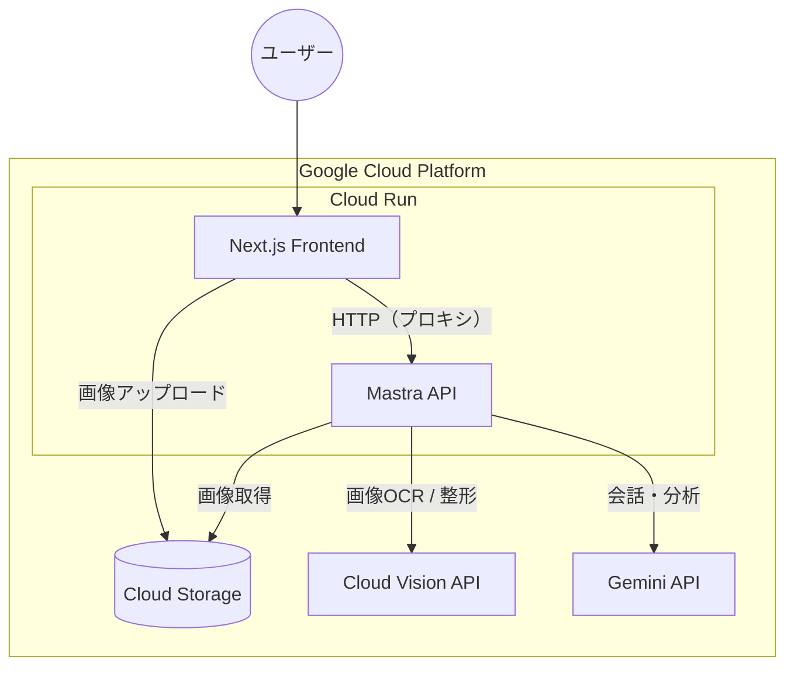
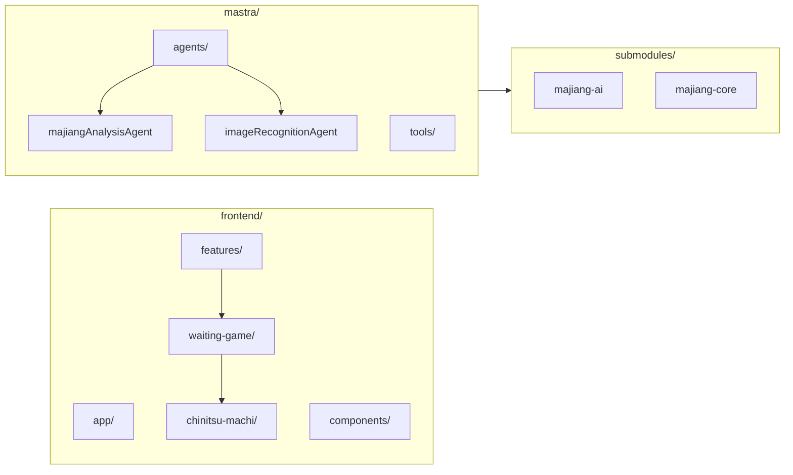
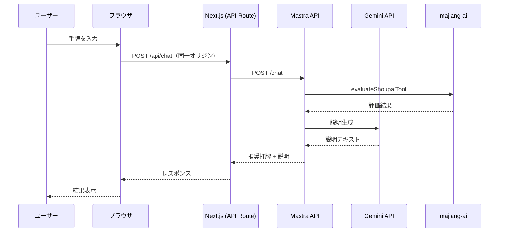
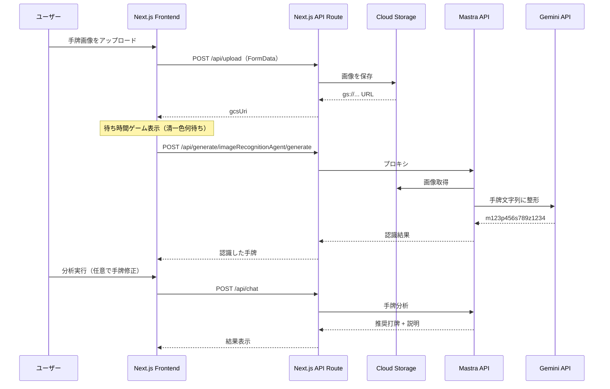

# majiang-ai

『麻雀ゲームAIのアルゴリズムと実装』

手牌の写真アップロード・手入力から、Mastra API（Gemini + 麻雀評価）で打牌候補と説明を得る Web アプリ。GCP（Cloud Run / Cloud Storage）でホストし、待ち時間中に遊べる「清一色何待ち」ゲームを搭載している。

---

## 今回作ったもの

| 領域 | 内容 |
|------|------|
| **フロントエンド** | Next.js（App Router）。手牌入力・画像アップロード・分析結果表示・待ち時間ゲーム枠。 |
| **待ち時間ゲーム** | 写真認識の待ち時間（約30秒）中に表示する「**清一色何待ち**」ゲーム。`features/waiting-game/chinitsu-machi` で問題・正解は静的 JSON、正誤判定は完全一致。枠は `WaitingGameSlot`、表示開始はアップロード開始時・終了は「辞める」押下まで。 |
| **画像認識** | 手牌画像を GCS にアップロード → Mastra の `imageRecognitionAgent`（Gemini Vision）で手牌文字列を取得 → 手牌入力に反映。 |
| **分析 API** | Mastra の `majiangAnalysisAgent`（evaluateShoupai ツール + Gemini）を Next の API Route 経由でプロキシ。同一オリジンで CORS を避ける構成。 |
| **インフラ** | Mastra API と Next.js をそれぞれ Cloud Run にデプロイ。画像は Cloud Storage（`majiang-ai-images`）に保存。 |

詳細な設計は [docs/waiting-game-feature-design.md](./docs/waiting-game-feature-design.md) と [ARCHITECTURE.md](./ARCHITECTURE.md) を参照。

---

## ローカル環境構築

### 前提

- **Node.js**: 22.13.0 以上（Mastra v1 の要件）
- リポジトリルートの `.node-version` でバージョンを固定。**Volta** 利用時は `cd` するだけで自動的に 22.13.0 が使われます。
- 初回のみ: `volta install node@22.13.0` で Node をインストール。

### 1. リポジトリのクローンとサブモジュール

```bash
git clone <repo-url> majiang-ai && cd majiang-ai
git submodule update --init --recursive
```

### 2. GCP 認証（画像アップロード・画像認識を使う場合）

画像を Cloud Storage に上げ、Mastra が Vision/Gemini で認識するには、ローカルで **Application Default Credentials (ADC)** を設定する。

```bash
gcloud auth application-default login --project=majiang-ai-beta
```

詳細は [docs/gcp/application-default-credentials.md](./docs/gcp/application-default-credentials.md) を参照。

### 3. Mastra API（バックエンド）

```bash
cd mastra
npm ci
cp .env.example .env
# .env を編集: GOOGLE_API_KEY または GOOGLE_GENERATIVE_AI_API_KEY（Gemini）、
#             GOOGLE_CLOUD_PROJECT=majiang-ai-beta, GCS_BUCKET=majiang-ai-images
npm run dev
```

デフォルトで `http://localhost:4111` で起動。`/api/tools` で疎通確認できる。

### 4. フロントエンド

別ターミナルで:

```bash
cd frontend
npm ci
cp .env.local.example .env.local   # ファイルが無い場合は下記の内容で .env.local を作成
# .env.local を編集:
#   MASTRA_API_URL=http://localhost:4111
#   GCS_BUCKET=majiang-ai-images-dev  # または majiang-ai-images（本番バケット）
#   GOOGLE_CLOUD_PROJECT=majiang-ai-beta
npm run dev
```

ブラウザで [http://localhost:3000](http://localhost:3000) を開く。

**.env.local の例**（サーバー専用。ブラウザには渡さない）:

```bash
MASTRA_API_URL=http://localhost:4111
GCS_BUCKET=majiang-ai-images-dev
GOOGLE_CLOUD_PROJECT=majiang-ai-beta
```

### 5. 動作確認

- 「写真から」で画像をアップロード → 待ち時間中に清一色何待ちゲームが表示され、「辞める」で閉じる or 認識完了後に手牌が入力されること。
- 「手で入力」で手牌を入力し分析実行 → 打牌候補と説明が返ること。

---

## 構成（Mermaid）

### システム全体



### リポジトリ構成（主要部分）



### リクエストの流れ

#### 手牌分析（テキスト入力）



#### 画像アップロード → 認識 → 分析



---

## ドキュメント（docs/）

| ドキュメント | 内容 |
|--------------|------|
| [ARCHITECTURE.md](./ARCHITECTURE.md) | アーキテクチャ・データフロー・デプロイ・実装ステップ |
| [docs/gcp/README.md](./docs/gcp/README.md) | GCP プロジェクト・API・環境変数・バケット |
| [docs/gcp/deploy-commands.md](./docs/gcp/deploy-commands.md) | Mastra / Frontend の Cloud Run デプロイコマンド一覧 |
| [docs/gcp/application-default-credentials.md](./docs/gcp/application-default-credentials.md) | ローカル開発用 ADC の設定 |
| [docs/waiting-game-feature-design.md](./docs/waiting-game-feature-design.md) | 待ち時間ゲームの設計・枠とゲームの責務 |
| [docs/cors-strategy.md](./docs/cors-strategy.md) | CORS 方針（同一オリジン・プロキシ） |
| [docs/image-recognition-evaluation.md](./docs/image-recognition-evaluation.md) | 画像認識の精度検証 |

その他、[docs/](./docs/) 配下にフロントエンド実装計画・UI 設計・ストリーミングなど多数あり。
