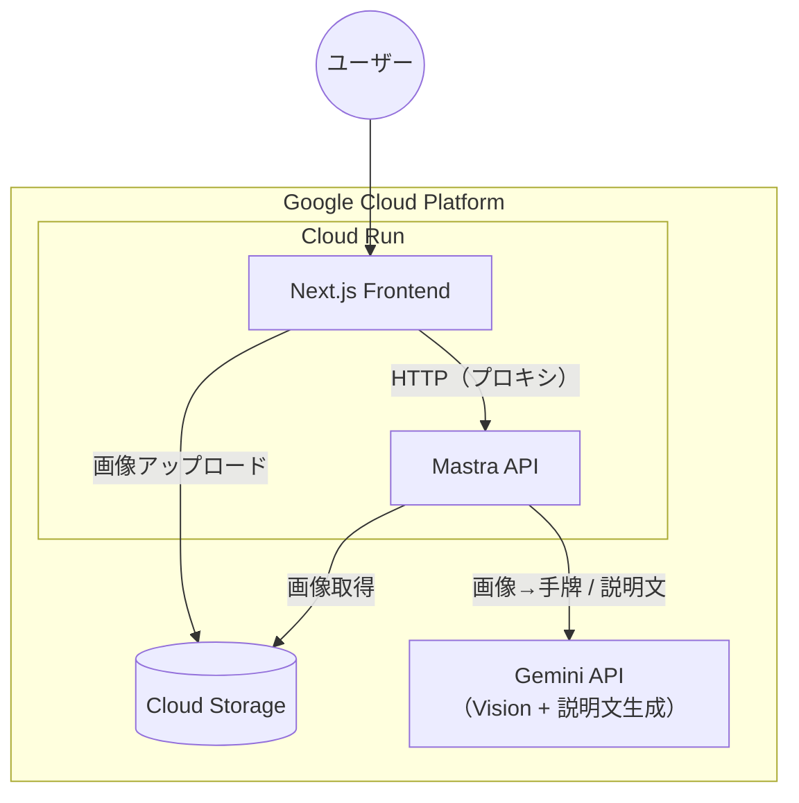
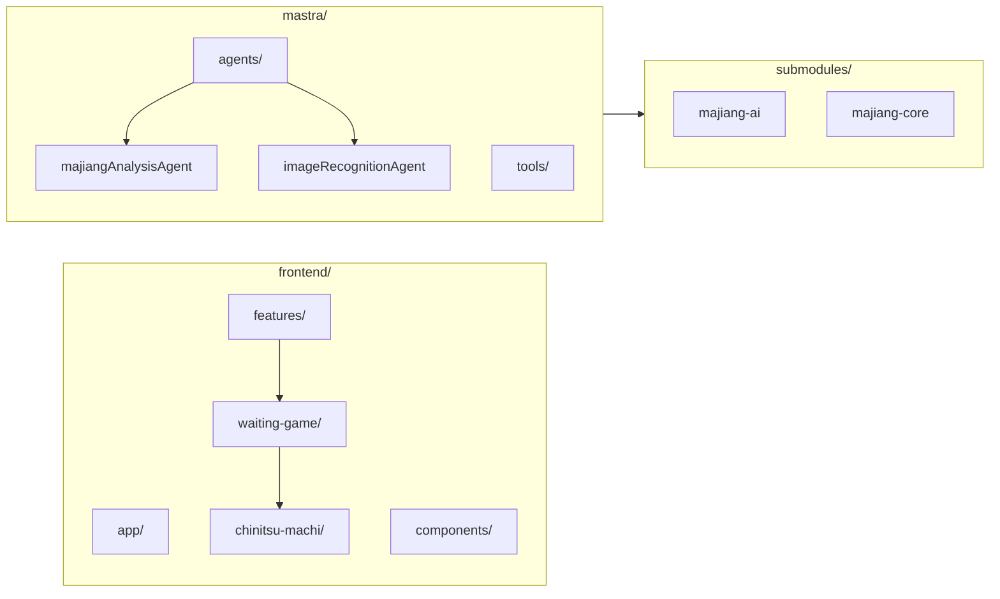
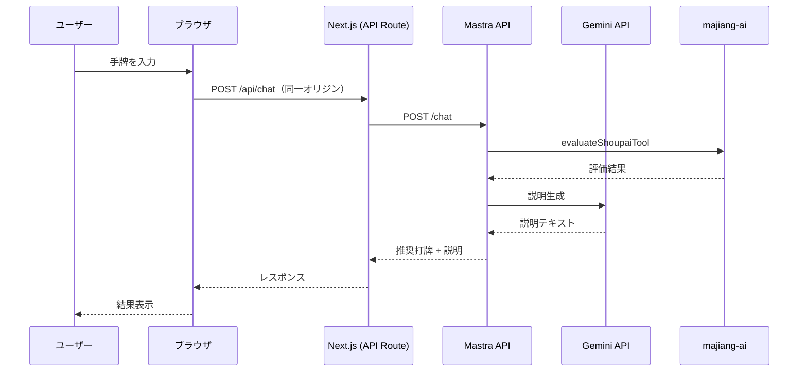
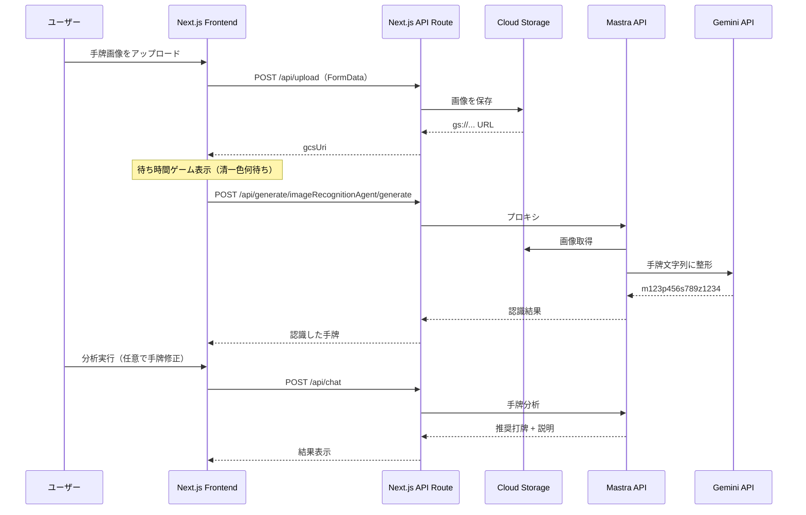

# majiang-ai

『麻雀ゲームAIのアルゴリズムと実装』

手牌の写真アップロード・手入力から、Mastra API（Gemini + 麻雀評価）で打牌候補と説明を得る Web アプリ。GCP（Cloud Run / Cloud Storage）でホストし、待ち時間中に遊べる「清一色何待ち」ゲームを搭載している。

---

## 機能紹介

今回作ったプロダクトでは大きく以下4つの機能があります。それぞれの機能概要や特徴を説明します。

### 1. 手牌の写真認識機能

**どんな機能か**  
スマホやPCで撮った手牌の写真をアップロードするだけで、AI（Gemini Vision）が牌を読み取り、手牌として自動入力します。

**できること**

- 写真を1枚送るだけで、萬子・筒子・索子・字牌を認識し、`m123p456s789z1234` のような手牌表記に変換する
- 対面麻雀で「この手、何切る？」となったときに、いちいち手牌を打ち込まなくてよい
- 認識結果は画面上で確認・修正できるため、誤認識があってもその場で直してから分析できる

**特徴**  
従来の最大の障壁であった入力コストを**手牌の写真を撮影する**だけで解決しています。ユーザーは手牌の写真をアップロードさえすれば、あとは自動認識された牌を元に分析を実行することができます。また牌を自動認識後、ユーザーによる確認フローを設けています。これは牌の自動認識が誤っている場合にユーザー自ら修正することができるようにするためです。

---

### 2. AIによる最適打牌提案

**どんな機能か**  
現在の手牌・場況（ドラ・残り牌など）をもとに、評価ロジックで「どの牌を切るのがよいか」を候補ごとに数値化し、最も有利な打牌を提案します。

**できること**

- 打牌候補ごとに**評価値（ev）**を算出し、和了期待値が高い打牌を順位付きで表示する
- 手入力または写真認識で得た手牌のどちらからでも、同じロジックで分析できる

**特徴**  
majiang-ai の評価エンジン（和了期待値の再帰計算）に基づいて打牌候補をランク付けするため、**感覚ではなく数値に裏打ちされた提案**が得られます。向聴戻しをしない打牌に絞りつつ、聴牌・和了への進みが良い打牌を優先するため、初心者でも「なぜその候補が良いか」を評価値の大小で確認できます。

---

### 3. 打牌理由の言語化

**どんな機能か**  
「なぜその牌を切るのが良いか」を、AI（Gemini）が自然な日本語で説明します。評価値やシャンテン数などの数値結果を、読みやすい文章に変換します。

**できること**

- 推奨打牌が選ばれた理由を、**短文で理由付き**で読める
- 複数候補がある場合は、候補ごとの得失やトレードオフを説明してもらえる
- 数値だけでは分かりにくい部分を、言葉で補足して理解を深められる

本アプリでは、これらを文章として出力し、初心者でも理解できる形で提示します。

**特徴**  
評価値やシャンテン数だけでは「どれを切るか」は分かっても**理由**が伝わりにくい課題があります。Gemini が数値結果を解釈し、**「この牌を切ると○○が進む」「△△を残すと将来の選択肢が広がる」**といった形で言語化するため、判断の根拠を読みながら打牌の考え方を学べます。

---

### 4. 待ち時間を活用した学習コンテンツ

**どんな機能か**  
手牌写真を送ってから認識結果が返るまで（おおよそ30秒程度）の待ち時間に、麻雀の学習・練習ができるミニゲームを表示します。待ち時間を「何もできない時間」ではなく「学び・遊びの時間」にします。

**できること**

- **清一色何待ち**：問題手牌（清一色）を見て、待ち牌を答えるゲーム。正解・不正解と正解の表示で、待ちの形を覚えられる
- 認識が終わっても、**「辞める」を押すまでゲームは続く**ため、解きかけの問題をそのまま完了できる
- 将来的に「何切るアンケート」や、別の学習コンテンツの追加も想定しています

**特徴**  
写真認識には数十秒かかるため、その間の**空白時間**が UX 上の課題でした。本機能ではその時間を「清一色何待ち」などのミニゲームに充てることで、**待ち時間そのものを価値ある時間に転換**しています。認識完了後も「辞める」までゲームを続けられるため、途中で遮られることなく学習を完結できます。

---

## 今回作ったもの

| 領域               | 内容                                                                                                                                                                                                                                     |
| ------------------ | ---------------------------------------------------------------------------------------------------------------------------------------------------------------------------------------------------------------------------------------- |
| **フロントエンド** | Next.js（App Router）。手牌入力・画像アップロード・分析結果表示・待ち時間ゲーム枠。                                                                                                                                                      |
| **待ち時間ゲーム** | 写真認識の待ち時間（約30秒）中に表示する「**清一色何待ち**」ゲーム。`features/waiting-game/chinitsu-machi` で問題・正解は静的 JSON、正誤判定は完全一致。枠は `WaitingGameSlot`、表示開始はアップロード開始時・終了は「辞める」押下まで。 |
| **画像認識**       | 手牌画像を GCS にアップロード → Mastra の `imageRecognitionAgent`（Gemini Vision）で手牌文字列を取得 → 手牌入力に反映。                                                                                                                  |
| **分析 API**       | Mastra の `majiangAnalysisAgent`（evaluateShoupai ツール + Gemini）を Next の API Route 経由でプロキシ。同一オリジンで CORS を避ける構成。                                                                                               |
| **インフラ**       | Mastra API と Next.js をそれぞれ Cloud Run にデプロイ。画像は Cloud Storage（`majiang-ai-images`）に保存。                                                                                                                               |

詳細な設計は [docs/waiting-game-feature-design.md](./docs/waiting-game-feature-design.md) と [ARCHITECTURE.md](./ARCHITECTURE.md) を参照。

---

## ローカル環境構築

### 前提

- **Node.js**: 22.13.0 以上（Mastra v1 の要件）
- リポジトリルートの `.node-version` でバージョンを固定。**Volta** 利用時は `cd` するだけで自動的に 22.13.0 が使われます。
- 初回のみ: `volta install node@22.13.0` で Node をインストール。

### 1. リポジトリのクローンとサブモジュール

```bash
git clone <repo-url> majiang-ai && cd majiang-ai
git submodule update --init --recursive
```

### 2. GCP 認証（画像アップロード・画像認識を使う場合）

画像を Cloud Storage に上げ、Mastra が Vision/Gemini で認識するには、ローカルで **Application Default Credentials (ADC)** を設定する。

```bash
gcloud auth application-default login --project=majiang-ai-beta
```

詳細は [docs/gcp/application-default-credentials.md](./docs/gcp/application-default-credentials.md) を参照。

### 3. Mastra API（バックエンド）

```bash
cd mastra
npm ci
cp .env.example .env
# .env を編集: GOOGLE_API_KEY または GOOGLE_GENERATIVE_AI_API_KEY（Gemini）、
#             GOOGLE_CLOUD_PROJECT=majiang-ai-beta, GCS_BUCKET=majiang-ai-images
npm run dev
```

デフォルトで `http://localhost:4111` で起動。`/api/tools` で疎通確認できる。

### 4. フロントエンド

別ターミナルで:

```bash
cd frontend
npm ci
cp .env.local.example .env.local   # ファイルが無い場合は下記の内容で .env.local を作成
# .env.local を編集:
#   MASTRA_API_URL=http://localhost:4111
#   GCS_BUCKET=majiang-ai-images-dev  # または majiang-ai-images（本番バケット）
#   GOOGLE_CLOUD_PROJECT=majiang-ai-beta
npm run dev
```

ブラウザで [http://localhost:3000](http://localhost:3000) を開く。

**.env.local の例**（サーバー専用。ブラウザには渡さない）:

```bash
MASTRA_API_URL=http://localhost:4111
GCS_BUCKET=majiang-ai-images-dev
GOOGLE_CLOUD_PROJECT=majiang-ai-beta
```

### 5. 動作確認

- 「写真から」で画像をアップロード → 待ち時間中に清一色何待ちゲームが表示され、「辞める」で閉じる or 認識完了後に手牌が入力されること。
- 「手で入力」で手牌を入力し分析実行 → 打牌候補と説明が返ること。

---

## システム構成の概要

本プロダクトは、**フロント**・**API（Mastra）**・**画像保管**・**画像認識（Vision）**・**LLM** の5要素で構成されています。各要素の役割と連携の概要は以下のとおりです。

### Next.js（Frontend）

- **役割**: ユーザーとの接点。画像のアップロード、認識結果の確認・修正、分析結果の表示、待ち時間中のミニゲーム表示を担当します。
- **詳細**: App Router でページを構成し、手牌入力は「写真から」と「手で入力」の2タブで切り替え。写真の場合はブラウザから Next.js の API Route（`/api/upload`）に FormData で送信し、返却された GCS の URL を元に Mastra の画像認識エージェントを呼び出します。分析リクエストは同一オリジンの `/api/chat`・`/api/generate/...` に送り、Next.js が Mastra API へプロキシするため、CORS を避けた構成になっています。認識待ち中は待ち時間ゲーム（清一色何待ち）を表示し、「辞める」で閉じるまで表示を維持します。

### Mastra API（Cloud Run）

- **役割**: ワークフローのオーケストレーション。画像アップロード後の「認識」、認識結果の「整形」、手牌の「分析」、分析結果の「説明文生成」までを一連の流れとしてつなぎます。
- **詳細**: エージェント（`imageRecognitionAgent`・`majiangAnalysisAgent`）とツール（画像から手牌文字列を取得するツール、majiang-ai の評価ツール）を定義し、Cloud Run 上でコンテナとして稼働。フロントからは Next.js 経由でしか叩かず、Mastra の URL はサーバー側の環境変数（`MASTRA_API_URL`）でのみ保持します。画像認識時は GCS の URL を受け取り、画像取得→認識→手牌表記の返却までを担当。分析時は手牌・ドラ等を受け取り、評価ツールで打牌候補と評価値を算出したうえで LLM に説明文の生成を依頼します。

### Cloud Storage

- **役割**: 手牌画像の一時保管。アップロード受付と、API による画像取得のための保存先です。
- **詳細**: フロントの `/api/upload` が受け取った画像バイナリを、GCS クライアント（`@google-cloud/storage`）で指定バケット（例: `majiang-ai-images`）にオブジェクトとして保存し、`gs://バケット名/...` の URL をフロントに返します。Mastra 側の画像認識ツールはこの URL を参照して画像を取得し、認識処理に渡します。開発用・本番用でバケットを分ける運用が可能です（例: `majiang-ai-images-dev` / `majiang-ai-images`）。

### 画像認識（Vision）

- **役割**: 手牌画像から牌を読み取り、手牌表記（例: `m123p456s789z1234`）に変換します。
- **詳細**: 現状の実装では **Gemini のマルチモーダル（Vision）機能** を用いて、画像を入力に手牌文字列を出力しています。Mastra の画像認識ツールが GCS から画像を取得し、Gemini API に渡して「萬・筒・索・字」の並びをテキストで得る流れです。Cloud Vision API は GCP 上で有効化の想定はありますが、現在の認識パイプラインでは使用していません。

### Gemini（LLM）

- **役割**: 分析結果の**説明の言語化**。「なぜその打牌が良いか」を自然な日本語で生成します。あわせて画像認識では、画像から手牌文字列を得るために Vision としても利用しています。
- **詳細**: majiang-ai の評価ツールが返す打牌候補・評価値・シャンテン数などの数値結果をプロンプトに含め、Gemini に説明文を生成させます。ユーザーには数値だけではなく、「この牌を切ると○○が進む」「△△を残すと選択肢が広がる」といった形で理由が伝わるようにしています。Generative AI API（Gemini）を利用し、API キーは Mastra 側の環境変数で管理します。

---

## 技術的に工夫した点

以下の5点を特に意識して設計・実装しています。Zenn などにそのまま転載できるよう、説明はこのセクション内で完結させています。

### 1. CI/CD の構築

- **CI**: `main` / `develop` への push および PR で、**Frontend**（lint + build）と **Mastra**（build）を**並列**で実行します。Frontend は `frontend/package-lock.json`、Mastra は `mastra/package-lock.json` をキャッシュし、Mastra 側では `submodules: recursive` でサブモジュール（majiang-ai, majiang-core 等）を取得してから `npm ci` / `npm run build` しています。どちらかが落ちたら PR をマージできないようにし、品質を担保しています。
- **CD**: `main` への push（merge 含む）で、**Mastra → Frontend の順**に Cloud Run へデプロイします。Mastra を先にデプロイし、取得したサービス URL を Frontend の環境変数 `MASTRA_API_URL` に渡すことで、Frontend が常に正しい API 先を参照します。認証は **OIDC（Workload Identity Federation）** または **GCP サービスアカウントの JSON キー** のどちらかで切り替え可能にし、セキュリティと運用の両立を図っています。  
  ワークフロー定義: `.github/workflows/ci.yml`, `.github/workflows/cd.yml`

### 2. feature / components の分離と「差し込み口」設計

- **依存の向きを一方向に固定**: `app` → `features` → `components` とし、**components は feature を import しない** ルールにしています。変更が features 側に閉じるため、分析ページの仕様変更や待ち時間ゲームの差し替えを行っても、components の変更範囲を最小にできます。
- **待ち時間ゲームの「枠」と「中身」**: 「枠」（いつ・何を表示するか）も「各ゲーム」（清一色何待ち等）も **features に置き**、`features/waiting-game/` 配下にゲームごとのフォルダを切っています。components には **`waitingGameContent?: ReactNode` のような差し込み口**だけを用意し、features で組み立てた ReactNode を props で渡します。components は「何が渡るか」の実装に依存しないため、ゲームの追加・課金・ユーザー設定に応じた切り替えを features 側だけで拡張できます。

### 3. CORS を避ける「同一オリジン + プロキシ」構成

Frontend と Mastra API は別々の Cloud Run サービス（別オリジン）のため、ブラウザから Mastra を直接叩くと CORS の設定・管理が発生します。本プロダクトでは **Next.js API Routes でプロキシ** する構成を採用しています。

- ブラウザは **常に同一オリジン**（`/api/chat`、`/api/upload`、`/api/generate/...`）のみを呼び出し、これらの API Route がサーバー側で Mastra API に転送します。
- そのため **CORS 設定が不要**です。Mastra の URL は `MASTRA_API_URL` として**サーバー専用**の環境変数で保持するためブラウザに漏れず、本番では Secret Manager とも組み合わせやすく、Load Balancer 等の追加インフラなしでシンプルにセキュアな構成にしています。

### 4. エラーハンドリングの二分類と表示の統一

- API 呼び出しで発生するエラーを **「ユーザーがどうすることもできない問題」（ネットワーク・5xx・タイムアウト等）** と **「ユーザー起因の問題」（4xx・入力不備等）** の2つに分類し、表示メッセージの方針を統一しています。前者は「時間をおいて再度実行してください」系の一律メッセージ、後者は API から返ったメッセージや「入力内容を確認してください」など解消方法が分かる文言にし、技術用語を避けています。
- 表示は **react-toastify で Toast に一本化**し、API の body 形式のばらつきは 1 箇所の共通ロジックで吸収する方針にしています。

### 5. 写真アップロード時の画像認識：選択肢の検証と採用方針

手牌写真をアップロードしたあと「どのモデルで牌を読み取るか」について、複数の選択肢を検討し、**実際に実装・検証**したうえで採用方針を決めています。Zenn ブログにそのまま転載できる形で、選択肢・メリデメ・検証方法・結果をまとめます。詳細は [docs/image-recognition-evaluation.md](./docs/image-recognition-evaluation.md) にあります。

#### どのような選択肢を考えたか

| 選択肢 | 概要 |
|--------|------|
| **Cloud Vision API（OCR）＋ Gemini 整形** | TEXT_DETECTION で画像からテキストを抽出し、Gemini で牌文字列に整形 |
| **Cloud Vision API（ラベル検出）＋ Gemini 整形** | LABEL_DETECTION で画像内容を分類し、Gemini で牌文字列に整形 |
| **Cloud Vision API（物体検出）＋ Gemini 整形** | OBJECT_LOCALIZATION で物体の位置・種類を検出し、Gemini で牌文字列に整形 |
| **Gemini Vision で画像を直接認識** | 画像を Gemini に直接渡し、プロンプトで牌認識を指示。1 ステップで牌文字列を取得 |
| **OpenAI GPT-4o / GPT-5.2 Vision** | 画像を GPT に直接渡し、プロンプトで牌認識を指示 |
| **カスタム ML モデル（Vertex AI 等）** | 麻雀牌のデータセットで学習したモデルで検出・分類 |

#### 各選択肢のメリット・デメリット

| 選択肢 | メリット | デメリット |
|--------|----------|------------|
| **Cloud Vision OCR** | GCP 統一、既存 API で実装しやすい | 麻雀牌は「テキスト」ではないため OCR では不向き。字牌は特に難しい |
| **Cloud Vision ラベル** | GCP 統一 | 「麻雀牌」「ゲーム」などの大まかなラベルにとどまり、個別の牌を識別できない可能性 |
| **Cloud Vision 物体検出** | 位置情報が得られる | 麻雀牌が学習データに含まれていない可能性。牌種（萬・筒・索・字）まで識別できるか不明 |
| **Gemini Vision 直接** | 1 ステップでシンプル。GCP 統一。麻雀の知識を持つ可能性 | 精度・並び順は検証が必要 |
| **GPT-4o / GPT-5.2 Vision** | 高精度な画像認識が期待できる | OpenAI の追加コスト。GCP 以外のサービス依存 |
| **カスタム ML** | 最も高精度になる可能性。完全にカスタマイズ可能 | データセット作成・学習の工数が大きい。初期段階では現実的でない |

このため、**Cloud Vision 系は OCR/ラベルは不向きと判断し、物体検出は工数対効果が不明なため後回し**。**カスタム ML は見送り**。**Gemini Vision と GPT Vision 系**を実際に実装して精度を比較することにしました。

#### 検証方法

- **テストデータ**: 手牌のみが写った画像を 10 枚用意（スクリーンショット 5 枚・対面で撮影した写真 5 枚）。照明・角度・牌の組み合わせを変え、各画像に正解の牌文字列（例: `m12345p56s3490z22`）を付与。
- **評価指標**: (1) **牌単位正解率** — 14 枚中何枚を正しく認識したか、(2) **完全一致率** — 14 枚すべて正しい画像の割合。あわせてレイテンシ・コストも記録。
- **実装**: 同一のプロンプト・抽出ロジックで、旧 Gemini Vision・GPT-4o Vision・GPT-5.2 Vision・Gemini 3.0 Vision（gemini-3-flash-preview）の 4 手法を実装し、同じ 10 枚に対して実行。

#### 実際の結果

| 手法 | 平均精度（牌単位正解率） | 完全一致（10 枚中） | 備考 |
|------|--------------------------|---------------------|------|
| 旧 Gemini Vision | 74/139 ≒ **53.2%** | 0/10 | 体感 3〜5 秒。筒子・索子の混同が多い |
| GPT-4o Vision | 81/139 ≒ **58.3%** | 0/10 | やや速いが精度は不十分 |
| GPT-5.2 Vision | 77/139 ≒ **55.4%** | 0/10 | 同上 |
| **Gemini 3.0 Vision（gemini-3-flash-preview）** | 128/137 ≒ **93.4%** | **4/10** | 遅い場合あり（例: 30 秒以上）。赤牌・黒牌の誤りはあるが他より圧倒的に高い |

スクリーンショットのみだと Gemini 3 は約 94%、対面写真のみでも約 93% と、いずれも他手法（50〜67% 程度）を大きく上回りました。

#### 採用方針

**Gemini 3 Flash（gemini-3-flash-preview）** を採用しました。他モデルはレスポンスは早いものの精度が 50〜66% でした。この精度では基本ユーザーの修正が必須になってしまい、このアプリの **「ユーザーの手入力の工数を最小限にする」** という特徴を損なうものになってしまいました。Gemini 3 は遅いケースがあるものの精度が圧倒的に高かったため採用しました。

ただ、他モデルに比べて時間が 10 倍以上かかってしまうというデメリットがありました。この点は以下の「待ち時間ゲーム」機能を導入することで解決しました。

#### 待ち時間の UX を埋める「待ち時間ゲーム」

**背景・課題**

- 手牌写真をアップロードしてから認識結果が返るまで **平均 30 秒弱（体感）** かかる。
- 当初の UI は「スピナー ＋ 「手牌を読み取っています...」」のみで、ユーザーは何もできない。
- この **空白時間は最悪な UX** として認識されていた。一方で、精度の悪いモデルで早く返すと正答率が低く、結局ユーザーの修正が増えて UX も悪い。そこで「待ち時間を短くする」よりも、**待ち時間そのものを価値ある時間に変える** 方向で検討した。

**やっていること**

- アップロード開始（`uploading`）の段階から、**待ち時間中にだけ遊べるミニゲーム** を表示する。
- 第一弾として **清一色何待ち**（問題手牌を見て待ち牌を答えるゲーム）を実装。正解・不正解と正解の表示で、待ちの形を覚えられる。
- 認識が終わっても **即閉じない**。ユーザーが「辞める」を押すか、問題を解き終えて手牌入力に移るまで表示を維持し、「認識完了と同時にゲームが消える」という突然終了を避ける。

**技術的な設計の要点**（詳細は [docs/waiting-game-feature-design.md](./docs/waiting-game-feature-design.md)）

- **なぜ「枠」と「ゲーム」で分けたか**  
  他のゲーム（清一色何待ち以外）も同じ待ち時間中に表示できるようにするため、**「枠」用の feature**（いつ表示するか・どのゲームを表示するか・辞めるボタンなど共通 UI）と **「ゲーム」用の feature**（清一色何待ち・将来的な「ここから何切る」アンケートなど、1 ゲーム＝1 フォルダ）を分けています。枠が「今どれを表示するか」を決めてゲームの中身を差し込む形にすることで、ゲームの追加・差し替えが枠の実装に依存しません。

- **課金・新ゲーム追加を見据えた薄いラッパー**  
  今後、課金機能（解禁ゲーム・ヒントなど）や新ゲームを足すときは、**features 側で server components を薄いラッパー**として置きます。例えば「利用可能なゲーム一覧」「ユーザーの課金状態」を server で取得し、その結果をゲームに渡す。画面を描画する components は「渡された中身を表示するだけ」にし、どのゲームを出すか・課金で何を変えるかはすべて features の責務に閉じます。こうしておくと、課金やゲーム種類の変更が components に波及しません。

- **表示の開始・終了**  
  表示開始は写真アップロード開始後（認識処理が始まったとき）。表示終了は **ユーザーが「辞める」を押すまで** で、認識が終わっただけでは閉じません。そうすることで「認識完了と同時にゲームが消える」という違和感を避けています。

- **データ**  
  現状は問題・正解を静的データ（JSON）で持ち、正誤は完全一致で判定。将来は server から設定・課金情報を取得し、ゲームに渡す形を想定しています。

**関連するファイル（frontend の構成）**

```
frontend/
├── features/
│   ├── analysis/
│   │   └── analysis-page.tsx      # Server Component。getGameId() → getGameContent(gameId) で ReactNode を組み立て、AnalysisPageContent に渡す薄いラッパー
│   └── waiting-game/
│       ├── get-game-id.ts         # 「どのゲームを表示するか」を返す（現状は固定。将来は課金・ユーザー設定を参照）
│       ├── get-game-content.tsx   # gameId に応じてゲームの ReactNode を返す（枠が差し込む中身）
│       ├── types.ts               # GameId など
│       ├── WaitingGameContent.tsx # 枠＋中身を組み立てるクライアント側
│       ├── index.ts
│       └── chinitsu-machi/        # 1 ゲーム = 1 フォルダ
│           ├── ChinitsuMachiGame.tsx
│           ├── index.tsx
│           └── data/
│               └── questions.json # 問題・正解の静的データ
└── components/
    ├── analysis/
    │   └── AnalysisPageContent.tsx  # 表示条件（showWaitingGame）を持ち、渡された waitingGameContent を表示するだけ
    └── waiting-game/
        ├── WaitingGameSlot.tsx      # 枠 UI（children + onDismiss、辞めるボタン）
        └── WaitingGameWithDismiss.tsx  # 「辞める」で閉じる状態を持つ client ラッパー
```

このように **「待ち時間＝何もできない時間」ではなく「学び・遊びの時間」に転換する** ことで、Gemini 3 の遅さを UX 上の弱点にせず、特徴にしています。

---

## 構成（Mermaid）

### システム全体



### リポジトリ構成（主要部分）



### リクエストの流れ

#### 手牌分析（テキスト入力）



#### 画像アップロード → 認識 → 分析



---

## ドキュメント（docs/）

| ドキュメント                                                                                 | 内容                                                 |
| -------------------------------------------------------------------------------------------- | ---------------------------------------------------- |
| [ARCHITECTURE.md](./ARCHITECTURE.md)                                                         | アーキテクチャ・データフロー・デプロイ・実装ステップ |
| [docs/gcp/README.md](./docs/gcp/README.md)                                                   | GCP プロジェクト・API・環境変数・バケット            |
| [docs/gcp/deploy-commands.md](./docs/gcp/deploy-commands.md)                                 | Mastra / Frontend の Cloud Run デプロイコマンド一覧  |
| [docs/gcp/application-default-credentials.md](./docs/gcp/application-default-credentials.md) | ローカル開発用 ADC の設定                            |
| [docs/waiting-game-feature-design.md](./docs/waiting-game-feature-design.md)                 | 待ち時間ゲームの設計・枠とゲームの責務               |
| [docs/cors-strategy.md](./docs/cors-strategy.md)                                             | CORS 方針（同一オリジン・プロキシ）                  |
| [docs/image-recognition-evaluation.md](./docs/image-recognition-evaluation.md)               | 画像認識の精度検証                                   |

その他、[docs/](./docs/) 配下にフロントエンド実装計画・UI 設計・ストリーミングなど多数あり。
