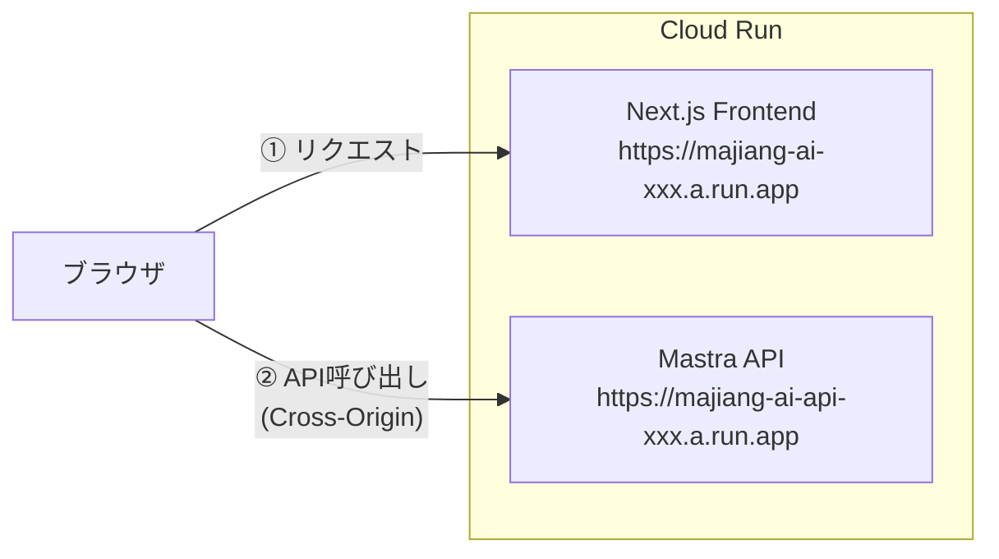
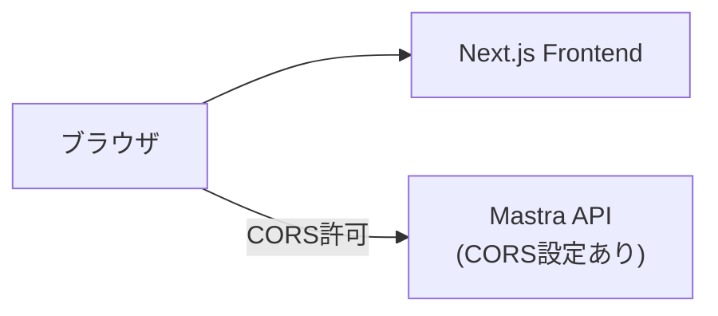
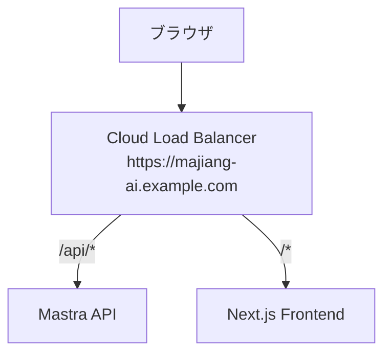
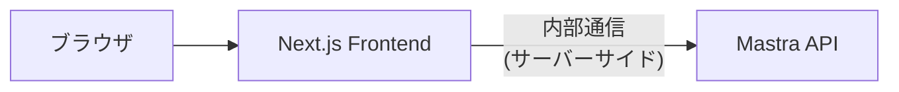
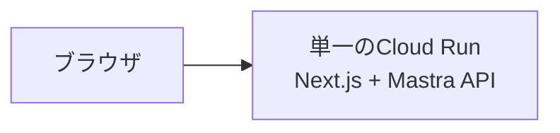
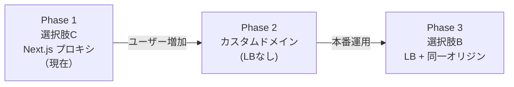

# Cloud Run間通信のCORS戦略

## 概要

Next.js Frontend と Mastra API は別々の Cloud Run サービスとしてデプロイされるため、異なるオリジン間の通信となり、CORS（Cross-Origin Resource Sharing）の設定が必要になる。

本ドキュメントでは、CORS問題を解決するための選択肢を比較検討する。

## 前提



- UI と API は**異なる URL**（異なるオリジン）
- ブラウザから直接 API を呼び出すと CORS エラーが発生

---

## 選択肢

### 選択肢 A: API側でCORS設定



**実装例:**

```typescript
// Mastra API側
import cors from "cors";

app.use(
  cors({
    origin: [
      "https://majiang-ai-xxx.a.run.app",
      "http://localhost:3000", // 開発用
    ],
    credentials: true,
  })
);
```

| メリット | デメリット |
|----------|------------|
| シンプルな実装 | 許可オリジンの管理が必要 |
| 追加インフラ不要 | デプロイごとにURLが変わる場合は設定更新が必要 |
| 直接通信で低レイテンシ | API が公開エンドポイントになる |

**注意点:**
- Cloud Run のURLは自動生成されるため、カスタムドメインを使わない場合は設定が煩雑になる可能性
- `credentials: true` の場合、ワイルドカード (`*`) は使用不可

---

### 選択肢 B: Cloud Load Balancer + カスタムドメイン



**構成:**
- 単一のカスタムドメイン（例: `majiang-ai.example.com`）
- パスベースルーティング:
  - `/api/*` → Mastra API
  - `/*` → Next.js Frontend
- 同一オリジンになるため CORS 不要

| メリット | デメリット |
|----------|------------|
| CORS 完全不要 | Cloud Load Balancer の追加コスト |
| 同一オリジンでセキュア | カスタムドメイン・SSL証明書が必要 |
| URLがシンプル | 設定が複雑（特に初回） |
| 将来的なスケールに対応 | DNS設定が必要 |

**コスト:**
- Cloud Load Balancer: 約 $18/月（最低）
- SSL証明書: 無料（Google管理の場合）

---

### 選択肢 C: Next.js API Routes でプロキシ



**実装例:**

```typescript
// frontend/app/api/mastra/[...path]/route.ts
import { NextRequest, NextResponse } from "next/server";

const MASTRA_API_URL = process.env.MASTRA_API_URL;

export async function POST(request: NextRequest) {
  const path = request.nextUrl.pathname.replace("/api/mastra", "");
  
  const response = await fetch(`${MASTRA_API_URL}${path}`, {
    method: "POST",
    headers: request.headers,
    body: await request.text(),
  });

  return NextResponse.json(await response.json());
}
```

**クライアント側:**

```typescript
// ブラウザからは同一オリジンのプロキシAPIを呼ぶ
const response = await fetch("/api/mastra/agents/majiangAnalysisAgent", {
  method: "POST",
  body: JSON.stringify({ messages }),
});
```

| メリット | デメリット |
|----------|------------|
| CORS 不要（同一オリジン） | レイテンシ増加（2ホップ） |
| API URL を隠せる | Next.js サーバーに負荷集中 |
| 追加インフラ不要 | プロキシコードのメンテナンス |
| 環境変数で内部URLを管理 | ストリーミング対応が複雑 |

**注意点:**
- Mastra の `/stream` エンドポイント（SSE）をプロキシする場合は追加実装が必要
- Cloud Run間の内部通信には認証トークン設定が必要な場合あり

---

### 選択肢 D: Cloud Run の同一サービス化（モノリス）



**構成:**
- Next.js と Mastra API を同一コンテナにまとめる
- 同一オリジンなので CORS 不要

| メリット | デメリット |
|----------|------------|
| CORS 完全不要 | デプロイが遅くなる（大きなイメージ） |
| 最もシンプルな構成 | スケーリングが非効率 |
| 通信オーバーヘッドなし | 関心の分離が難しい |
| コスト最小 | Mastra の独立デプロイができない |

---

## 比較表

| 観点 | A: API CORS | B: LB + ドメイン | C: プロキシ | D: モノリス |
|------|-------------|------------------|-------------|-------------|
| **実装難易度** | ◎ 簡単 | △ 複雑 | ○ 中程度 | ◎ 簡単 |
| **追加コスト** | ◎ なし | △ $18+/月 | ◎ なし | ◎ なし |
| **レイテンシ** | ◎ 最小 | ◎ 最小 | △ 増加 | ◎ 最小 |
| **セキュリティ** | ○ 公開API | ◎ 同一オリジン | ◎ API隠蔽 | ◎ 同一オリジン |
| **スケーラビリティ** | ◎ 独立スケール | ◎ 独立スケール | ○ UI依存 | △ 一体スケール |
| **ストリーミング対応** | ◎ 対応 | ◎ 対応 | △ 追加実装 | ◎ 対応 |
| **カスタムドメイン** | 不要 | 必要 | 不要 | 不要 |

---

## 推奨

### 短期（MVP・プロトタイプ）

**選択肢 C: Next.js API Routes でプロキシ** を推奨（2025年方針変更）

理由:
- API URL をクライアントに晒さない（`NEXT_PUBLIC_` 不要）
- Mastra 用のトークン・API Key をサーバー側だけで扱える（Secret Manager 等で実行時設定可能）
- 追加インフラ不要、CORS 不要（同一オリジン）
- ストリーミングはプロキシ側で中継する実装が必要（選択肢 C の注意点のとおり）

### 中長期（本番運用）

**選択肢 B: Cloud Load Balancer + カスタムドメイン** を検討

理由:
- 同一オリジンで最もセキュア
- ユーザーにとって分かりやすいURL
- 将来的なスケールに対応

---

## 決定事項

| 項目 | 決定 | 理由 |
|------|------|------|
| CORS戦略 | **選択肢 C: Next.js API Routes でプロキシ** | 下記参照 |

### 決定理由（2026/2/3方針変更）

当初は **選択肢 A: API側でCORS設定** を採用していたが、セキュリティ・運用の観点で **選択肢 C（プロキシ）** に変更した。

1. **API URL をクライアントに露出させない**
   - ブラウザから Mastra を直接叩くと `NEXT_PUBLIC_MASTRA_API_URL` がクライアントバンドルに埋め込まれ、誰でも URL を取得できる
   - プロキシにするとブラウザは同一オリジンの Next.js のみ叩くため、Mastra の URL はサーバー専用の `MASTRA_API_URL` でよい

2. **トークン・API Key を秘密にできる**
   - ブラウザから直接叩く場合、Mastra 用の認証トークンをブラウザに載せると漏れるため「秘密」にできない
   - Next.js 経由にすると、Mastra 用の API Key や IAM トークンはサーバー側だけで持ち、Secret Manager で実行時に渡せる

3. **追加インフラ不要**
   - Load Balancer（選択肢 B）はコストがかかるため、まずはプロキシで CORS 不要・API 隠蔽を実現する

4. **トレードオフ**
   - ストリーミング（`/stream`）をプロキシする場合は Next.js API Route で ReadableStream を中継する実装が必要
   - レイテンシは 2 ホップ分増加する

### 段階的アプローチ



| Phase | 構成 | 備考 |
|-------|------|------|
| **1（現在）** | Next.js API Route で Mastra をプロキシ。ブラウザは同一オリジンのみ。 | CORS 不要、API URL 隠蔽、Secret Manager で URL 管理可 |
| 2 | カスタムドメイン（LBなし） | ドメイン代のみ |
| 3 | LB + 同一オリジン | $18+/月 |

---

## 次のステップ（選択肢 C 採用時）

- [x] CORS戦略を決定 → **選択肢C（Next.js API Routes でプロキシ）**
- [x] Next.js に Mastra 用プロキシ API Route を追加（`/api/agents/[...path]/route.ts`。generate と stream を body パイプで中継）
- [x] フロントの `getBaseUrl()` を `""` にし、同一オリジン（`/api/agents/...`）呼び出しに変更
- [x] 環境変数 `MASTRA_API_URL`（サーバー専用）を Next.js に設定（.env.local / Secret Manager）
- [ ] ローカルで Next + Mastra を起動し、ストリーミング（ReadableStream 中継）の動作確認
