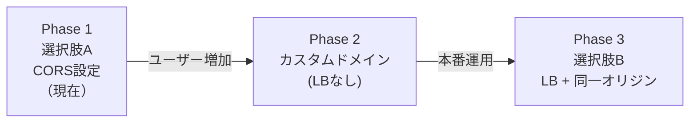

# Cloud Run間通信のCORS戦略

## 概要

Next.js Frontend と Mastra API は別々の Cloud Run サービスとしてデプロイされるため、異なるオリジン間の通信となり、CORS（Cross-Origin Resource Sharing）の設定が必要になる。

本ドキュメントでは、CORS問題を解決するための選択肢を比較検討する。

## 前提


- UI と API は**異なる URL**（異なるオリジン）
- ブラウザから直接 API を呼び出すと CORS エラーが発生

---

## 選択肢

### 選択肢 A: API側でCORS設定


**実装例:**

```typescript
// Mastra API側
import cors from "cors";

app.use(
  cors({
    origin: [
      "https://majiang-ai-xxx.a.run.app",
      "http://localhost:3000", // 開発用
    ],
    credentials: true,
  })
);
```

| メリット | デメリット |
|----------|------------|
| シンプルな実装 | 許可オリジンの管理が必要 |
| 追加インフラ不要 | デプロイごとにURLが変わる場合は設定更新が必要 |
| 直接通信で低レイテンシ | API が公開エンドポイントになる |

**注意点:**
- Cloud Run のURLは自動生成されるため、カスタムドメインを使わない場合は設定が煩雑になる可能性
- `credentials: true` の場合、ワイルドカード (`*`) は使用不可

---

### 選択肢 B: Cloud Load Balancer + カスタムドメイン


**構成:**
- 単一のカスタムドメイン（例: `majiang-ai.example.com`）
- パスベースルーティング:
  - `/api/*` → Mastra API
  - `/*` → Next.js Frontend
- 同一オリジンになるため CORS 不要

| メリット | デメリット |
|----------|------------|
| CORS 完全不要 | Cloud Load Balancer の追加コスト |
| 同一オリジンでセキュア | カスタムドメイン・SSL証明書が必要 |
| URLがシンプル | 設定が複雑（特に初回） |
| 将来的なスケールに対応 | DNS設定が必要 |

**コスト:**
- Cloud Load Balancer: 約 $18/月（最低）
- SSL証明書: 無料（Google管理の場合）

---

### 選択肢 C: Next.js API Routes でプロキシ


**実装例:**

```typescript
// frontend/app/api/mastra/[...path]/route.ts
import { NextRequest, NextResponse } from "next/server";

const MASTRA_API_URL = process.env.MASTRA_API_URL;

export async function POST(request: NextRequest) {
  const path = request.nextUrl.pathname.replace("/api/mastra", "");
  
  const response = await fetch(`${MASTRA_API_URL}${path}`, {
    method: "POST",
    headers: request.headers,
    body: await request.text(),
  });

  return NextResponse.json(await response.json());
}
```

**クライアント側:**

```typescript
// ブラウザからは同一オリジンのプロキシAPIを呼ぶ
const response = await fetch("/api/mastra/agents/majiangAnalysisAgent", {
  method: "POST",
  body: JSON.stringify({ messages }),
});
```

| メリット | デメリット |
|----------|------------|
| CORS 不要（同一オリジン） | レイテンシ増加（2ホップ） |
| API URL を隠せる | Next.js サーバーに負荷集中 |
| 追加インフラ不要 | プロキシコードのメンテナンス |
| 環境変数で内部URLを管理 | ストリーミング対応が複雑 |

**注意点:**
- Mastra の `/stream` エンドポイント（SSE）をプロキシする場合は追加実装が必要
- Cloud Run間の内部通信には認証トークン設定が必要な場合あり

---

### 選択肢 D: Cloud Run の同一サービス化（モノリス）


**構成:**
- Next.js と Mastra API を同一コンテナにまとめる
- 同一オリジンなので CORS 不要

| メリット | デメリット |
|----------|------------|
| CORS 完全不要 | デプロイが遅くなる（大きなイメージ） |
| 最もシンプルな構成 | スケーリングが非効率 |
| 通信オーバーヘッドなし | 関心の分離が難しい |
| コスト最小 | Mastra の独立デプロイができない |

---

## 比較表

| 観点 | A: API CORS | B: LB + ドメイン | C: プロキシ | D: モノリス |
|------|-------------|------------------|-------------|-------------|
| **実装難易度** | ◎ 簡単 | △ 複雑 | ○ 中程度 | ◎ 簡単 |
| **追加コスト** | ◎ なし | △ $18+/月 | ◎ なし | ◎ なし |
| **レイテンシ** | ◎ 最小 | ◎ 最小 | △ 増加 | ◎ 最小 |
| **セキュリティ** | ○ 公開API | ◎ 同一オリジン | ◎ API隠蔽 | ◎ 同一オリジン |
| **スケーラビリティ** | ◎ 独立スケール | ◎ 独立スケール | ○ UI依存 | △ 一体スケール |
| **ストリーミング対応** | ◎ 対応 | ◎ 対応 | △ 追加実装 | ◎ 対応 |
| **カスタムドメイン** | 不要 | 必要 | 不要 | 不要 |

---

## 推奨

### 短期（MVP・プロトタイプ）

**選択肢 A: API側でCORS設定** を推奨

理由:
- 実装が最もシンプル
- 追加コストなし
- 後から他の選択肢に移行可能

### 中長期（本番運用）

**選択肢 B: Cloud Load Balancer + カスタムドメイン** を推奨

理由:
- 同一オリジンで最もセキュア
- ユーザーにとって分かりやすいURL
- 将来的なスケールに対応

---

## 決定事項

| 項目 | 決定 | 理由 |
|------|------|------|
| CORS戦略 | **選択肢 A: API側でCORS設定** | 下記参照 |

### 決定理由

1. **URLは再デプロイでも変わらない**
   - Cloud Run のURLはサービス削除しない限り固定
   - 開発中にURLが変わる心配なし

2. **API Keyで認証すれば公開エンドポイントでも問題ない**
   - Mastra API に認証を追加することでセキュリティ確保

3. **$300クレジットを有効活用できる**
   - Load Balancer の追加コスト（$18+/月）を節約
   - クレジットを Cloud Run / Vision API / Gemini API に集中

4. **後からいつでも移行可能**
   - ユーザーが増えてカスタムドメインが必要になったら Phase 2/3 に移行

### 段階的アプローチ



| Phase | 構成 | URL例 | 追加コスト |
|-------|------|-------|------------|
| **1（現在）** | CORS設定のみ | `xxx-abc123.a.run.app` | $0 |
| 2 | カスタムドメイン（LBなし） | `app.majiang-ai.com` / `api.majiang-ai.com` | ドメイン代のみ |
| 3 | LB + 同一オリジン | `majiang-ai.com` | $18+/月 |

---

## 実装メモ（選択肢 A を採用する場合）

### 1. Mastra API に CORS ミドルウェアを追加

```typescript
// mastra/src/server.ts または index.ts
import cors from "cors";

const allowedOrigins = [
  process.env.FRONTEND_URL || "https://majiang-ai-xxx.a.run.app",
  "http://localhost:3000", // 開発用
];

app.use(
  cors({
    origin: (origin, callback) => {
      // 同一オリジンからのリクエスト（originがundefined）は許可
      if (!origin || allowedOrigins.includes(origin)) {
        callback(null, true);
      } else {
        callback(new Error("Not allowed by CORS"));
      }
    },
    credentials: true,
  })
);
```

### 2. 環境変数の追加

**Mastra API:**

| 変数名 | 説明 | 例 |
|--------|------|-----|
| `FRONTEND_URL` | Frontend の URL | `https://majiang-ai-xxx.a.run.app` |

### 3. デプロイ順序

1. Mastra API をデプロイ → API URL を取得
2. Frontend をデプロイ → `NEXT_PUBLIC_MASTRA_API_URL` に API URL を設定
3. Mastra API の `FRONTEND_URL` を Frontend URL に更新

---

## 次のステップ

- [x] CORS戦略を決定 → **選択肢A（API側でCORS設定）**
- [ ] Mastra API に CORS ミドルウェアを追加
- [ ] 環境変数 `FRONTEND_URL` を設定
- [ ] 動作確認
