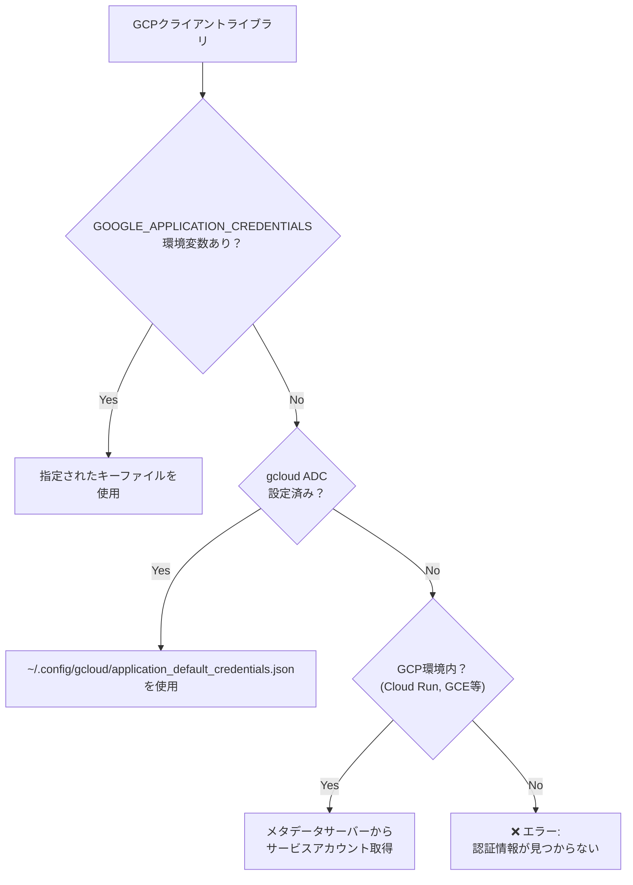

# Application Default Credentials (ADC)

## 概要

**ADC（Application Default Credentials）** は、GCP のクライアントライブラリが「どの認証情報を使うか」を自動的に決定する仕組みです。

開発者が認証コードを書かなくても、環境に応じて適切な認証情報が自動的に使われます。

---

## なぜ ADC が必要なのか

### 問題: 認証情報をどこに書くか？

GCP のサービス（Cloud Storage, Vision API など）にアクセスするには認証が必要です。

```typescript
// Cloud Storage にアクセスする例
import { Storage } from "@google-cloud/storage";

const storage = new Storage();  // ← ここで認証が必要
await storage.bucket("majiang-ai-images").getFiles();
```

しかし、認証情報の管理には問題があります：

| 方法 | 問題点 |
|------|--------|
| コードに直接書く | ❌ セキュリティリスク（GitHubに漏洩） |
| 環境変数で渡す | △ 管理が面倒、環境ごとに設定が必要 |
| キーファイルを使う | △ ファイル管理が必要、漏洩リスク |

### 解決: ADC による自動認証

ADC を使うと、**環境に応じて自動的に認証情報が選ばれます**：

```typescript
// ADC を使う場合（認証コード不要）
const storage = new Storage();  // ← 自動的に認証される
```

| 環境 | ADC が使う認証情報 |
|------|-------------------|
| ローカル開発 | `gcloud auth application-default login` で設定した認証 |
| Cloud Run | サービスに紐づけたサービスアカウント |
| GCE（VM） | VMに紐づけたサービスアカウント |
| Cloud Functions | 関数に紐づけたサービスアカウント |

---

## ADC がないとどうなるか

### エラー例

ADC を設定せずに GCP クライアントライブラリを使うと、以下のようなエラーが発生します：

```
Error: Could not load the default credentials.
Browse to https://cloud.google.com/docs/authentication/getting-started
for more information.
```

または：

```
Error: The request had invalid authentication credentials.
Expected OAuth 2 access token, login cookie or other valid authentication credential.
```

### 具体的な影響

| 機能 | ADC なし | ADC あり |
|------|---------|---------|
| Cloud Storage アクセス | ❌ 認証エラー | ✅ 動作 |
| Cloud Vision API 呼び出し | ❌ 認証エラー | ✅ 動作 |
| ローカルでの開発 | ❌ 不可能 | ✅ 可能 |

---

## ADC の仕組み

### 認証情報の検索順序

ADC は以下の順序で認証情報を探します：



### 各環境での動作

#### 1. ローカル開発（gcloud ADC 設定後）

```bash
# ADC を設定
gcloud auth application-default login
```

実行すると：
1. ブラウザが開き、Googleアカウントでログイン
2. 認証情報が `~/.config/gcloud/application_default_credentials.json` に保存
3. GCPクライアントライブラリがこのファイルを自動的に読み込む

#### 2. Cloud Run（本番環境）

```bash
# デプロイ時にサービスアカウントを指定
gcloud run deploy majiang-ai-api \
  --service-account majiang-ai-sa@majiang-ai-beta.iam.gserviceaccount.com
```

Cloud Run 内では：
1. GCPのメタデータサーバーが自動的にトークンを提供
2. サービスアカウントの権限で認証される
3. **設定不要で自動的に動作**

---

## ローカル開発での設定方法

### ステップ 1: ADC を設定

```bash
gcloud auth application-default login
```

実行すると：
1. ブラウザが開く
2. Googleアカウントを選択してログイン
3. 「Google Auth Library」へのアクセスを許可

### ステップ 2: 確認

```bash
# トークンが取得できることを確認
gcloud auth application-default print-access-token
```

長いトークン文字列が表示されれば成功です。

### ステップ 3: 認証情報ファイルの確認

```bash
# macOS/Linux
cat ~/.config/gcloud/application_default_credentials.json

# Windows
type %APPDATA%\gcloud\application_default_credentials.json
```

以下のような JSON が保存されています：

```json
{
  "client_id": "764086051850-xxxxxxxxxx.apps.googleusercontent.com",
  "client_secret": "xxxxxx",
  "refresh_token": "1//xxxxxxxxxx",
  "type": "authorized_user"
}
```

---

## `gcloud auth login` との違い

よくある混乱ポイントです：

| コマンド | 用途 | 認証対象 |
|----------|------|----------|
| `gcloud auth login` | gcloud CLI 自体の認証 | gcloud コマンド |
| `gcloud auth application-default login` | アプリケーションの認証 | GCPクライアントライブラリ |

### 具体例

```bash
# これだけでは不十分
gcloud auth login  # ← gcloud コマンドは使えるが...

# Node.js アプリを実行
npm run dev
# → エラー: Could not load the default credentials

# ADC も設定が必要
gcloud auth application-default login  # ← これでアプリも動く
```

---

## プロジェクト指定

ADC を設定する際、どのプロジェクトの権限を使うかを指定できます：

```bash
# プロジェクトを指定して ADC を設定
gcloud auth application-default login --project=majiang-ai-beta

# または、環境変数で指定
export GOOGLE_CLOUD_PROJECT=majiang-ai-beta
```

これにより、コード内で明示的にプロジェクトIDを指定しなくても動作します：

```typescript
// プロジェクトIDを省略可能
const storage = new Storage();  // majiang-ai-beta が自動的に使われる
```

---

## よくあるトラブルと解決法

### 1. 「Could not load the default credentials」

**原因**: ADC が設定されていない

**解決**:
```bash
gcloud auth application-default login
```

### 2. 「Permission denied」（権限エラー）

**原因**: ADC は設定されているが、必要な権限がない

**解決**: IAM で権限を付与（ローカルでは自分のアカウントに権限が必要）

```bash
# 自分のアカウントに Storage の権限を付与
gcloud projects add-iam-policy-binding majiang-ai-beta \
  --member="user:your-email@gmail.com" \
  --role="roles/storage.objectViewer"
```

### 3. 「Quota exceeded」（クォータ超過）

**原因**: ADC で使用しているアカウントの API 呼び出し制限に達した

**解決**: 
- 時間をおいて再試行
- クォータの引き上げをリクエスト

### 4. 複数プロジェクトでの混乱

**原因**: 別プロジェクトの ADC が設定されている

**解決**:
```bash
# 現在の設定を確認
gcloud auth application-default print-access-token

# プロジェクトを指定して再設定
gcloud auth application-default login --project=majiang-ai-beta
```

---

## セキュリティ上の注意

### 1. ADC ファイルを Git にコミットしない

```bash
# .gitignore に追加（通常は不要、ホームディレクトリにあるため）
application_default_credentials.json
```

### 2. 本番環境ではキーファイルを使わない

```bash
# ❌ 非推奨: キーファイルを作成してアプリに埋め込む
gcloud iam service-accounts keys create key.json \
  --iam-account=majiang-ai-sa@majiang-ai-beta.iam.gserviceaccount.com
```

代わりに Cloud Run のサービスアカウント機能を使用：

```bash
# ✅ 推奨: サービスアカウントを指定してデプロイ
gcloud run deploy majiang-ai-api \
  --service-account majiang-ai-sa@majiang-ai-beta.iam.gserviceaccount.com
```

### 3. 定期的に認証情報を更新

```bash
# ADC をリフレッシュ（トークンの有効期限切れ対策）
gcloud auth application-default login
```

---

## まとめ

| 環境 | 認証方法 | 設定コマンド |
|------|----------|-------------|
| **ローカル開発** | ADC（個人アカウント） | `gcloud auth application-default login` |
| **Cloud Run** | サービスアカウント | `--service-account` オプション |
| **CI/CD** | サービスアカウントキー | `GOOGLE_APPLICATION_CREDENTIALS` 環境変数 |

ADC を使うことで、**同じコードがローカルでも本番でも動作する**ようになります。

---

## 参考リンク

- [Application Default Credentials の仕組み](https://cloud.google.com/docs/authentication/application-default-credentials)
- [gcloud auth application-default](https://cloud.google.com/sdk/gcloud/reference/auth/application-default)
- [認証のベストプラクティス](https://cloud.google.com/docs/authentication/best-practices-applications)
