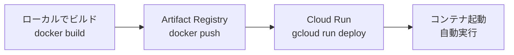

# Cloud Run と Docker の仕組み

## 概要

このドキュメントでは、Cloud RunにDockerイメージをデプロイする際の技術的な仕組みと、よくある疑問について説明します。

---

## 1. Docker のプラットフォーム指定（`--platform`）

### なぜ `--platform linux/amd64` が必要なのか

#### 問題: アーキテクチャの不一致

```bash
# ❌ エラーが発生する例
docker build -f mastra/Dockerfile -t my-image:latest .
docker push my-image:latest
# Cloud Runで実行 → "exec format error"
```

**原因**: ローカル環境（Apple Silicon Mac）とCloud Runのアーキテクチャが異なるため

| 環境                             | アーキテクチャ  | 説明                          |
| -------------------------------- | --------------- | ----------------------------- |
| **Apple Silicon Mac** (M1/M2/M3) | ARM64 (aarch64) | Appleの独自チップ             |
| **Intel Mac**                    | x86_64 (amd64)  | Intel/AMDプロセッサ           |
| **Cloud Run**                    | x86_64 (amd64)  | Googleのサーバー（Intel互換） |

#### 解決策: プラットフォームを明示的に指定

```bash
# ✅ 正しい方法
docker build --platform linux/amd64 \
  -f mastra/Dockerfile \
  -t my-image:latest .
```

**`--platform linux/amd64` の意味**:

- `linux`: OS（Linux）
- `amd64`: CPUアーキテクチャ（x86_64互換）

これにより、Cloud Runが実行できるx86_64アーキテクチャのイメージがビルドされます。

### アーキテクチャの違いによる影響

#### 1. バイナリの互換性

```
ARM64バイナリ → x86_64環境で実行 → ❌ "exec format error"
x86_64バイナリ → x86_64環境で実行 → ✅ 正常動作
```

**具体例**:

- Node.jsのバイナリはアーキテクチャごとに異なる
- ネイティブモジュール（C++で書かれたnpmパッケージ）もアーキテクチャ依存
- Dockerイメージ内のすべてのバイナリが一致している必要がある

#### 2. エミュレーション（QEMU）

`--platform linux/amd64`を指定すると、Dockerは**QEMU**というエミュレーターを使用してx86_64環境をシミュレートします：

```
Apple Silicon Mac (ARM64)
  ↓
Docker + QEMU エミュレーション
  ↓
x86_64環境としてビルド
  ↓
Cloud Run (x86_64) で実行可能
```

**注意点**:

- エミュレーションを使用するため、ビルド時間が長くなる（2-3倍）
- ローカルでの実行も`--platform linux/amd64`を指定する必要がある

### ローカルでの動作確認

```bash
# ローカルで実行する場合もプラットフォームを指定
docker run --platform linux/amd64 -p 8080:8080 \
  -e PORT=8080 \
  -e GOOGLE_API_KEY="your-api-key" \
  my-image:latest
```

**理由**: Cloud Runと同じ環境（x86_64）でテストすることで、本番環境での問題を事前に発見できる

### まとめ

| 項目               | 説明                                                               |
| ------------------ | ------------------------------------------------------------------ |
| **なぜ必要か**     | ローカル（ARM64）とCloud Run（x86_64）のアーキテクチャが異なるため |
| **何をするか**     | x86_64互換のイメージをビルドする                                   |
| **どう実現するか** | QEMUエミュレーションを使用                                         |
| **デメリット**     | ビルド時間が長くなる                                               |

---

## 2. Cloud Run が Docker イメージを実行する仕組み

### デプロイフロー



### ステップ1: Artifact Registry へのプッシュ

```bash
# イメージをビルド
docker build --platform linux/amd64 -t my-image:latest .

# Artifact Registryにプッシュ
docker push asia-northeast1-docker.pkg.dev/majiang-ai-beta/majiang-ai-repo/my-image:latest
```

**何が起こるか**:

1. Dockerイメージが**レイヤー単位**でArtifact Registryにアップロードされる
2. イメージのメタデータ（タグ、サイズ、アーキテクチャなど）が保存される
3. Artifact Registryは**プライベートリポジトリ**として機能（認証が必要）

### ステップ2: Cloud Run へのデプロイ

```bash
gcloud run deploy my-service \
  --image asia-northeast1-docker.pkg.dev/majiang-ai-beta/majiang-ai-repo/my-image:latest \
  --region asia-northeast1
```

**何が起こるか**:

1. **イメージの取得**
   - Cloud RunがArtifact Registryからイメージを取得
   - イメージのメタデータを確認（アーキテクチャ、サイズなど）

2. **新しいリビジョンの作成**
   - Cloud Runが新しい**リビジョン**（バージョン）を作成
   - リビジョンにはイメージのURL、環境変数、リソース設定などが含まれる

3. **コンテナの起動**
   - Cloud Runがコンテナを起動
   - イメージ内の`CMD`または`ENTRYPOINT`で指定されたコマンドを実行
   - 例: `CMD ["npm", "start"]` → `npm start`が実行される

4. **ヘルスチェック**
   - Cloud Runが指定されたポート（デフォルト: 8080）でリッスンしているか確認
   - ヘルスチェックが成功すると、トラフィックがルーティングされる

### なぜ「プッシュしたら動く」のか

#### 1. イメージは自己完結型

Dockerイメージには以下がすべて含まれています：

```
Dockerイメージ
├── OSレイヤー（Alpine Linuxなど）
├── ランタイム（Node.jsなど）
├── アプリケーションコード
├── 依存関係（node_modulesなど）
└── 起動コマンド（CMD ["npm", "start"]）
```

**つまり**: Cloud Runはイメージを取得して実行するだけで、追加のセットアップは不要

#### 2. Cloud Run の自動化

Cloud Runは以下の処理を**自動的に**行います：

| 処理                   | 説明                                      |
| ---------------------- | ----------------------------------------- |
| **イメージの取得**     | Artifact Registryから自動的にダウンロード |
| **コンテナの起動**     | イメージを基にコンテナを起動              |
| **ネットワーク設定**   | ポート8080を自動的に公開                  |
| **ロードバランシング** | 複数のインスタンス間でトラフィックを分散  |
| **スケーリング**       | リクエスト数に応じて自動的にスケール      |

#### 3. 実行環境の統一

```
ローカル環境:
  Docker Desktop (x86_64エミュレーション)
  ↓
Cloud Run環境:
  Googleのインフラ (x86_64)
```

**同じアーキテクチャ（x86_64）**で実行されるため、ローカルで動作すればCloud Runでも動作します。

### イメージの更新とデプロイ

```bash
# 1. 新しいイメージをビルド・プッシュ
docker build --platform linux/amd64 -t my-image:v2 .
docker push asia-northeast1-docker.pkg.dev/.../my-image:v2

# 2. Cloud Runを更新（新しいイメージを指定）
gcloud run deploy my-service \
  --image asia-northeast1-docker.pkg.dev/.../my-image:v2

# 3. Cloud Runが自動的に:
#    - 新しいリビジョンを作成
#    - 新しいコンテナを起動
#    - ヘルスチェックを実行
#    - 成功したらトラフィックを新しいリビジョンに切り替え
```

**重要なポイント**:

- イメージをプッシュしただけでは、既存のサービスは更新されない
- `gcloud run deploy`を実行して、新しいイメージを指定する必要がある
- Cloud Runは**ゼロダウンタイムデプロイ**をサポート（新しいリビジョンが準備できてから切り替え）

### イメージの保存場所

```
Artifact Registry
└── majiang-ai-repo/
    └── majiang-ai-api/
        ├── latest (タグ)
        ├── v1.0.0 (タグ)
        └── v1.0.1 (タグ)
```

**特徴**:

- **バージョン管理**: 同じイメージに複数のタグを付与可能
- **履歴保持**: 過去のイメージも保持される（削除するまで）
- **アクセス制御**: IAMでアクセス権限を管理

### まとめ

| 質問                           | 回答                                                                      |
| ------------------------------ | ------------------------------------------------------------------------- |
| **なぜプッシュしたら動くのか** | イメージに必要なものがすべて含まれており、Cloud Runが自動的に実行するため |
| **どこに保存されるか**         | Artifact Registry（GCPのプライベートリポジトリ）                          |
| **どう実行されるか**           | Cloud Runがイメージを取得し、コンテナを起動して`CMD`を実行                |
| **更新はどうするか**           | 新しいイメージをプッシュして、`gcloud run deploy`で更新                   |

---

## 参考リンク

- [Docker マルチプラットフォームビルド](https://docs.docker.com/build/building/multi-platform/)
- [Cloud Run の仕組み](https://cloud.google.com/run/docs/overview/what-is-cloud-run)
- [Artifact Registry の概要](https://cloud.google.com/artifact-registry/docs/overview)
- [Cloud Run のデプロイ](https://cloud.google.com/run/docs/deploying)
