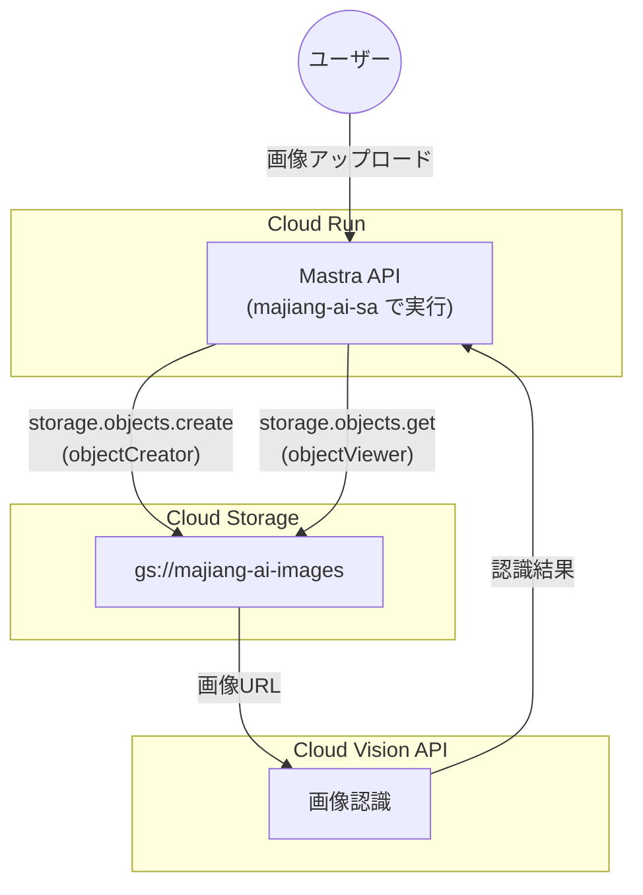

# IAM サービスアカウント設定

## 概要

このドキュメントでは、majiang-ai プロジェクトで使用するGCPのIAM（Identity and Access Management）サービスアカウントについて説明します。

---

## サービスアカウントとは

**サービスアカウント**は、人間ではなくアプリケーションやサービスが使用する特別なGoogleアカウントです。

### 通常のユーザーアカウントとの違い

| 項目 | ユーザーアカウント | サービスアカウント |
|------|-------------------|-------------------|
| 使用者 | 人間 | アプリケーション/サービス |
| 認証方法 | パスワード/OAuth | キーファイル/Workload Identity |
| 用途 | コンソール操作、開発 | 自動化、本番サービス |
| セキュリティ | MFA推奨 | 最小権限の原則 |

### なぜ必要か

1. **セキュリティ**: 個人のアカウント情報をアプリに埋め込まずに済む
2. **最小権限**: 必要最小限の権限だけを付与できる
3. **監査**: サービスごとにアクセスログを追跡できる
4. **自動化**: CI/CDパイプラインやCloud Runで自動認証

---

## 作成したサービスアカウント

### 基本情報

| 項目 | 値 |
|------|-----|
| **名前** | `majiang-ai-sa` |
| **メールアドレス** | `majiang-ai-sa@majiang-ai-beta.iam.gserviceaccount.com` |
| **用途** | Cloud Run サービスがGCPリソースにアクセスするため |

### 作成コマンド

```bash
gcloud iam service-accounts create majiang-ai-sa \
  --display-name="Majiang AI Service Account"
```

---

## 付与したロール

### roles/storage.objectViewer

**目的**: Cloud Storage からファイルを読み取る

| 権限 | 説明 |
|------|------|
| `storage.objects.get` | オブジェクト（ファイル）の取得 |
| `storage.objects.list` | バケット内のオブジェクト一覧取得 |

**使用場面**:
- Mastra API が Cloud Vision API に画像を渡す前に、GCS から画像を取得する
- 保存された手牌画像を読み込む

### roles/storage.objectCreator

**目的**: Cloud Storage にファイルを書き込む

| 権限 | 説明 |
|------|------|
| `storage.objects.create` | 新しいオブジェクトの作成 |

**使用場面**:
- ユーザーがアップロードした手牌画像を GCS に保存する
- 処理結果のキャッシュを保存する（将来）

### ロール付与コマンド

```bash
# 読み取り権限
gcloud projects add-iam-policy-binding majiang-ai-beta \
  --member="serviceAccount:majiang-ai-sa@majiang-ai-beta.iam.gserviceaccount.com" \
  --role="roles/storage.objectViewer"

# 書き込み権限
gcloud projects add-iam-policy-binding majiang-ai-beta \
  --member="serviceAccount:majiang-ai-sa@majiang-ai-beta.iam.gserviceaccount.com" \
  --role="roles/storage.objectCreator"
```

---

## アーキテクチャでの使われ方



### 処理フロー

1. **ユーザーが画像をアップロード**
   - フロントエンド → Mastra API → GCS

2. **Mastra API が画像を保存** (`objectCreator` ロール使用)
   ```typescript
   // GCS に画像を保存
   await bucket.file('images/shoupai-001.jpg').save(imageBuffer);
   ```

3. **Mastra API が画像を取得** (`objectViewer` ロール使用)
   ```typescript
   // GCS から画像を取得して Cloud Vision API に渡す
   const [imageData] = await bucket.file('images/shoupai-001.jpg').download();
   ```

4. **Cloud Vision API で認識**
   - GCS の URL (`gs://majiang-ai-images/...`) を直接渡すことも可能

---

## Cloud Run でのサービスアカウント設定

Cloud Run にデプロイする際、このサービスアカウントを指定します:

```bash
gcloud run deploy majiang-ai-api \
  --image gcr.io/majiang-ai-beta/majiang-ai-api \
  --region asia-northeast1 \
  --service-account majiang-ai-sa@majiang-ai-beta.iam.gserviceaccount.com
```

これにより、Cloud Run で動作するコンテナは自動的に `majiang-ai-sa` の権限でGCPリソースにアクセスできます。

---

## ローカル開発での認証

ローカル開発では、ADC（Application Default Credentials）を使用します:

```bash
# ローカルで認証
gcloud auth application-default login
```

これにより、ローカル環境では**自分のGoogleアカウント**の権限でGCPリソースにアクセスします。

### ローカル vs 本番の認証の違い

| 環境 | 認証方法 | 使用アカウント |
|------|----------|----------------|
| **ローカル開発** | `gcloud auth application-default login` | 開発者の個人アカウント |
| **Cloud Run（本番）** | 自動（Workload Identity） | `majiang-ai-sa` サービスアカウント |

---

## セキュリティのベストプラクティス

### 1. 最小権限の原則

必要最小限のロールのみを付与:
- ❌ `roles/storage.admin`（全権限）は使わない
- ✅ `roles/storage.objectViewer` + `objectCreator`（必要な権限のみ）

### 2. サービスアカウントキーは使わない

```bash
# ❌ 非推奨: キーファイルを作成してアプリに埋め込む
gcloud iam service-accounts keys create key.json \
  --iam-account=majiang-ai-sa@majiang-ai-beta.iam.gserviceaccount.com
```

代わりに:
- **Cloud Run**: 自動でWorkload Identityを使用
- **ローカル**: ADC (`gcloud auth application-default login`)

### 3. 定期的な権限レビュー

使われなくなったロールは削除:

```bash
# ロールを削除する場合
gcloud projects remove-iam-policy-binding majiang-ai-beta \
  --member="serviceAccount:majiang-ai-sa@majiang-ai-beta.iam.gserviceaccount.com" \
  --role="roles/storage.objectViewer"
```

---

## 将来の拡張

追加機能に応じて、以下のロールが必要になる可能性があります:

| 機能 | 必要なロール | 説明 |
|------|-------------|------|
| Cloud Logging | `roles/logging.logWriter` | ログの書き込み |
| Secret Manager | `roles/secretmanager.secretAccessor` | APIキーの安全な管理 |
| Cloud Pub/Sub | `roles/pubsub.publisher` | 非同期処理（将来） |

---

## 参考リンク

- [サービスアカウントの概要](https://cloud.google.com/iam/docs/service-account-overview)
- [IAM ロールの一覧](https://cloud.google.com/iam/docs/understanding-roles)
- [Cloud Storage のIAM](https://cloud.google.com/storage/docs/access-control/iam-roles)
- [Cloud Run でのサービスアカウント](https://cloud.google.com/run/docs/configuring/service-accounts)
