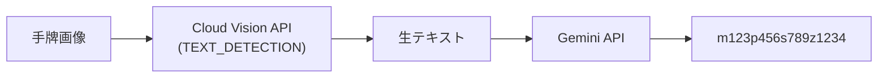
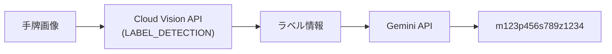
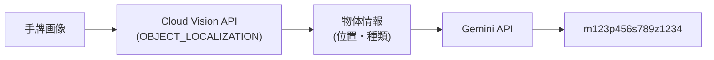
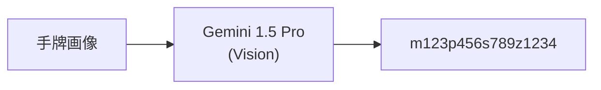
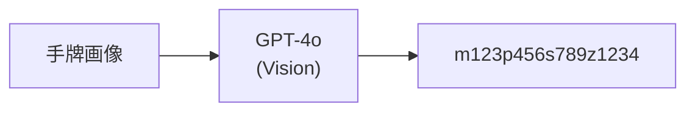
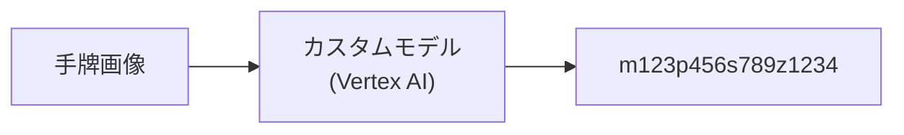

# 画像認識精度検証

## 概要

麻雀牌の画像認識において、どの手法が最も精度が高いかを検証する。
実際の手牌画像を使って各手法の認識精度を比較し、最適な実装方針を決定する。

## 検証対象の手法

### 手法 1: Cloud Vision API (OCR) + Gemini 整形



**概要:**
- Cloud Vision API の `TEXT_DETECTION`（OCR）で画像からテキストを抽出
- Gemini API で牌文字列（m123p456...）に整形

**想定される課題:**
- 麻雀牌の模様は「テキスト」ではないため、OCRでは認識できない可能性
- 数字牌（1〜9）は認識できるかもしれないが、字牌は難しい

---

### 手法 2: Cloud Vision API (ラベル検出) + Gemini 整形



**概要:**
- Cloud Vision API の `LABEL_DETECTION` で画像の内容を分類
- Gemini API で牌文字列に整形

**想定される課題:**
- 「麻雀牌」「ゲーム」などの一般的なラベルしか返さない可能性
- 個別の牌を識別できない可能性

---

### 手法 3: Cloud Vision API (物体検出) + Gemini 整形



**概要:**
- Cloud Vision API の `OBJECT_LOCALIZATION` で画像内の物体を検出
- 各牌の位置と種類を特定
- Gemini API で牌文字列に整形

**想定される課題:**
- 麻雀牌が学習データに含まれていない可能性
- 牌の種類（萬子・筒子・索子・字牌）まで識別できない可能性

---

### 手法 4: Gemini Vision（直接認識）



**概要:**
- Gemini 1.5 Pro に画像を直接入力
- プロンプトで牌認識を指示
- 1ステップで牌文字列を取得

**想定される利点:**
- 麻雀牌の知識を持っている可能性
- 1ステップでシンプル
- GCP統一でコスト効率良い

**想定される課題:**
- 認識精度が不明
- 牌の並び順が正確に取れるか不明

---

### 手法 5: OpenAI GPT-4o Vision



**概要:**
- OpenAI GPT-4o に画像を直接入力
- プロンプトで牌認識を指示

**想定される利点:**
- 高精度な画像認識
- 麻雀の知識を持っている可能性が高い

**想定される課題:**
- OpenAI API の追加コスト
- GCP以外のサービス依存

---

### 手法 6: カスタム機械学習モデル



**概要:**
- 麻雀牌の画像データセットを作成
- Vertex AI AutoML Vision または TensorFlow でモデルを学習
- 牌を個別に検出・分類

**想定される利点:**
- 最も高精度になる可能性
- 完全にカスタマイズ可能

**想定される課題:**
- 開発コストが高い
- 学習データの準備が必要
- 初期段階では現実的でない

---

## 検証計画

### Phase 1: テストデータの準備

- [ ] 手牌画像を10〜20枚収集
  - 様々な照明条件
  - 様々な角度
  - 様々な牌の組み合わせ
- [ ] 各画像の正解ラベル（牌文字列）を作成

### Phase 2: 各手法の実装

- [ ] 手法 1: Cloud Vision OCR + Gemini
- [ ] 手法 2: Cloud Vision ラベル検出 + Gemini
- [ ] 手法 3: Cloud Vision 物体検出 + Gemini
- [ ] 手法 4: Gemini Vision 直接
- [ ] 手法 5: GPT-4o Vision

### Phase 3: 精度評価

各手法について以下を測定:

| 指標 | 説明 |
|------|------|
| **牌単位正解率** | 14枚中何枚正しく認識できたか |
| **完全一致率** | 14枚すべて正しい画像の割合 |
| **レイテンシ** | 認識にかかる時間 |
| **コスト** | 1回あたりの API コスト |

### Phase 4: 結果分析・決定

- 精度・コスト・レイテンシのバランスで最適な手法を決定
- 必要に応じてフォールバック戦略を検討

---

## 検証結果

### テストデータ

| ID | 画像 | 正解ラベル | 備考 |
|----|------|------------|------|
| 1 | TODO | TODO | |
| 2 | TODO | TODO | |
| ... | | | |

### 手法 1: Cloud Vision OCR + Gemini

| ID | 認識結果 | 牌単位正解 | 完全一致 | 備考 |
|----|----------|------------|----------|------|
| 1 | TODO | /14 | ✅/❌ | |
| 2 | TODO | /14 | ✅/❌ | |

**平均精度:** TODO  
**レイテンシ:** TODO  
**コスト:** TODO

---

### 手法 2: Cloud Vision ラベル検出 + Gemini

| ID | 認識結果 | 牌単位正解 | 完全一致 | 備考 |
|----|----------|------------|----------|------|
| 1 | TODO | /14 | ✅/❌ | |
| 2 | TODO | /14 | ✅/❌ | |

**平均精度:** TODO  
**レイテンシ:** TODO  
**コスト:** TODO

---

### 手法 3: Cloud Vision 物体検出 + Gemini

| ID | 認識結果 | 牌単位正解 | 完全一致 | 備考 |
|----|----------|------------|----------|------|
| 1 | TODO | /14 | ✅/❌ | |
| 2 | TODO | /14 | ✅/❌ | |

**平均精度:** TODO  
**レイテンシ:** TODO  
**コスト:** TODO

---

### 手法 4: Gemini Vision 直接

| ID | 認識結果 | 牌単位正解 | 完全一致 | 備考 |
|----|----------|------------|----------|------|
| 1 | TODO | /14 | ✅/❌ | |
| 2 | TODO | /14 | ✅/❌ | |

**平均精度:** TODO  
**レイテンシ:** TODO  
**コスト:** TODO

---

### 手法 5: GPT-4o Vision

| ID | 認識結果 | 牌単位正解 | 完全一致 | 備考 |
|----|----------|------------|----------|------|
| 1 | TODO | /14 | ✅/❌ | |
| 2 | TODO | /14 | ✅/❌ | |

**平均精度:** TODO  
**レイテンシ:** TODO  
**コスト:** TODO

---

## 比較サマリー

| 手法 | 平均精度 | レイテンシ | コスト/回 | 総合評価 |
|------|----------|------------|-----------|----------|
| 1: OCR + Gemini | TODO | TODO | TODO | |
| 2: ラベル + Gemini | TODO | TODO | TODO | |
| 3: 物体検出 + Gemini | TODO | TODO | TODO | |
| 4: Gemini直接 | TODO | TODO | TODO | |
| 5: GPT-4o | TODO | TODO | TODO | |

---

## 決定事項

| 項目 | 決定 | 理由 |
|------|------|------|
| 採用手法 | **TODO: 決定** | |
| フォールバック | **TODO: 決定** | |

---

## 実装サンプル

### 手法 4: Gemini Vision 直接

```typescript
import { GoogleGenerativeAI } from "@google/generative-ai";
import * as fs from "fs";

const genAI = new GoogleGenerativeAI(process.env.GOOGLE_API_KEY!);

async function recognizeTiles(imagePath: string): Promise<string> {
  const model = genAI.getGenerativeModel({ model: "gemini-1.5-pro" });

  const imageData = fs.readFileSync(imagePath);
  const base64Image = imageData.toString("base64");

  const prompt = `
    この画像は麻雀の手牌（14枚）です。
    左から順に各牌を認識し、以下の形式で出力してください:
    
    形式:
    - 萬子: m + 数字（例: m1 = 一萬, m9 = 九萬）
    - 筒子: p + 数字（例: p1 = 一筒, p9 = 九筒）
    - 索子: s + 数字（例: s1 = 一索, s9 = 九索）
    - 字牌: z + 数字（1=東, 2=南, 3=西, 4=北, 5=白, 6=發, 7=中）
    
    出力例: m123p456s789z1234
    
    牌文字列のみを出力してください。説明は不要です。
  `;

  const result = await model.generateContent([
    prompt,
    {
      inlineData: {
        mimeType: "image/jpeg",
        data: base64Image,
      },
    },
  ]);

  return result.response.text().trim();
}
```

---

## 次のステップ

- [ ] テスト画像の収集
- [ ] 正解ラベルの作成
- [ ] 各手法の実装
- [ ] 精度検証の実施
- [ ] 結果に基づき採用手法を決定
- [ ] image-to-paipu-design.md を更新
