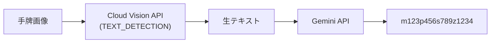
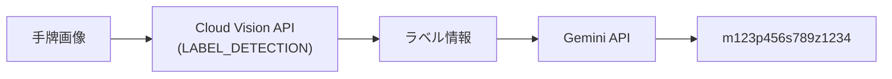
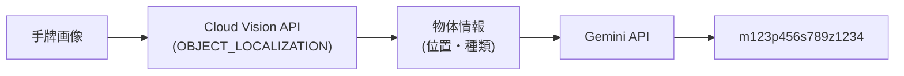
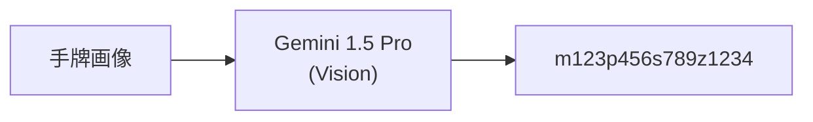
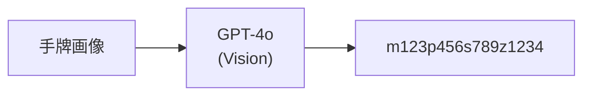
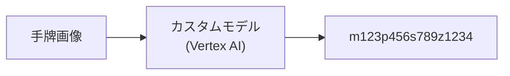

# 画像認識精度検証

## 概要

麻雀牌の画像認識において、どの手法が最も精度が高いかを検証する。
実際の手牌画像を使って各手法の認識精度を比較し、最適な実装方針を決定する。

## 検証対象の手法

### 手法 1: Cloud Vision API (OCR) + Gemini 整形

**概要:**
- Cloud Vision API の `TEXT_DETECTION`（OCR）で画像からテキストを抽出
- Gemini API で牌文字列（m123p456...）に整形

**想定される課題:**
- 麻雀牌の模様は「テキスト」ではないため、OCRでは認識できない可能性
- 数字牌（1〜9）は認識できるかもしれないが、字牌は難しい

---

### 手法 2: Cloud Vision API (ラベル検出) + Gemini 整形

**概要:**
- Cloud Vision API の `LABEL_DETECTION` で画像の内容を分類
- Gemini API で牌文字列に整形

**想定される課題:**
- 「麻雀牌」「ゲーム」などの一般的なラベルしか返さない可能性
- 個別の牌を識別できない可能性

---

### 手法 3: Cloud Vision API (物体検出) + Gemini 整形

**概要:**
- Cloud Vision API の `OBJECT_LOCALIZATION` で画像内の物体を検出
- 各牌の位置と種類を特定
- Gemini API で牌文字列に整形

**想定される課題:**
- 麻雀牌が学習データに含まれていない可能性
- 牌の種類（萬子・筒子・索子・字牌）まで識別できない可能性

---

### 手法 4: Gemini Vision（直接認識）

**概要:**
- Gemini 1.5 Pro に画像を直接入力
- プロンプトで牌認識を指示
- 1ステップで牌文字列を取得

**想定される利点:**
- 麻雀牌の知識を持っている可能性
- 1ステップでシンプル
- GCP統一でコスト効率良い

**想定される課題:**
- 認識精度が不明
- 牌の並び順が正確に取れるか不明

---

### 手法 5: OpenAI GPT-4o Vision

**概要:**
- OpenAI GPT-4o に画像を直接入力
- プロンプトで牌認識を指示

**想定される利点:**
- 高精度な画像認識
- 麻雀の知識を持っている可能性が高い

**想定される課題:**
- OpenAI API の追加コスト
- GCP以外のサービス依存

---

### 手法 6: カスタム機械学習モデル

**概要:**
- 麻雀牌の画像データセットを作成
- Vertex AI AutoML Vision または TensorFlow でモデルを学習
- 牌を個別に検出・分類

**想定される利点:**
- 最も高精度になる可能性
- 完全にカスタマイズ可能

**想定される課題:**
- 開発コストが高い
- 学習データの準備が必要
- 初期段階では現実的でない

---

## 検証計画

### Phase 1: テストデータの準備
まず手牌のみの写真を用意する。その精度を確認する。なのでテストデータは手牌のみの写真に切り取って、それの精度を見る

- [x] 手牌画像を10〜20枚収集
  - 様々な照明条件
  - 様々な角度
  - 様々な牌の組み合わせ
- [x] 各画像の正解ラベル（牌文字列）を作成

### Phase 2: 各手法の実装

- [ ] 手法 1: Cloud Vision OCR + Gemini
- [ ] 手法 2: Cloud Vision ラベル検出 + Gemini
- [ ] 手法 3: Cloud Vision 物体検出 + Gemini
- [x] 手法 4: Gemini Vision 直接
- [x] 手法 5: GPT-4o Vision
- [x] 手法 6: GPT-5.2 Vision
- [x] 手法 7: Gemini 3.0 Vision

### Phase 3: 精度評価

各手法について以下を測定:

| 指標 | 説明 |
|------|------|
| **牌単位正解率** | 14枚中何枚正しく認識できたか |
| **完全一致率** | 14枚すべて正しい画像の割合 |
| **レイテンシ** | 認識にかかる時間 |
| **コスト** | 1回あたりの API コスト |

### Phase 4: 結果分析・決定

- 精度・コスト・レイテンシのバランスで最適な手法を決定
- 必要に応じてフォールバック戦略を検討

---

## 検証結果

### 手法 1: Cloud Vision OCR + Gemini

| ID | 認識結果 | 牌単位正解 | 完全一致 | 備考 |
|----|----------|------------|----------|------|
| 1 | TODO | /14 | ✅/❌ | |
| 2 | TODO | /14 | ✅/❌ | |

**平均精度:** TODO  
**レイテンシ:** TODO  
**コスト:** TODO

---

### 手法 2: Cloud Vision ラベル検出 + Gemini

| ID | 認識結果 | 牌単位正解 | 完全一致 | 備考 |
|----|----------|------------|----------|------|
| 1 | TODO | /14 | ✅/❌ | |
| 2 | TODO | /14 | ✅/❌ | |

**平均精度:** TODO  
**レイテンシ:** TODO  
**コスト:** TODO

---

### 手法 3: Cloud Vision 物体検出 + Gemini

| ID | 認識結果 | 牌単位正解 | 完全一致 | 備考 |
|----|----------|------------|----------|------|
| 1 | TODO | /14 | ✅/❌ | |
| 2 | TODO | /14 | ✅/❌ | |

**平均精度:** TODO  
**レイテンシ:** TODO  
**コスト:** TODO

---

### 手法 4: Gemini Vision 直接

- スクリーンショットの精度
| 手牌写真 | 期待する結果 | 認識結果 | 牌単位正解 | 完全一致 | 備考 |
|----|----------|----------|------------|----------|------|
| [virtual01](./images/virtual/01.jpg) | m12345p56s3490z22 | m12345z22p999 | 7/14 | ❌ | そもそも10枚しか認識できていない。萬子と字牌は認識出ているが、それ以外はだめ |
| [virtual02](./images/virtual/02.png) | m11124779p8s5z67 | m11124779p8s5z6 | 12/13 | ❌ |  |
| [virtual03](./images/virtual/03.png) | m6p113456790s5z456 | m6p113456790s5z456 | 8/14 | ❌ | 白は認識できないのはもちろん、pも認識できない |
| [virtual04](./images/virtual/04.png) | m4p46s123456680z24 | m4p222s11223344z24 | 7/14 | ❌ | pもsもだめ |
| [virtual05](./images/virtual/05.png) | m2358p348s190z2256 | m2308p466s234z226 | 7/14 | ❌ | pもsもだめ、白が認識できない。赤5ｍと黒5ｍが混同している |

- 対面の精度
| 手牌写真 | 期待する結果 | 認識結果 | 牌単位正解 | 完全一致 | 備考 |
|----|----------|----------|------------|----------|------|
| [real01](./images/real/01.png) | m12345s3490p56z22 | m234567789p0p5s2 | 9/14 | ❌ | sが認識できない、pもあやしい、0m以外はいけそう |
| [real02](./images/real/02.png) | m67s34455660p456 | m67m222m5555p33p0 | 2/14 | ❌ | 索子を萬子だと認識しだした |
| [real03](./images/real/03.png) | m234p12233456z44 | m234p12355678z44 | 10/14 | ❌ |  |
| [real04](./images/real/04.png) | m79p23s4699z12457 | m1111222233p30z12755 | 4/14 | ❌ | 17枚に認識している。架空の萬子を認識している。字牌も逆向きだからか精度が悪い。 |
| [real05](./images/real/05.png) | m2356p3444588s46 | p555088m1234566 | 8/14 | ❌ | 筒子の3456が認識できない。 |

**平均精度:**
- スクリーンショット（5枚）: 41/69 ≒ **59.4%**（7+12+8+7+7、virtual02 は 13 枚手牌）
- 対面（5枚）: 33/70 ≒ **47.1%**（9+2+10+4+8）
- **全体（10枚）: 74/139 ≒ 53.2%**
- 完全一致: 0/10

**レイテンシ:**
- 体感3~5秒ぐらい

**コスト:** TODO

---

### 手法 5: GPT-4o Vision

- **呼び出し**: `POST /api/agents/imageRecognitionGpt4oAgent/generate`、body は `{ "messages": [{ "role": "user", "content": "gs://..." }] }`。要 `OPENAI_API_KEY`。
- **ツール**: `recognize-shoupai-from-gcs-gpt4o`（GCS 取得＋GPT-4o で画像認識）。プロンプト・抽出ロジックは手法 4 と共通（`shared.ts`）。

- スクリーンショットの精度
| 手牌写真 | 期待する結果 | 認識結果 | 牌単位正解 | 完全一致 | 備考 |
|----|----------|----------|------------|----------|------|
| [virtual01](./images/virtual/01.jpg) | m234677890p567s45 | m23456789p556s222 | 9/14 | ❌ | sが認識できない、pもあやしい、0m以外はいけそう |
| [virtual02](./images/virtual/02.png) | m11124779p8s5z67 | m11124779p5s33z6 | 12/13 | ❌ | 12枚しか認識できていない。白が認識できない。p、sが全然違う |
| [virtual03](./images/virtual/03.png) | m6p113456790s5z456 | m6p008p34p445566s5z47 | 7/14 | ❌ | 15枚認識している。pの間違いが多い。5sはあっている。 |
| [virtual04](./images/virtual/04.png) | m4p46s123456680z24 | m4p66s123345607z24 | 11/14 | ❌ |  |
| [virtual05](./images/virtual/05.png) | m2358p348s190z2256 | m2358p0p55s678z226 | 7/14 | ❌ | 白が認識できない。5mの区別はできている。 |

- 対面の精度
| 手牌写真 | 期待する結果 | 認識結果 | 牌単位正解 | 完全一致 | 備考 |
|----|----------|----------|------------|----------|------|
| [real01](./images/real/01.png) | m12345s3490p56z22 | m12345s223334p556 | 9/14 | ❌ | 字牌が認識できなくなっている |
| [real02](./images/real/02.png) | m67s34455660p456 | m678s555s0s677p234 | 7/14 | ❌ | s、ｐの区別ができていない |
| [real03](./images/real/03.png) | m234p12233456z44 | m2344p147799s99z44 | 8/14 | ❌ | 存在しない索子を認識している |
| [real04](./images/real/04.png) | m79p23s4699z12457 | s333444p115z12367 | 4/14 | ❌ |  |
| [real05](./images/real/05.png) | m2356p3444588s46 | p333p0p23444m23s6666 | 7/14 | ❌ | p適当すぎる |

**平均精度:**
- スクリーンショット（5枚）: 46/69 ≒ **66.7%**（9+12+7+11+7、virtual02 は 13 枚手牌）
- 対面（5枚）: 35/70 = **50.0%**（9+7+8+4+7）
- **全体（10枚）: 81/139 ≒ 58.3%**
- 完全一致: 0/10

**レイテンシ:** TODO  
**コスト:** TODO

---

## 最新モデルでの検証（GPT-5.2 / Gemini 3.0）

- **OpenAI 最新モデル**: [Using GPT-5.2 \| OpenAI API](https://platform.openai.com/docs/guides/latest-model#quickstart) — `gpt-5.2` はマルチモーダル（画像含む）対応。Vision は Chat Completions または Responses API で利用可能。
- **Gemini 最新モデル・料金**: [Gemini Developer API の料金](https://ai.google.dev/gemini-api/docs/pricing?hl=ja) — Gemini 3 Pro / 3 Flash など。画像入力は「テキスト/画像/動画」の入力単価で課金。

検証時は同一のテスト画像（手法 4・5 と同じ virtual01–05, real01–05）を使い、牌単位正解・完全一致・レイテンシ・コストを記録する。

---

### 手法 6: GPT-5.2 Vision

- **モデル**: `gpt-5.2`（または Mastra 上の `openai/gpt-5.2` 等、利用可能な ID に合わせる）
- **呼び出し**: ツール側で model を `gpt-5.2` に変更したエージェント、または `POST /api/agents/imageRecognitionGpt5Agent/generate` 等（実装に応じて記載）
- **参考**: [Latest: GPT-5.2](https://platform.openai.com/docs/guides/latest-model#quickstart)

- スクリーンショットの精度

| 手牌写真 | 期待する結果 | 認識結果 | 牌単位正解 | 完全一致 | 備考 |
|----|----------|----------|------------|----------|------|
| [virtual01](./images/virtual/01.jpg) | m234677890p567s45 | m134567789p236s1113 | 7/14 | ❌ | |
| [virtual02](./images/virtual/02.png) | m11124779p8s5z67 | m111147799p8s2z6 | 9/13 | ❌ | 2mと1ｍをまちがえた | |
| [virtual03](./images/virtual/03.png) | m6p113456790s5z456 | m6p115667789s5z4z6 | 9/14 | ❌ | pの56789が認識できない |
| [virtual04](./images/virtual/04.png) | m4p46s123456680z24 | m4p224s11222334445567z24 | 11/14 | ❌ | 20枚も認識しているので一見精度が高そうに見えるがそうではない。 |
| [virtual05](./images/virtual/05.png) | m2358p348s190z2256 | m2358p05s789z226 | 8/14 | ❌ | pもsもだめ。萬子と字牌は正しい |

- 対面の精度

| 手牌写真 | 期待する結果 | 認識結果 | 牌単位正解 | 完全一致 | 備考 |
|----|----------|----------|------------|----------|------|
| [real01](./images/real/01.png) | m12345s3490p56z22 | m12345s22355z22p44 | 9/14 | ❌ |  |
| [real02](./images/real/02.png) | m67s34455660p456 | z77s2222333344p44455 | 6/14 | ❌ | 適当に返している |
| [real03](./images/real/03.png) | m234p12233456z44 | m3334p1222455567z44 | 9/14 | ❌ | 萬子も間違えている |
| [real04](./images/real/04.png) | m79p23s4699z12457 | s111p235z14577 | 6/14 | ❌ | 索子はどんな間違いをするかわからないぐらい間違える |
| [real05](./images/real/05.png) | m2356p3444588s46 | p22256m22347s2222p11 | 3/14 | ❌ | |

**平均精度:**
- スクリーンショット（5枚）: 44/69 ≒ **63.8%**（7+9+9+11+8、virtual02 は 13 枚手牌）
- 対面（5枚）: 33/70 ≒ **47.1%**（9+6+9+6+3）
- **全体（10枚）: 77/139 ≒ 55.4%**
- 完全一致: 0/10

**レイテンシ:** TODO  
**コスト:** TODO（[OpenAI Pricing](https://platform.openai.com/docs/pricing) 参照）

---

### 手法 7: Gemini 3.0 Vision

- **モデル**: `gemini-3-flash-preview`（[料金ページ](https://ai.google.dev/gemini-api/docs/pricing?hl=ja)で利用可能なモデル ID を確認）
- **呼び出し**: ツール側で model を Gemini 3 系に変更したエージェント、または別エンドポイント（実装に応じて記載）
- **参考**: [Gemini Developer API の料金](https://ai.google.dev/gemini-api/docs/pricing?hl=ja)（Gemini 3 Pro / 3 Flash の入力・出力単価）

- スクリーンショットの精度

| 手牌写真 | 期待する結果 | 認識結果 | 牌単位正解 | 完全一致 | 備考 |
|----|----------|----------|------------|----------|------|
| [virtual01](./images/virtual/01.jpg) | m234677890p567s45 | m234067789p067s40 | 12/14 | ❌ | 赤5pと赤5sを間違えただけで |
| [virtual02](./images/virtual/02.png) | m11124779p8s5z56 | m11124779p8s5z56 | 12/12 | ✅| |
| [virtual03](./images/virtual/03.png) | m6p113456790s5z456 | m6p113450679s5z456 | 14/14 | ✅ | |
| [virtual04](./images/virtual/04.png) | m4p46s123456680z24 | m4p46s123400668z24 | 13/14 | ❌ | 黒5sと赤5ｓを間違えた |
| [virtual05](./images/virtual/05.png) | m2358p348s190z2256 | m2358p348s156z2256 | 13/14 | ❌ | 赤5と黒5sを間違えた |

- 対面の精度

| 手牌写真 | 期待する結果 | 認識結果 | 牌単位正解 | 完全一致 | 備考 |
|----|----------|----------|------------|----------|------|
| [real01](./images/real/01.png) | m12345s3490p56z22 | m12345p569s3689z22 | 11/14 | ❌ | sとpを間違える |
| [real02](./images/real/02.png) | m67s34455660p456 | m67p456s34450566 | 14/14 | ✅ | 30秒以上かかっている |
| [real03](./images/real/03.png) | m234p12233456z44 | m234p122334458z44 | 13/14 | ❌ | 4pが1つ多いだけ |
| [real04](./images/real/04.png) | m79p23s4699z12457 | m79p23s4699z12457 | 14/14 | ✅ | 逆さまの牌でも正解できる |
| [real05](./images/real/05.png) | m2356p3444588s46 | m2356p0344488s46 | 12/13 | ❌ | 黒5pと赤5pを間違える |

**平均精度:**
- スクリーンショット（5枚）: 64/68 ≒ **94.1%**（12+12+14+13+13、virtual02 は 12 枚手牌）
- 対面（5枚）: 64/69 ≒ **92.8%**（11+14+13+14+12、real05 は 13 枚で集計）
- **全体（10枚）: 128/137 ≒ 93.4%**
- 完全一致: 4/10（virtual02, virtual03, real02, real04）

**レイテンシ:** TODO（real02 で 30 秒以上かかったとの記録あり）  
**コスト:** TODO（[Gemini API 料金](https://ai.google.dev/gemini-api/docs/pricing?hl=ja) 参照）

---

## 比較サマリー

| 手法 | 平均精度 | レイテンシ | コスト/回 | 総合評価 |
|------|----------|------------|-----------|----------|
| 1: OCR + Gemini | TODO | TODO | TODO | |
| 2: ラベル + Gemini | TODO | TODO | TODO | |
| 3: 物体検出 + Gemini | TODO | TODO | TODO | |
| 4: Gemini直接 | 74/139 ≒ 53.2% | 体感3〜5秒 | TODO | 完全一致 0/10 |
| 5: GPT-4o | 81/139 ≒ 58.3% | TODO | TODO | 完全一致 0/10 |
| 6: GPT-5.2 Vision | 77/139 ≒ 55.4% | TODO | TODO | 完全一致 0/10 |
| 7: Gemini 3.0 Vision | 128/137 ≒ 93.4% | TODO | TODO | 完全一致 4/10 |

---

## 決定事項

| 項目 | 決定 | 理由 |
|------|------|------|
| 採用手法 | **Gemini 3 Flash（gemini-3-flash-preview）** | 精度が他手法より圧倒的に高い（全体 93.4%、完全一致 4/10）。他モデル（GPT-4o / GPT-5.2 / 旧 Gemini）はレスポンスは早いが精度が低く実用に耐えない。 |
| フォールバック | **当面は見送り** | 遅延時のみ別モデルに切り替えるより、UI/UX で待ち時間を許容させる方針。 |

### 方針の背景

- **他モデル**: レスポンスは早いが精度が悪く使い物にならない（50〜66% 程度）。
- **Gemini 3 Flash**: 精度は良いが時間がかかる（例: real02 で 30 秒以上）。
- **Cloud Vision（OCR / 物体検出）**: 精度向上の可能性はあるが、「時間がかかる」解消にはつながらない可能性が高く、工数もかさむ。
- **結論**: いったん **gemini-3-flash-preview で進め、UI/UX の改善**（ローディング表示・待ち時間の明示・結果の確認・修正しやすさなど）に工数を振り向ける。必要になった段階で Cloud Vision の組み合わせを検討する。

---

## 次のステップ

- [x] テスト画像の収集
- [x] 正解ラベルの作成
- [x] 手法 4・5・6・7 の実装・精度検証
- [x] 結果に基づき採用手法を決定（Gemini 3 Flash）
- [ ] 画像認識の UI/UX 改善（ローディング表示・待ち時間の明示・認識結果の確認・修正フロー）
- [ ] 必要に応じて image-to-paipu-design.md を更新
