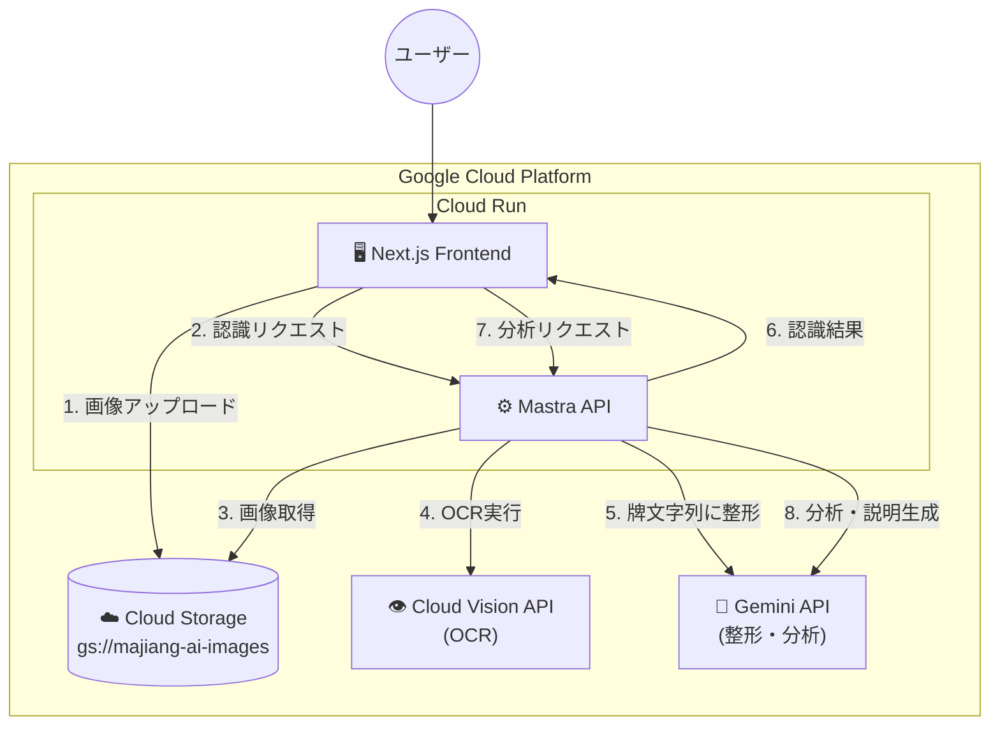
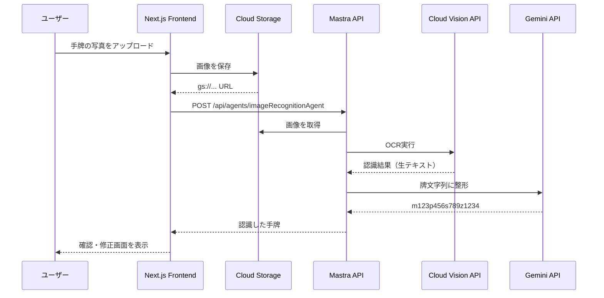
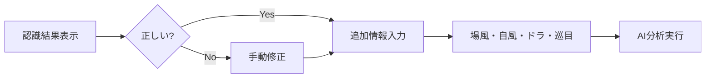
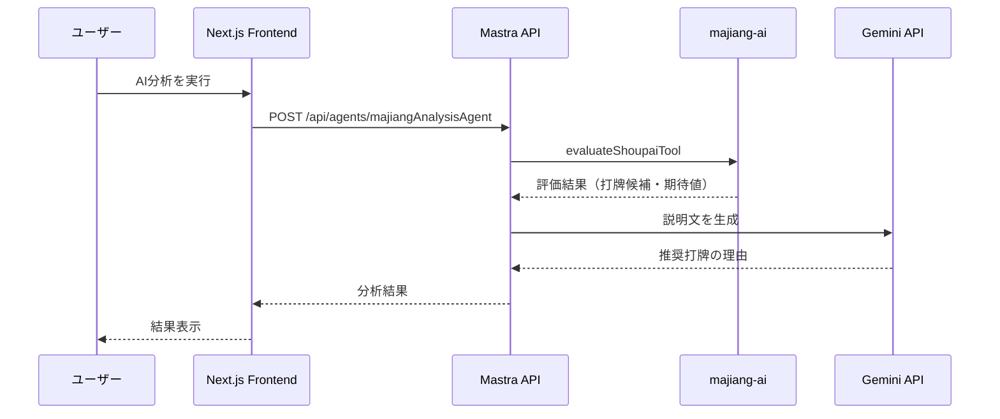

# 写真から牌譜情報変換機能 設計・実装案

## 概要

手牌の写真（画像）から手牌情報を認識し、ユーザーが確認・修正した後、追加情報（場風・自風・ドラ表示牌・巡目）を入力してAI分析を行う機能を実装します。

> 全体アーキテクチャは [ARCHITECTURE.md](../ARCHITECTURE.md) を参照

## 要件定義

### 写真の内容

- **手牌のみ**（14枚の牌が写っている写真）
- 場風・自風・ドラ表示牌・巡目は写真からは認識しない

### 保存方法

- **Cloud Storage (GCS)** を使用

### ユーザーフロー

1. ユーザーが手牌の写真をアップロード
2. システムが手牌を認識して結果を返す
3. ユーザーが認識結果を確認・修正
4. ユーザーが場風・自風・ドラ表示牌・巡目を入力
5. AI分析を実行

## 牌譜情報の形式

```
m123p1234789s3388/0/0/s3/+7
```

- `m123p1234789s3388`: 手牌文字列
  - `m`: 萬子、`p`: 筒子、`s`: 索子、`z`: 字牌
  - 数字は牌の種類（例: `m123` = 一萬、二萬、三萬）
- `/0`: 場風 (zhuangfeng: 0-3)
- `/0`: 自風 (menfeng: 0-3)
- `/s3`: ドラ表示牌 (baopai)
- `/+7`: 巡目 (xun)

## アーキテクチャ



## データフロー

### Phase 1: 手牌認識



### Phase 2: ユーザー確認・修正



### Phase 3: AI分析



## 実装方針

### 画像認識: Cloud Vision API + Gemini API

**理由**:

- GCP統一でコスト最適化
- Cloud Vision APIはOCRに特化、高精度
- Gemini APIで麻雀牌の形式に整形

**処理フロー**:

1. Cloud Vision APIでOCR実行（生テキスト取得）
2. Gemini APIで牌文字列（m123p456...）に整形

### 保存方法: Cloud Storage (GCS)

**理由**:

- GCP統一
- Cloud Vision APIとの親和性が高い
- 低コスト（$0.02/GB/月）

**実装**:

- `@google-cloud/storage` パッケージを使用
- Signed URLでセキュアにアップロード
- バケット名: `majiang-ai-images`

## 実装ステップ

### Phase 1: 写真アップロード機能（Frontend）

1. **Cloud Storage設定**
   - バケット作成（`majiang-ai-images`）
   - CORS設定
   - サービスアカウント設定

2. **写真アップロードUI**
   - ファイル選択コンポーネント
   - 画像プレビュー
   - アップロードボタン

3. **写真の処理**
   - Signed URLを取得してアップロード
   - gs:// URLを取得

### Phase 2: 画像認識エージェント（Mastra）

1. **画像認識エージェントの作成**
   - `image-recognition-agent.ts`を作成
   - Cloud Vision APIでOCR
   - Gemini APIで整形

2. **エージェントの設定**
   - 手牌認識に特化したプロンプト
   - 出力形式の指定

### Phase 3: 手牌確認・編集UI（Frontend）

1. **認識結果の表示**
   - 認識した手牌を表示
   - 編集可能なフォーム

2. **追加情報入力フォーム**
   - 場風選択
   - 自風選択
   - ドラ表示牌入力
   - 巡目入力

### Phase 4: AI分析の統合

1. **既存のmajiangAnalysisAgentを使用**
   - 手牌 + 追加情報で分析
   - 結果を表示

### Phase 5: エラーハンドリングとテスト

1. エラーハンドリング
   - 画像が読み込めない場合
   - 牌が認識できない場合
   - 認識結果が不正な形式の場合
   - 手動入力のフォールバック

2. テストとデバッグ

## 技術スタック

### Frontend

- Next.js (Cloud Run)
- React
- File API (写真アップロード)
- @google-cloud/storage (Cloud Storage)

### Backend (Mastra)

- Cloud Vision API (OCR)
- Gemini API (整形・分析)
- 既存のmajiangAnalysisAgent

## ディレクトリ構成

```
majiang-ai/
├── frontend/
│   ├── app/
│   │   ├── page.tsx                    # メインページ
│   │   └── api/
│   │       └── upload/
│   │           └── route.ts            # GCSアップロード用API Route
│   ├── components/
│   │   ├── ImageUpload.tsx             # 写真アップロードコンポーネント
│   │   ├── ImagePreview.tsx            # 画像プレビュー
│   │   ├── ShoupaiEditor.tsx           # 手牌編集コンポーネント
│   │   ├── GameInfoForm.tsx            # 追加情報入力フォーム
│   │   └── AnalysisResult.tsx          # 分析結果表示
│   └── lib/
│       ├── gcs-client.ts               # Cloud Storage クライアント
│       └── mastra-client.ts            # Mastra APIクライアント
│
└── mastra/
    └── src/
        └── mastra/
            └── agents/
                └── image-recognition-agent.ts  # 画像認識エージェント
```

## 要件確認（決定済み）

### 1. 写真の内容

✅ **手牌のみ**（14枚の牌が写っている写真）

- 場風・自風・ドラ表示牌・巡目は写真からは認識しない

### 2. 写真の保存方法

✅ **Cloud Storage (GCS)** を使用

- `@google-cloud/storage` パッケージを使用
- Signed URLでセキュアにアップロード

### 3. 画像認識の精度

✅ **2段階認識**

- Cloud Vision APIでOCR（生テキスト）
- Gemini APIで牌文字列に整形
- ユーザーが認識結果を修正可能

### 4. エラーハンドリング

✅ **対応方針**

- エラーメッセージを表示
- ユーザーに再試行を促す
- 手動入力のフォールバック

## 実装例

### Frontend: Cloud Storageへのアップロード

```typescript
// frontend/lib/gcs-client.ts
import { Storage } from "@google-cloud/storage";

const storage = new Storage();
const bucketName = process.env.GCS_BUCKET || "majiang-ai-images";

export async function uploadImage(file: Buffer, fileName: string): Promise<string> {
  const bucket = storage.bucket(bucketName);
  const blob = bucket.file(`uploads/${Date.now()}-${fileName}`);

  await blob.save(file, {
    contentType: "image/jpeg",
  });

  return `gs://${bucketName}/${blob.name}`;
}

// Signed URLを生成（クライアントから直接アップロード用）
export async function getSignedUploadUrl(fileName: string): Promise<string> {
  const bucket = storage.bucket(bucketName);
  const blob = bucket.file(`uploads/${Date.now()}-${fileName}`);

  const [url] = await blob.getSignedUrl({
    version: "v4",
    action: "write",
    expires: Date.now() + 15 * 60 * 1000, // 15分
    contentType: "image/jpeg",
  });

  return url;
}
```

### Frontend: アップロードAPI Route

```typescript
// frontend/app/api/upload/route.ts
import { NextRequest, NextResponse } from "next/server";
import { getSignedUploadUrl } from "@/lib/gcs-client";

export async function POST(request: NextRequest) {
  const { fileName } = await request.json();

  try {
    const signedUrl = await getSignedUploadUrl(fileName);
    return NextResponse.json({ signedUrl });
  } catch (error) {
    console.error("Error generating signed URL:", error);
    return NextResponse.json(
      { error: "Failed to generate upload URL" },
      { status: 500 }
    );
  }
}
```

### Frontend: 写真アップロードコンポーネント

```typescript
// frontend/components/ImageUpload.tsx
"use client";

import { useState } from "react";

export function ImageUpload() {
  const [imageUrl, setImageUrl] = useState<string | null>(null);
  const [loading, setLoading] = useState(false);
  const [recognizedShoupai, setRecognizedShoupai] = useState<string | null>(null);

  const handleFileChange = async (e: React.ChangeEvent<HTMLInputElement>) => {
    const file = e.target.files?.[0];
    if (!file) return;

    setLoading(true);
    try {
      // Signed URLを取得
      const { signedUrl } = await fetch("/api/upload", {
        method: "POST",
        headers: { "Content-Type": "application/json" },
        body: JSON.stringify({ fileName: file.name }),
      }).then((res) => res.json());

      // GCSにアップロード
      await fetch(signedUrl, {
        method: "PUT",
        headers: { "Content-Type": "image/jpeg" },
        body: file,
      });

      // プレビュー用にローカルURLを設定
      setImageUrl(URL.createObjectURL(file));

      // 画像認識APIを呼び出し
      const response = await fetch(
        `${process.env.NEXT_PUBLIC_MASTRA_API_URL}/api/agents/imageRecognitionAgent`,
        {
          method: "POST",
          headers: { "Content-Type": "application/json" },
          body: JSON.stringify({
            messages: [
              {
                role: "user",
                content: `画像を認識してください。GCS URL: ${signedUrl.split("?")[0]}`,
              },
            ],
          }),
        }
      );

      const result = await response.json();
      const shoupai = extractShoupaiFromResponse(result);
      setRecognizedShoupai(shoupai);
    } catch (error) {
      console.error("Error:", error);
      alert("画像の認識に失敗しました。もう一度お試しください。");
    } finally {
      setLoading(false);
    }
  };

  return (
    <div className="space-y-4">
      <input
        type="file"
        accept="image/*"
        onChange={handleFileChange}
        className="block w-full text-sm text-gray-500 file:mr-4 file:py-2 file:px-4 file:rounded-full file:border-0 file:text-sm file:font-semibold file:bg-blue-50 file:text-blue-700 hover:file:bg-blue-100"
      />
      {imageUrl && (
        
      )}
      {loading && <p className="text-gray-500">認識中...</p>}
      {recognizedShoupai && (
        <div className="p-4 bg-green-50 rounded-lg">
          <p className="font-medium">認識した手牌: {recognizedShoupai}</p>
          <ShoupaiEditor
            initialValue={recognizedShoupai}
            onUpdate={setRecognizedShoupai}
          />
        </div>
      )}
    </div>
  );
}

function extractShoupaiFromResponse(result: any): string {
  // Agentの応答から手牌文字列を抽出
  const content = result.output?.[0]?.content || "";
  const match = content.match(/[mpsz][0-9]+[mpsz0-9]*/g);
  return match ? match.join("") : content;
}
```

### Frontend: 手牌編集コンポーネント

```typescript
// frontend/components/ShoupaiEditor.tsx
"use client";

import { useState } from "react";

interface ShoupaiEditorProps {
  initialValue: string;
  onUpdate: (value: string) => void;
}

export function ShoupaiEditor({ initialValue, onUpdate }: ShoupaiEditorProps) {
  const [value, setValue] = useState(initialValue);

  return (
    <div className="mt-2">
      <label className="block text-sm font-medium text-gray-700">手牌:</label>
      <input
        type="text"
        value={value}
        onChange={(e) => {
          setValue(e.target.value);
          onUpdate(e.target.value);
        }}
        placeholder="m123p1234789s3388"
        className="mt-1 block w-full rounded-md border-gray-300 shadow-sm focus:border-blue-500 focus:ring-blue-500"
      />
      <p className="mt-1 text-sm text-gray-500">
        形式: m123p1234789s3388 (m=萬子, p=筒子, s=索子, z=字牌)
      </p>
    </div>
  );
}
```

### Frontend: 追加情報入力フォーム

```typescript
// frontend/components/GameInfoForm.tsx
"use client";

import { useState } from "react";

interface GameInfo {
  zhuangfeng: number;
  menfeng: number;
  baopai: string;
  xun: number;
}

interface GameInfoFormProps {
  onSubmit: (info: GameInfo) => void;
}

export function GameInfoForm({ onSubmit }: GameInfoFormProps) {
  const [info, setInfo] = useState<GameInfo>({
    zhuangfeng: 0,
    menfeng: 0,
    baopai: "",
    xun: 7,
  });

  return (
    <form
      onSubmit={(e) => {
        e.preventDefault();
        onSubmit(info);
      }}
      className="space-y-4"
    >
      <div className="grid grid-cols-2 gap-4">
        <div>
          <label className="block text-sm font-medium text-gray-700">場風:</label>
          <select
            value={info.zhuangfeng}
            onChange={(e) => setInfo({ ...info, zhuangfeng: Number(e.target.value) })}
            className="mt-1 block w-full rounded-md border-gray-300 shadow-sm"
          >
            <option value={0}>東</option>
            <option value={1}>南</option>
            <option value={2}>西</option>
            <option value={3}>北</option>
          </select>
        </div>
        <div>
          <label className="block text-sm font-medium text-gray-700">自風:</label>
          <select
            value={info.menfeng}
            onChange={(e) => setInfo({ ...info, menfeng: Number(e.target.value) })}
            className="mt-1 block w-full rounded-md border-gray-300 shadow-sm"
          >
            <option value={0}>東</option>
            <option value={1}>南</option>
            <option value={2}>西</option>
            <option value={3}>北</option>
          </select>
        </div>
        <div>
          <label className="block text-sm font-medium text-gray-700">ドラ表示牌:</label>
          <input
            type="text"
            value={info.baopai}
            onChange={(e) => setInfo({ ...info, baopai: e.target.value })}
            placeholder="s3"
            className="mt-1 block w-full rounded-md border-gray-300 shadow-sm"
          />
        </div>
        <div>
          <label className="block text-sm font-medium text-gray-700">巡目:</label>
          <input
            type="number"
            value={info.xun}
            onChange={(e) => setInfo({ ...info, xun: Number(e.target.value) })}
            min={0}
            max={18}
            className="mt-1 block w-full rounded-md border-gray-300 shadow-sm"
          />
        </div>
      </div>
      <button
        type="submit"
        className="w-full bg-blue-600 text-white py-2 px-4 rounded-md hover:bg-blue-700 focus:outline-none focus:ring-2 focus:ring-blue-500 focus:ring-offset-2"
      >
        AI分析を実行
      </button>
    </form>
  );
}
```

### Mastra: 画像認識エージェント

```typescript
// mastra/src/mastra/agents/image-recognition-agent.ts
import { Agent } from "@mastra/core/agent";
import vision from "@google-cloud/vision";

// Cloud Vision APIクライアント
const visionClient = new vision.ImageAnnotatorClient();

export const imageRecognitionAgent = new Agent({
  name: "Image Recognition Agent",
  instructions: `
    あなたは麻雀の手牌を認識する専門家です。
    
    Cloud Vision APIから得られたOCR結果を解析し、手牌を以下の形式に変換してください:
    - 萬子: m + 数字（例: m123 = 一萬、二萬、三萬）
    - 筒子: p + 数字（例: p456 = 四筒、五筒、六筒）
    - 索子: s + 数字（例: s789 = 七索、八索、九索）
    - 字牌: z + 数字（1=東, 2=南, 3=西, 4=北, 5=白, 6=發, 7=中）
    
    手牌は14枚である必要があります。
    手牌のみを認識し、場風・自風・ドラ表示牌・巡目は無視してください。
    
    出力形式: "m123p1234789s3388" のような文字列のみを返してください。
  `,
  model: "google/gemini-1.5-pro",
});

// Cloud Vision APIでOCRを実行するツール（必要に応じて追加）
export async function recognizeTilesFromImage(gcsUri: string): Promise<string> {
  const [result] = await visionClient.textDetection(gcsUri);
  const detections = result.textAnnotations;

  if (!detections || detections.length === 0) {
    throw new Error("No text detected in the image");
  }

  // 生のOCR結果を返す（Geminiで整形）
  return detections[0].description || "";
}
```

## 環境変数

### Frontend

| 変数名                   | 説明                   | 例                                       |
| ------------------------ | ---------------------- | ---------------------------------------- |
| `NEXT_PUBLIC_MASTRA_API_URL` | Mastra APIのURL     | `https://majiang-ai-api-xxxxx.a.run.app` |
| `GCS_BUCKET`             | Cloud Storage バケット | `majiang-ai-images`                      |
| `GOOGLE_CLOUD_PROJECT`   | GCPプロジェクトID      | `majiang-ai-project`                     |

### Mastra API

| 変数名                   | 説明                   | 例                   |
| ------------------------ | ---------------------- | -------------------- |
| `GOOGLE_API_KEY`         | Gemini API キー        | `AIza...`            |
| `GOOGLE_CLOUD_PROJECT`   | GCPプロジェクトID      | `majiang-ai-project` |
| `GCS_BUCKET`             | Cloud Storage バケット | `majiang-ai-images`  |

## 次のステップ

- [ ] Cloud Storageバケットの作成・設定
- [ ] Cloud Vision APIの有効化
- [ ] 画像認識エージェントの実装
- [ ] Mastraの`index.ts`に追加
- [ ] Frontendの実装
  - [ ] 写真アップロード機能
  - [ ] GCSへのアップロード（Signed URL）
  - [ ] 画像認識APIの呼び出し
  - [ ] 手牌編集UI
  - [ ] 追加情報入力フォーム
  - [ ] AI分析の統合
- [ ] テストと改善
  - [ ] 画像認識の精度テスト
  - [ ] エラーハンドリングの確認
  - [ ] UI/UXの改善

## 参考資料

- [Cloud Vision API Documentation](https://cloud.google.com/vision/docs)
- [Cloud Storage Documentation](https://cloud.google.com/storage/docs)
- [Gemini API Documentation](https://ai.google.dev/docs)
- [Mastra Tools Documentation](https://mastra.ai/docs/tools)
