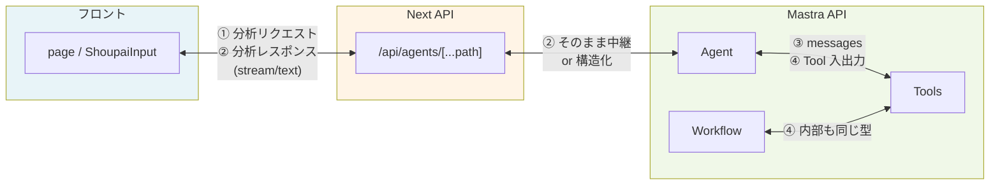

# 共通型（Shared Types）設計

手牌分析まわりのツール・エージェント・API・フロント間で、**共通の型（interface）を定義し、すべての境界をその型で統一する**ための設計ドキュメントです。

## 目次

- [1. 目的・背景](#section-1)
  - [1.1 なぜ共通型が必要か](#section-1-1)
  - [1.2 スコープ](#section-1-2)
- [2. 現状の課題整理](#section-2)
  - [2.1 型がバラバラになっている箇所](#section-2-1)
  - [2.2 根本原因の整理](#section-2-2)
- [3. 型の境界の整理](#section-3)
- [4. 共通型（interface）の設計案](#section-4)
  - [4.1 ドメインの基本型](#section-4-1)
  - [4.2 局情報（分析のコンテキスト）](#section-4-2)
  - [4.3 分析結果（ツール・API の出力）](#section-4-3)
  - [4.4 共通エラー型](#section-4-4)
  - [4.5 フロント ⇔ API のリクエスト・レスポンス](#section-4-5)
  - [4.6 画像認識の入出力](#section-4-6)
  - [4.7 牌の視覚化（formatTilesTool）](#section-4-7)
- [5. 型定義の配置方針](#section-5)
  - [5.1 オプション比較](#section-5-1)
  - [5.2 ファイル構成案](#section-5-2)
- [6. ツール・Agent の設計方針](#section-6)
  - [6.1 ツール](#section-6-1)
  - [6.2 Agent とリクエストの流れ](#section-6-2)
- [7. 移行の進め方](#section-7)
- [8. まとめ](#section-8)
- [9. 不足・考慮漏れの洗い出し](#section-9)

---

<a id="section-1"></a>
## 1. 目的・背景

<a id="section-1-1"></a>
### 1.1 なぜ共通型が必要か

- **現状**: 各ツールの Zod スキーマがバラバラで、LLM の誤った引数（文字列を数値の代わりに渡す等）を許容するために `z.union([z.number(), z.string()])` などを多用している。
- **結果**: 予期せぬ値が内部に流れ込む・バリデーションエラーが分かりにくい・フロントとバックで「手牌」「場況」の形が一致していない。
- **目標**: 共通の interface を一箇所で定義し、フロント⇔API、API⇔Agent、Agent⇔Tool、Workflow 内部のすべてで同じ型を通す。これにより型ミスや良からぬエラーを防ぐ。

<a id="section-1-2"></a>
### 1.2 スコープ

- **対象**: 手牌分析（evaluate-shoupai）および画像認識→手牌文字列→分析の一連の流れ。
- **対象外**: Weather 系のツール・ワークフロー（必要になったら同様の考え方で拡張する）。

---

<a id="section-2"></a>
## 2. 現状の課題整理

<a id="section-2-1"></a>
### 2.1 型がバラバラになっている箇所

各境界と、その境界を実装しているファイルパスを対応させた表です。関連セクションのリンクから、該当する設計説明へ飛べます。

| 境界 | 現状 | 問題例 | 該当パス（境界の実装箇所） | 関連セクション |
|------|------|--------|----------------------------|----------------|
| **フロント → 分析API** | 自然文 `"手牌: m123p...、場風: 東、の最適な打牌を教えてください"` を `content` で送っている | エージェントが解釈しないといけない。解釈ミスで zhuangfeng に `"S"` を渡す等。 | 自然文を組み立て: [ShoupaiInput.tsx](../frontend/components/ShoupaiInput/ShoupaiInput.tsx)（`buildAnalysisMessage`）。送信: [page.tsx](../frontend/app/page.tsx)（`handleSubmit`）→ [mastra-client.ts](../frontend/lib/mastra-client.ts)（`streamMajiangAnalysis`）。受信: [route.ts](../frontend/app/api/agents/[...path]/route.ts)（POST で body を Mastra に中継）。 | [§4.4](#section-4-4) [§6.2](#section-6-2) |
| **Agent → evaluateShoupaiTool** | Zod で union を多用（number \| string, boolean \| array 等） | LLM が `menfeng: "S"`, `heinfo: null`, `hongpai: []` を送り、都度スキーマを緩めている。 | エージェント定義: [majiang-analysis-agent.ts](../mastra/src/mastra/agents/majiang-analysis-agent.ts)。ツール入力スキーマ: [eval/shoupai/index.ts](../mastra/src/mastra/tools/eval/shoupai/index.ts)（`evaluateShoupaiTool` の `inputSchema`）。 | [§4.2](#section-4-2) [§6.1](#section-6-1) |
| **Agent → formatTilesTool** | `tiles` と `shoupai` のどちらかを渡す設計だが、LLM が逆や undefined を送る | バリデーション失敗が多く、ZodUndefined 等で OpenAI スキーマ変換が落ちることも。 | ツール定義: [format-tiles.ts](../mastra/src/mastra/tools/eval/shoupai/format-tiles.ts)（`formatTilesTool` の `inputSchema`・`execute`）。 | [§4.7](#section-4-7) [§6.1](#section-6-1) |
| **evaluateShoupaiTool → 内部関数** | context をそのまま initializePlayer 等に渡す | 変換後の型と内部の期待型が揃っていても、入口が緩いため null/配列が紛れ込む余地がある。 | ツール execute: [eval/shoupai/index.ts](../mastra/src/mastra/tools/eval/shoupai/index.ts)（`execute` 内で `initializePlayer` 等を呼ぶ）。内部: [initialize-player.ts](../mastra/src/mastra/tools/eval/shoupai/initialize-player.ts)、[calculate-paishu.ts](../mastra/src/mastra/tools/eval/shoupai/calculate-paishu.ts)、[evaluate-basic.ts](../mastra/src/mastra/tools/eval/shoupai/evaluate-basic.ts)、[evaluate-dapai-candidates.ts](../mastra/src/mastra/tools/eval/shoupai/evaluate-dapai-candidates.ts)。 | [§4.2](#section-4-2) [§6.1](#section-6-1) |
| **Workflow (evaluate-shoupai)** | 各ステップが独自の z.object で input/output を定義 | ツールの Zod と workflow の Zod が別定義で、同じ「場況」が二重管理。 | [evaluate-shoupai.ts](../mastra/src/mastra/workflows/evaluate-shoupai.ts)（各ステップの `inputSchema` / `outputSchema`）。 | [§4.2](#section-4-2) [§7](#section-7) |
| **画像認識 → フロント** | 応答テキストから手牌文字列を正規表現で抽出 | 契約が「文字列」だけで、形式（手牌文字列）がドキュメントとコードに分散。 | ツール出力: [recognize-shoupai-from-gcs.ts](../mastra/src/mastra/tools/image-recognition/recognize-shoupai-from-gcs.ts)。フロント利用: [mastra-client.ts](../frontend/lib/mastra-client.ts)（`generateImageRecognition`、`extractShoupaiFromAgentText`）。 | [§4.6](#section-4-6) |

<a id="section-2-2"></a>
### 2.2 根本原因の整理

1. **入口が自然文**: ユーザー意図を「構造化された入力」にしないままエージェントに渡している。
2. **ツールの入口型が「LLM の誤り許容」寄り**: 本来のドメイン型（例: 場風は 0–3 の数値）ではなく、文字列や null を許容する union になっている。
3. **共通の型定義がない**: 手牌文字列・場風・ドラ表示牌・評価結果などが、mastra と frontend で別々に「仕様」として書かれているだけ。

---

<a id="section-3"></a>
## 3. 型の境界の整理

次の 4 つの境界を、すべて共通型でつなぐ。



- **① フロント ⇔ Next API**: 分析を「構造化リクエスト」で送るか、従来どおり自然文で送るかは設計選択（後述）。
- **② Next API ⇔ Mastra API**: 現状は body をそのまま中継。共通型に合わせてリクエスト/レスポンスを定義すると、プロキシ層で検証・変換しやすい。
- **③ Mastra API ⇔ Agent**: Agent に渡す messages の content を「自然文」にするか「構造化データ＋プロンプト」にするか。
- **④ Agent ⇔ Tool / Workflow 内部**: ツールの入力は「共通型の入力」のみ受け付ける。LLM が解釈した結果を、**一度 API または Agent 側で共通型にマッピングしてから**ツールを呼ぶ設計にすると、ツール側は緩い union を持たずに済む。

---

<a id="section-4"></a>
## 4. 共通型（interface）の設計案

**根底の方針**: 共通型は **`submodules/majiang-core` および `submodules/majiang-ai` で使われている表記・型と同一**にしたい。手牌文字列・牌ID・場風・ドラ表示牌などの意味と形式を submodules に合わせることで、mastra のツールやフロントが submodules のロジックと齟齬なく連携できる。

- 参照: 牌の妥当性は [submodules/majiang-core/lib/shoupai.js](../submodules/majiang-core/lib/shoupai.js)（`valid_pai`, `fromString`）、局情報の扱いは [submodules/majiang-ai](../submodules/majiang-ai) の [dev/eval_shoupai.js](../submodules/majiang-ai/dev/eval_shoupai.js) や [test/player.js](../submodules/majiang-ai/test/player.js) の `qipai`（`zhuangfeng`, `baopai`, `shoupai`）と整合させる。
- ドキュメント: [tile-ids-and-images.md](tile-ids-and-images.md) に submodules との対応がまとまっている。

<a id="section-4-1"></a>
### 4.1 ドメインの基本型

```ts
// 牌1枚のID（majiang-core / majiang-ai と同一。m0=赤五萬, p1〜p9, s1〜s9, z1〜z7）
// 根拠: submodules/majiang-core/lib/shoupai.js の valid_pai（[mps]\\d | z[1-7]）、tile-ids-and-images.md
type TileId = string; // 実際は "m0"|"m1"|...|"z7" のリテラル型 or バリデーションで保証

// 手牌文字列（例: "m123p456s789z12"）。副露ありなら "m123p456s789,m2p2p2" 等
// 根拠: submodules/majiang-core/lib/shoupai.js の fromString(paistr)、majiang-ai の qipai.shoupai
type ShoupaiString = string;

// 場風・自風は 0=東, 1=南, 2=西, 3=北 に統一（数値のみ）。submodules の qipai.zhuangfeng / jushu と同一
type Feng = 0 | 1 | 2 | 3;
```

- **TileId**: [submodules/majiang-core](../submodules/majiang-core) の牌表記および [tile-ids-and-images.md](tile-ids-and-images.md)、[frontend/lib/shoupai-utils.ts](../frontend/lib/shoupai-utils.ts) の牌IDと一致させる。
- **ShoupaiString**: submodules の手牌表記（m/p/s/z + 数字、0 は赤）と一致。
- **Feng**: submodules では場風・自風を数値で扱っているため、内部・API・ツールもすべて数値とし、表示用の「東/南/西/北」はフロントでラベル変換する。

#### 値オブジェクトで表現するかどうか

値オブジェクトにすると「任意の string を渡す」事故を防げるが、境界（API・LLM の引数）では必ず JSON の string/number が来るため、**入口で一度「正しい型」に昇格させる**必要がある。

| 型 | 値オブジェクト化のしやすさ | コメント |
|----|---------------------------|----------|
| **Feng** | ◎ 容易 | 0–3 の範囲だけ。クラスでラップして `.label`（東/南/西/北）を持たせる、あるいは `0 \| 1 \| 2 \| 3` のままでも十分。 |
| **TileId** | ○ 現実的 | パターンが固定（`[mps]\d \| z[1-7]`）なので、コンストラクタで検証する値オブジェクト or 少なくとも**ブランド型**（`string & { readonly __brand: 'TileId' }`）にすると、ShoupaiString と取り違えを防げる。 |
| **ShoupaiString** | △ 難しい | 形式が複雑（副露・赤・空き面子など）で、**妥当性の正は majiang-core の `fromString` にある**。TS 側で同じ検証を二重に持つか、majiang-core を呼ぶ薄いラッパーにするかになる。まずは**ブランド型**で「ただの string ではない」と明示し、検証は Zod 等の境界に任せるのが現実的。 |

**方針案**: いきなりクラス値オブジェクトにしなくても、**ブランド型**（実行時は string/number のまま、型だけ区別する）を入れるだけでも、「手牌文字列と牌IDを渡し間違える」といったミスは防げる。手牌文字列を「完全な値オブジェクト」にするのは、majiang-core との責務分離や検証の一元化を決めてからにするとよい。

```ts
// ブランド型の例（実行時は string のまま。境界で as TileId するか、Zod の .transform で付与）
type TileId = string & { readonly __brand: unique symbol };
type ShoupaiString = string & { readonly __brand: unique symbol };
// Feng は 0|1|2|3 のままでも可。必要なら number & { readonly __brand: unique symbol } やクラスに。
```

- **`unique symbol` とは**: TypeScript の型で、「このシンボルは世界に1つだけ」と宣言するもの。`__brand: 'TileId'` のように文字列にすると、別の型でも `__brand: 'TileId'` と書けて区別がつかなくなるが、`unique symbol` は型ごとに別の「名前のついたシンボル」になるため、`TileId` と `ShoupaiString` が型レベルで確実に区別される。実行時にはシンボルは存在せず、消える（nominal typing のためだけに使う）。

**submodules で型・表記を確認する主なファイル:**

| 内容 | パス |
|------|------|
| 牌の妥当性・手牌文字列 fromString | [submodules/majiang-core/lib/shoupai.js](../submodules/majiang-core/lib/shoupai.js) |
| 局情報（zhuangfeng, baopai, shoupai）の渡し方 | [submodules/majiang-ai/test/player.js](../submodules/majiang-ai/test/player.js)（`init_player` の引数）、[submodules/majiang-ai/dev/eval_shoupai.js](../submodules/majiang-ai/dev/eval_shoupai.js) |
| 牌山・ドラ表示牌 | [submodules/majiang-core/lib/shan.js](../submodules/majiang-core/lib/shan.js)、majiang-ai の `suanpai` / `player` |

<a id="section-4-2"></a>
### 4.2 局情報（分析のコンテキスト）

```ts
/** 手牌分析の入力として必要な局情報。全境界でこの形に統一する。 */
interface AnalysisContext {
  /** 手牌文字列（必須） */
  shoupai: ShoupaiString;
  /** 場風 0-3 */
  zhuangfeng?: Feng;
  /** 自風 0-3 */
  menfeng?: Feng;
  /** ドラ表示牌の配列（ドラ表示牌のまま。実際のドラは suanpai 側で変換） */
  baopai?: TileId[];
  /** 赤牌ありか */
  hongpai?: boolean;
  /** 巡目 */
  xun?: number;
  /** 捨て牌情報（オプション） */
  heinfo?: string | null;
}
```

- **送信時の契約**: フロントで**バリデーション**を設け、フォームで必須とする項目（手牌・場風・自風・巡目・ドラ表示牌など）が揃っていない場合は送信しない（エラー表示）。**巡目やドラ表示牌を null や未入力のまま送らない**。API は受け取った `context` をそのままツールに渡し、デフォルト補完はしない。
- フロントの入力フォームは送信前にこの `AnalysisContext` に載せ、必須項目が足りなければ送信ボタン無効または送信時にエラーとする。
- evaluateShoupaiTool の入力は、**この型だけ**を受け付ける。
- Workflow の initializePlayer の入力も同じ `AnalysisContext` に揃える。ワークフロー内部の `gameState` は `AnalysisContext` の部分型（`Pick<AnalysisContext, 'zhuangfeng' | 'menfeng' | 'baopai' | 'hongpai' | 'xun'>`）とし、二重定義を避ける。

<a id="section-4-3"></a>
### 4.3 分析結果（ツール・API の出力）

```ts
/** 打牌候補1つ */
interface DapaiCandidate {
  tile: TileId;
  n_xiangting: number;
  ev: number;
  tingpai: TileId[];
  n_tingpai: number;
  /** 推奨打牌かどうか */
  selected?: boolean;
}

/** 手牌評価の結果。evaluateShoupaiTool / Workflow の出力を統一 */
interface EvaluateShoupaiResult {
  current: {
    n_xiangting: number;
    ev: number;
  };
  dapai_candidates: DapaiCandidate[];
  recommended: TileId;
}
```

- ツールの `outputSchema` および Workflow の最終出力は、この型に一致させる。
- フロントで「推奨打牌」「候補一覧」を表示するときも同じ型を前提にする。

<a id="section-4-4"></a>
### 4.4 共通エラー型

API・ストリーミング・画像認識で共通して使うエラー形。フロントは `code` で分類し、表示メッセージを切り替える（[error-handling.md](error-handling.md) と整合させる）。

```ts
/** 共通エラー型。分析API・画像認識・ストリーミングの error イベントで使用 */
interface ApiError {
  /** エラー種別（フロントでメッセージ切り替えに利用） */
  code?: string;
  /** ユーザー向けメッセージ */
  message: string;
  /** 追加情報（デバッグ用など） */
  details?: unknown;
}
```

- **code の例**: `VALIDATION_ERROR`（入力不備）、`TOOL_ERROR`（ツール実行失敗）、`BACKEND_ERROR`（サーバー障害・タイムアウト）、`RECOGNITION_EMPTY`（画像から手牌を取得できなかった）、`RECOGNITION_BACKEND_ERROR`（画像認識バックエンドの障害）など。フロントは「ユーザーが直せるか」「時間をおいて再試行か」を code や HTTP ステータスで判別する。

<a id="section-4-5"></a>
### 4.5 フロント ⇔ API のリクエスト・レスポンス

**採用: 構造化リクエスト + ストリーミングのみ**

分析 API は**ストリーミングのみ**とする（非ストリーミングは提供しない。ユーザー体験を優先する）。

```ts
/** 分析API に送るリクエスト body */
interface AnalysisRequest {
  /** 局情報。必須。 */
  context: AnalysisContext;
}

/** ストリーミング時のレスポンス契約（SSE または NDJSON） */
// 1. 先頭で result を 1 件送る（評価結果をすぐ表示するため）
// 2. 続けて explanation を text-delta でストリーミング（説明文を逐次表示）
interface AnalysisStreamEventResult {
  type: 'result';
  result: EvaluateShoupaiResult;
}

interface AnalysisStreamEventTextDelta {
  type: 'text-delta';
  delta: string;
}

interface AnalysisStreamEventDone {
  type: 'done';
}

/** エラー時はストリームの先頭で 1 件送る。error は共通型 ApiError */
interface AnalysisStreamEventError {
  type: 'error';
  error: ApiError;
}

/** ストリーミングで送られるイベントのいずれか */
type AnalysisStreamEvent =
  | AnalysisStreamEventResult
  | AnalysisStreamEventTextDelta
  | AnalysisStreamEventDone
  | AnalysisStreamEventError;
```

- フロントは `context: AnalysisContext` を body で送る。`stream` フラグは不要（常にストリーミング）。
- API は `evaluateShoupaiTool.execute({ context })` で `result` を取得し、**先頭イベントで `{ type: 'result', result }` を送る**。続けて LLM に「この result を説明して」と渡し、説明文を **text-delta でストリーミング**（`{ type: 'text-delta', delta }`）。最後に `{ type: 'done' }` を送る。
- フロントは先頭の `result` で表を描画し、続く text-delta で説明文を逐次表示する。

**分析専用エンドポイントの契約（path と body）**

- **path 例**: `POST /api/analysis/stream`（分析専用。既存の `POST /api/agents/.../stream` とは別に、構造化リクエスト専用のエンドポイントを設ける場合）。
- **body**: `{ context: AnalysisContext }` のみ。フロントは必須項目をバリデーションしたうえで送る。
- 既存の Agent 用 path と両立させる場合は、body に `context` が含まれていれば分析専用フローに振り分け、そうでなければ従来の messages フローにする、などの判定を API 側で行う。

**案B: 従来どおり自然文 + バックで解釈**

- フロントはこれまでどおり「手牌: m123p...、場風: 東、の最適な打牌を教えてください」を送る。
- その場合でも、**ツールの入力型は共通型（AnalysisContext）に厳密に合わせ、エージェントの「解釈結果」を共通型にマッピングする層を 1 箇所にまとめる**。それ以外の箇所は共通型だけを扱う。

<a id="section-4-6"></a>
### 4.6 画像認識の入出力

```ts
/** 画像認識ツールの入力 */
interface RecognizeShoupaiInput {
  gcsUri: string;
}

/** 画像認識ツールの出力（フロントも同じ型で受け取る） */
interface RecognizeShoupaiOutput {
  shoupaiString: ShoupaiString;
  rawResponse?: string;
  /** 失敗時。2 パターンあり（下記） */
  error?: ApiError;
}
```

- 成功時: `shoupaiString` に認識結果を入れ、フロントは手牌入力欄にそのまま反映する。
- **失敗時の 2 パターン**（フロントの見せ方を分けるため、`error.code` で区別する）:
  - **① バックエンドは動いているが、画像が手牌と無関係で何も取得できなかった**  
    `error: { code: 'RECOGNITION_EMPTY', message: '...' }` を返す。フロントは「手牌を読み取れませんでした。画像を確認するか、手動で入力してください。」などと表示し、**手牌入力フォームには何も渡さない**。
  - **② バックエンド側の不調（API 障害・タイムアウトなど）**  
    `error: { code: 'RECOGNITION_BACKEND_ERROR', message: '...' }` を返す（または HTTP 5xx で body に ApiError）。フロントは「しばらく時間をおいて再度お試しください。」などと表示する（[error-handling.md](error-handling.md) の「ユーザーがどうすることもできない問題」に合わせる）。
- 複数モデル（Gemini / GPT 等）があっても、出力は共通の `RecognizeShoupaiOutput` に揃える。

<a id="section-4-7"></a>
### 4.7 牌の視覚化（formatTilesTool）

```ts
/** 手牌文字列または牌ID配列のどちらか一方を渡す */
type FormatTilesInput =
  | { shoupai: ShoupaiString; tiles?: never }
  | { tiles: TileId[]; shoupai?: never };

interface FormatTilesOutput {
  formatted: string;
}
```

- **formatTilesTool は LLM（エージェント）に渡さない**。構造化リクエストではサーバーが `formatTiles` **関数**で牌を整形してから LLM に渡すため、ツールとして公開する必要はない。`FormatTilesInput` / `FormatTilesOutput` は **formatTiles 関数の型**としてサーバー内でのみ使用する。
- ツールとして使う場合の入力は「手牌文字列のみ」か「牌ID配列のみ」のどちらか一方に限定する。

---

<a id="section-5"></a>
## 5. 型定義の配置方針 {#section-5}

<a id="section-5-1"></a>
### 5.1 オプション比較 {#section-5-1}

| 方針 | メリット | デメリット |
|------|----------|------------|
| **A. 共有パッケージ (packages/types)** | 1 箇所で管理、frontend と mastra の両方で import | モノレポ構成・ビルドの追加が必要 |
| **B. mastra に定義し frontend が参照** | 単一リポジトリで mastra が正とする場合に自然 | frontend が mastra に依存する形になる |
| **C. ドキュメント + 両方に同じ interface を手書き** | 追加インフラ不要 | 重複とずれのリスク |
| **D. シンボリックリンクで片方に集約** | 実体は 1 箇所だけなのでずれない。packages 不要。mastra か frontend のどちらかに型を置き、もう一方は `ln -s` で参照 | Git の symlink 扱い・CI/ビルドのパス解決に注意。別パッケージなら tsconfig の paths 等の設定が必要 |

- **D の補足**: 例として、型を `mastra/src/mastra/types/` に置き、`frontend/types/shared` を `ln -s ../../../mastra/src/mastra/types frontend/types/shared` のようにする。frontend からは `import type { AnalysisContext } from '@/types/shared'` のように見える。逆に frontend に型を置いて mastra から symlink で見ることもできる。

**推奨**: 短期は **C**（本ドキュメントに型を書き、mastra と frontend の両方に同じ interface をコピーまたは手書きして「契約」として扱う）。**symlink で済ませたい場合は D**（mastra に型を置き frontend が symlink で参照、が自然）。余裕が出たら **A** に移行し、`packages/types`（未作成）で `AnalysisContext`, `EvaluateShoupaiResult` 等を export する。

<a id="section-5-2"></a>
### 5.2 型定義の所在（実装済み） {#section-5-2}

共通型は **mastra と frontend の両方** に同じ構成で定義している。本ドキュメントの §4 の interface と一致させる。

**mastra（正とする実装）**

| ファイル | 含まれる型 |
|----------|------------|
| [mastra/src/mastra/types/domain.ts](../mastra/src/mastra/types/domain.ts) | TileId, ShoupaiString, Feng, AnalysisContext |
| [mastra/src/mastra/types/evaluation.ts](../mastra/src/mastra/types/evaluation.ts) | DapaiCandidate, EvaluateShoupaiResult |
| [mastra/src/mastra/types/errors.ts](../mastra/src/mastra/types/errors.ts) | ApiError |
| [mastra/src/mastra/types/api.ts](../mastra/src/mastra/types/api.ts) | AnalysisRequest, AnalysisStreamEvent 一式, RecognizeShoupaiInput, RecognizeShoupaiOutput |
| [mastra/src/mastra/types/format-tiles.ts](../mastra/src/mastra/types/format-tiles.ts) | FormatTilesInput, FormatTilesOutput |
| [mastra/src/mastra/types/index.ts](../mastra/src/mastra/types/index.ts) | 上記の再エクスポート |

**frontend（mastra と同一の型を維持）**

| ファイル | 備考 |
|----------|------|
| [frontend/types/domain.ts](../frontend/types/domain.ts) | mastra の domain.ts と同一 |
| [frontend/types/evaluation.ts](../frontend/types/evaluation.ts) | mastra の evaluation.ts と同一 |
| [frontend/types/errors.ts](../frontend/types/errors.ts) | mastra の errors.ts と同一 |
| [frontend/types/api.ts](../frontend/types/api.ts) | mastra の api.ts と同一 |
| [frontend/types/format-tiles.ts](../frontend/types/format-tiles.ts) | mastra の format-tiles.ts と同一 |
| [frontend/types/index.ts](../frontend/types/index.ts) | 上記の再エクスポート。`import type { ... } from '@/types'` で利用 |

- 型を変更するときは **mastra と frontend の両方を同じ内容に更新**する。将来 symlink（§5.1 の D）や packages/types（A）に寄せれば一箇所管理にできる。

---

## 6. ツール・Agent の設計方針（共通型を通す） {#section-6}

### 6.1 ツール {#section-6-1}

- **evaluateShoupaiTool**: 入力は `AnalysisContext` のみを受け付ける。Zod スキーマは `AnalysisContext` に厳密に合わせる（場風は 0–3 の number のみ、baopai は string[] のみ）。**ツール内では場風の変換やゆるい型の整形は行わない**。呼び出し元（API / Agent / Workflow）が共通型に揃えてから渡す。
- **formatTilesTool**: **LLM には渡さない**。formatTiles 関数の型（FormatTilesInput / FormatTilesOutput）はサーバー内でのみ使用（§4.7）。
- **recognize-shoupai-from-gcs**: 入力 `RecognizeShoupaiInput`、出力 `RecognizeShoupaiOutput`。

### 6.2 Agent とリクエストの流れ {#section-6-2}

**採用方針: 構造化リクエスト**

- フロントが `AnalysisRequest.context`（`AnalysisContext`）を送る → Next API が分析用エンドポイントに `context` を渡す → **API が `evaluateShoupaiTool.execute({ context })` を直接呼ぶ**（LLM に evaluateShoupai ツールを叩かせない）。得た `EvaluateShoupaiResult` を LLM に「この結果を説明して」と渡す場合、LLM は formatTilesTool 等の説明用ツールだけを利用する。evaluateShoupai の入力は常に共通型のみになる。
- 本プロジェクトではこの**構造化リクエスト**で行う。自然文で LLM にツール引数を解釈させる方式は採用しない。

---

## 7. 移行の進め方 {#section-7}

1. **Phase 1: 型の定義とドキュメント**
   - 本ドキュメントの interface を確定させる。
   - [mastra/src/mastra/types/](../mastra/src/mastra/types/)（または `packages/types`）に domain / evaluation / api を追加。

2. **Phase 2: ツールの厳密化**
   - evaluateShoupaiTool の inputSchema を `AnalysisContext` に合わせて厳密な Zod のみにする。ツール内では正規化・変換ロジックを持たない（済）。

3. **Phase 3: フロントとの契約**
   - フロントの分析送信を**構造化リクエスト**に切り替える（`context: AnalysisContext` を body で送る）。レスポンスは**ストリーミングのみ**（非ストリーミングは提供しない）。
   - `AnalysisRequest` / `AnalysisStreamEvent` / `EvaluateShoupaiResult` を frontend の型として導入する。

4. **Phase 4: Workflow との統一**
   - evaluate-shoupai ワークフローの最終出力を `EvaluateShoupaiResult` に揃える（**済**）。必要なら各ステップの input を AnalysisContext の部分型で型付けする。

5. **Phase 5: formatTilesTool の整理**
   - 入力は「shoupai のみ」か「tiles のみ」の 2 形に限定し、Zod と execute を共通型に合わせる。

---

## 8. まとめ {#section-8}

- **共通型**: `AnalysisContext`, `EvaluateShoupaiResult`, `DapaiCandidate`, `ApiError`, `FormatTilesInput` / `FormatTilesOutput`, `RecognizeShoupaiInput` / `RecognizeShoupaiOutput` を中心に、全境界で同じ型を通す。
- **リクエスト・レスポンス**: **構造化リクエスト**＋**ストリーミングのみ**。フロントが `context: AnalysisContext` を送り、API が `evaluateShoupaiTool.execute({ context })` を直接呼ぶ。レスポンスは先頭で `result`、続けて説明文を text-delta でストリーミング。非ストリーミングは提供しない（UX のため）。
- **ツール**: 入力は「共通型に厳密に合わせた Zod」のみ受け付ける。場風の変換やゆるい型の整形はツール内では行わない。
- **配置**: まずはドキュメント＋mastra/frontend の両方で同じ interface を契約として持ち、必要なら packages/types に集約する。
- この設計に沿って実装すれば、型ミスや予期せぬ値の混入を防ぎ、デバッグや拡張がしやすくなる。

---

<a id="section-9"></a>
## 9. 不足・考慮漏れの洗い出し {#section-9}

設計・実装を照合して見つかった「型の不足」と「考慮漏れ」を列挙する。Phase や今後の修正で埋めていく想定。

### 9.1 型・契約の不足

| 項目 | 内容 | 状態 |
|------|------|------|
| **Workflow 出力と EvaluateShoupaiResult のずれ** | 共通型に揃える。 | **済**。ワークフローの出力スキーマを `EvaluateShoupaiResult`（`current` + `dapai_candidates` の full shape + `recommended`）に揃えた（[evaluate-shoupai.ts](../mastra/src/mastra/workflows/evaluate-shoupai.ts)）。 |
| **エラー型の統一** | 共通の `ApiError` で分析API・画像認識・ストリーミングの error を送る。 | **済**。§4.4 で `ApiError`（`code`, `message`, `details?`）を定義し、`AnalysisStreamEventError` および §4.6 の `RecognizeShoupaiOutput.error` で使用する。 |
| **画像認識のエラー時** | ①画像が無関係で取得できなかった ②バックエンド不調 の 2 パターンを区別する。 | **済**。§4.6 で `RecognizeShoupaiOutput` に `error?: ApiError` を追加し、`code: 'RECOGNITION_EMPTY'`（手牌入力に何も渡さない）と `code: 'RECOGNITION_BACKEND_ERROR'`（時間をおいて再試行）の 2 パターンを明文化した。 |

### 9.2 考慮漏れ・仕様の明確化

| 項目 | 内容 | 状態 |
|------|------|------|
| **AnalysisContext の送信時契約** | 誰がデフォルトを埋めるか。 | **済**。§4.2 に「フロントでバリデーションを設け、必須項目が足りなければ送信しない。巡目・ドラ表示牌を null で送らない。API はデフォルト補完しない」と明記。 |
| **構造化リクエストの API 契約** | 分析 API の **path と body の具体形**（どの URL に何を送るか）。 | **済**。§4.5 に「分析専用エンドポイントの契約」を追記。path 例（`POST /api/analysis/stream`）、body（`{ context: AnalysisContext }`）、既存 path との両立の書き分けを記載。 |
| **formatTilesTool の扱い** | LLM に渡さない。FormatTilesInput/Output は formatTiles 関数の型としてサーバー内のみ。 | **済**。§4.7 と §6.1 に「formatTilesTool は LLM に渡さない」と明記。 |
| **Workflow 内部の gameState** | gameState を AnalysisContext の部分型とし、二重定義を避ける。 | **済**。§4.2 に「gameState は `Pick<AnalysisContext, 'zhuangfeng' | 'menfeng' | 'baopai' | 'hongpai' | 'xun'>` とする」と明記。実装時は共通型から導出する。 |
| **画像認識の複数実装** | 複数モデルでも RecognizeShoupaiOutput に揃える。 | **現状のまま**。§4.6 に記載済。今後別モデルを試す際も同じ型に揃える。 |

### 9.3 内部パイプラインの型（スコープ外だが将来的に）

- evaluateShoupaiTool の内部で呼ばれる `initializePlayer` / `calculatePaishu` / `evaluateBasic` / `evaluateDapaiCandidates` は、現状 `player`, `shoupai`, `paishu` を `any` で受けている。共通型の「境界」の外だが、将来的に submodule の型や最小インターフェース（例: `PlayerLike`, `PaishuLike`）で置き換えると保守しやすい。本設計のスコープ外として扱い、必要になったら別途定義する。
