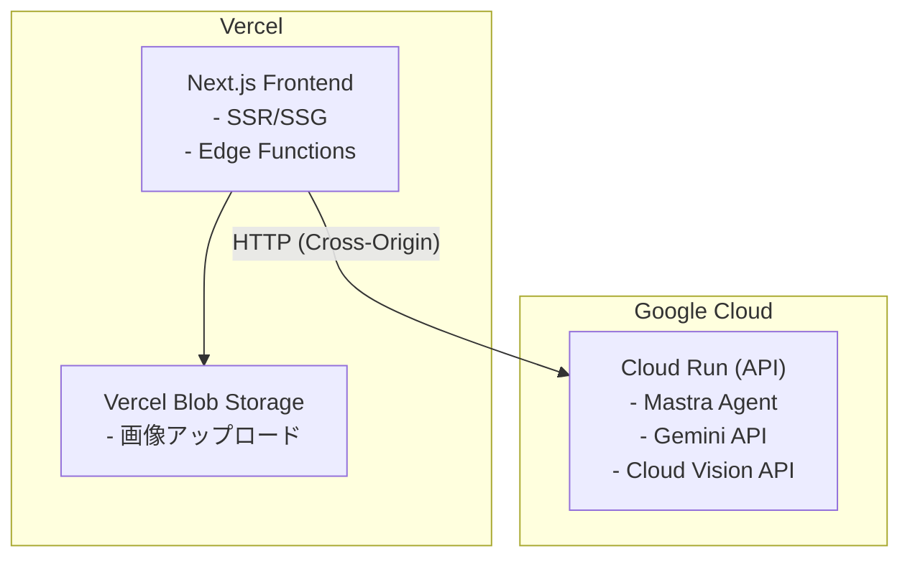
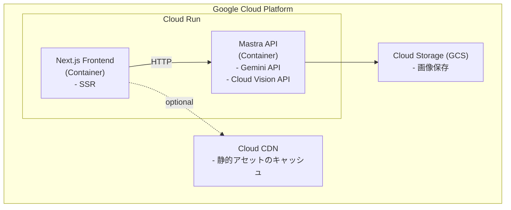
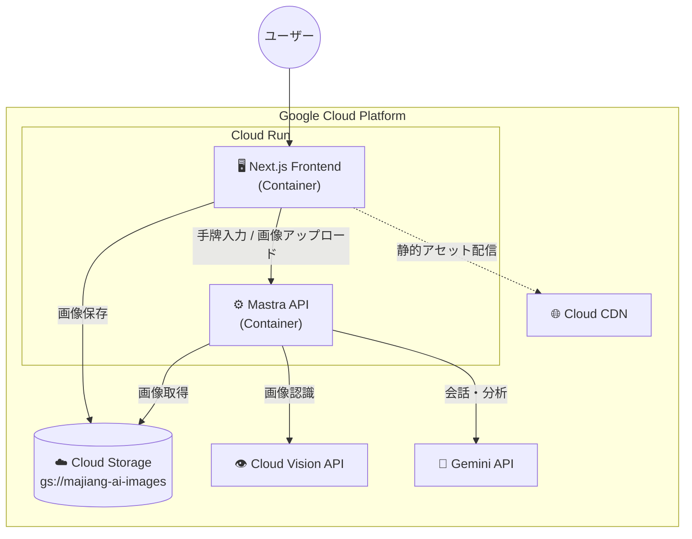

# UI デプロイ先比較: Vercel vs Cloud Run

## 概要

Next.js フロントエンドのデプロイ先として、**Vercel** と **Cloud Run** のどちらが適切かを比較検討する。

## 前提条件

- **API**: Cloud Run でホスト（Mastra + Gemini API + Cloud Vision API）
- **画像ストレージ**: UIの配置先によって決定
  - Vercel → Vercel Blob Storage
  - Cloud Run → Cloud Storage (GCS)

---

## 構成パターン

### パターン A: UI on Vercel + API on Cloud Run



### パターン B: UI + API on Cloud Run (GCP統一)



---

## 比較表

| 観点                   | Vercel (パターンA)       | Cloud Run (パターンB)          |
| ---------------------- | ------------------------ | ------------------------------ |
| **デプロイ難易度**     | ◎ 簡単（Git連携で自動）  | △ Dockerfile作成が必要         |
| **パフォーマンス**     | ◎ Edge Network + CDN内蔵 | ○ Cloud CDN追加で同等          |
| **コールドスタート**   | ◎ ほぼなし（Edge）       | △ コンテナ起動時間あり（数秒） |
| **コスト（小規模）**   | ◎ 無料枠が充実           | ○ 無料枠あり                   |
| **コスト（大規模）**   | △ 高くなりやすい         | ◎ 従量課金で予測しやすい       |
| **CORS設定**           | △ 必要（クロスオリジン） | ◎ 不要（同一オリジン可）       |
| **認証・セキュリティ** | ○ Vercel Auth等          | ◎ IAM/Cloud Armor統合          |
| **画像ストレージ**     | Vercel Blob              | Cloud Storage                  |
| **ログ・監視**         | ○ Vercel Dashboard       | ◎ Cloud Logging/Monitoring統合 |
| **ベンダーロックイン** | △ Vercel依存             | ○ コンテナなので移植性高い     |
| **開発体験**           | ◎ プレビューURL自動生成  | ○ Cloud Build連携で可能        |

---

## 詳細比較

### 1. デプロイ難易度

#### Vercel

```bash
# Git push で自動デプロイ
git push origin main
```

- プロジェクトルートに `next.config.js` があれば自動検出
- 環境変数はダッシュボードから設定

#### Cloud Run

```dockerfile
# Dockerfile が必要
FROM node:20-alpine
WORKDIR /app
COPY package*.json ./
RUN npm ci
COPY . .
RUN npm run build
CMD ["npm", "start"]
```

```bash
# Cloud Build + Cloud Run へデプロイ
gcloud run deploy frontend \
  --source . \
  --region asia-northeast1
```

**結論**: Vercelの方が圧倒的に簡単

---

### 2. パフォーマンス

#### Vercel

- **Edge Network**: 世界中にエッジノード
- **ISR (Incremental Static Regeneration)**: 静的ページを高速配信
- **Streaming SSR**: React Server Components対応

#### Cloud Run

- **リージョン限定**: 単一リージョン（asia-northeast1等）
- **Cloud CDN追加**: 静的アセットのキャッシュは別途設定が必要
- **min-instances設定**: コールドスタート回避には追加コスト

**結論**: Vercelがデフォルトで高パフォーマンス、Cloud Runは追加設定で同等

---

### 3. コスト比較

#### Vercel（Hobby/Pro）

| プラン | 月額         | 制限                    |
| ------ | ------------ | ----------------------- |
| Hobby  | 無料         | 商用利用不可、100GB帯域 |
| Pro    | $20/ユーザー | 1TB帯域、チーム機能     |

- **Serverless Function実行**: 100GB-hrs/月（無料枠）
- **帯域超過**: $40/100GB

#### Cloud Run

| 項目       | 無料枠            | 超過料金           |
| ---------- | ----------------- | ------------------ |
| CPU        | 180,000 vCPU秒/月 | $0.00002400/vCPU秒 |
| メモリ     | 360,000 GiB秒/月  | $0.00000250/GiB秒  |
| リクエスト | 200万/月          | $0.40/100万        |

**試算例（月間10万PV）**:

- Vercel Pro: $20/月（固定）
- Cloud Run: 約$5-15/月（従量）

**結論**: 小規模はVercel無料枠、中〜大規模はCloud Runがコスト効率良い

---

### 4. CORS・通信

#### パターンA（Vercel + Cloud Run）

```typescript
// Cloud Run API側でCORS設定が必要
app.use(
  cors({
    origin: "https://majiang-ai.vercel.app",
    credentials: true,
  }),
);
```

- クロスオリジン通信のレイテンシ
- CORS設定の管理

#### パターンB（Cloud Run統一）

```typescript
// 同一オリジンなのでCORS不要
// 内部通信も可能（Cloud Run間通信）
```

- シンプルな構成
- 内部ネットワーク利用可能

**結論**: 同一オリジンの方がシンプルで高速

---

### 5. 画像アップロード

#### Vercel Blob

```typescript
import { put } from "@vercel/blob";

const blob = await put(file.name, file, { access: "public" });
// blob.url → Cloud Vision APIに渡す
```

- **料金**: $0.15/GB/月（ストレージ）、$0.30/GB（転送）
- **最大ファイルサイズ**: 5GB

#### Cloud Storage (GCS)

```typescript
import { Storage } from "@google-cloud/storage";

const storage = new Storage();
await storage.bucket("majiang-ai-images").upload(file);
// gs://majiang-ai-images/xxx → Cloud Vision APIに渡す
```

- **料金**: $0.02/GB/月（Standard）
- **Cloud Vision APIとの親和性**: 高い（同一GCP内）

**結論**: Cloud Vision APIを使うならGCSの方が自然で安い

---

## 推奨

### 短期（MVP・プロトタイプ）

**パターンA: Vercel + Cloud Run** を推奨

理由:

- デプロイが簡単で開発スピード優先
- Vercel無料枠で十分
- 後からCloud Runへ移行可能

### 中長期（本番運用）

**パターンB: Cloud Run統一** を推奨

理由:

- GCP統一でコスト最適化
- Cloud Vision APIとの連携がシンプル
- IAM/Cloud Armorによるセキュリティ統合
- ログ・監視の一元管理

---

## 移行パス

パターンA → パターンB への移行は比較的容易:

1. Next.js用Dockerfileを作成
2. Cloud Storageへの画像アップロードに変更
3. 環境変数をCloud Run用に設定
4. Cloud Buildでデプロイパイプライン構築

---

## 決定事項

| 項目           | 決定                       | 理由     |
| -------------- | -------------------------- | -------- |
| UI配置         | **Cloud Run（パターンB）** | 下記参照 |
| 画像ストレージ | **Cloud Storage (GCS)**    | GCP統一  |

### 決定理由

1. **本番運用する可能性が高い**
   - 中長期でのスケーラビリティとコスト最適化を重視
   - GCP統一によるログ・監視の一元管理

2. **Googleクレジット$300がある**
   - 初期コストの懸念なし
   - Cloud Run/GCSを十分に試せる余裕がある

3. **Vercel Blobからの移行コスト回避**
   - 最初からGCSを使うことで、後からの移行作業が不要
   - Cloud Vision APIとの連携もスムーズ

---

## 最終構成



### コンポーネント詳細

| コンポーネント       | 役割                                               |
| -------------------- | -------------------------------------------------- |
| **Next.js Frontend** | 手牌入力、画像アップロード、結果表示（majiang-ui） |
| **Mastra API**       | Agent実行、ツール呼び出し                          |
| **Cloud Storage**    | 手牌画像の保存（gs://majiang-ai-images）           |
| **Cloud Vision API** | 画像OCR（牌認識）                                  |
| **Gemini API**       | 会話生成、分析結果の整形                           |
| **Cloud CDN**        | 静的アセットのキャッシュ（必要に応じて追加）       |
